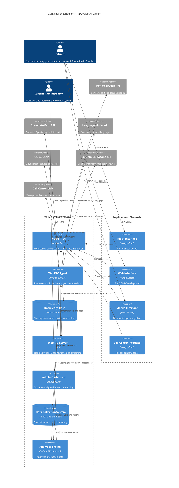

# 2.2 Container Diagram

## Overview

This document presents the Container diagram for the TAINA Voice AI system, following the C4 model for visualizing software architecture. While the [Context Diagram](./2.1_Context_Diagram.md) shows the system in relation to its users and external systems, this Container diagram zooms in to show the high-level technical components (containers) that make up the system and how they interact.

## Container Diagram

## Container Descriptions

### 1. Voice AI UI (Frontend)

**Technology Stack**: Next.js, React, WebRTC Client SDK

**Description**: 
The Voice AI UI is a web-based application that provides the conversational interface for citizens. It captures audio from the user's microphone, streams it to the backend via WebRTC, and plays back the system's responses. The UI is entirely in Spanish, providing an accessible interface for Spanish-speaking citizens. The UI is adaptable to multiple deployment channels, including kiosks, web, mobile, and call center interfaces.

**Key Responsibilities**:
- Provide an intuitive, conversational interface in Spanish
- Capture and stream audio from the user's microphone
- Display real-time transcriptions of user speech
- Play back audio responses from the system
- Visualize conversation state (listening, processing, speaking)
- Support text input as an alternative to speech
- Display conversation history
- Adapt to different deployment channels

### 2. WebRTC Agent (Backend)

**Technology Stack**: Python, FastAPI, WebRTC Server SDK

**Description**:
The WebRTC Agent is the core backend component that processes audio streams, manages conversations, and coordinates with external services. It handles speech-to-text conversion, natural language processing, knowledge retrieval, and text-to-speech conversion. It also integrates with government systems to provide accurate and up-to-date information about government services.

**Key Responsibilities**:
- Process incoming audio streams from citizens
- Perform Voice Activity Detection (VAD)
- Convert speech to text using Speech-to-Text API
- Process natural language using Language Model API
- Retrieve relevant information from the Knowledge Base
- Generate responses based on user queries
- Convert responses to speech using Text-to-Speech API
- Stream audio responses back to citizens
- Manage conversation state and context
- Integrate with government systems
- Store interaction data for analysis

### 3. Knowledge Base

**Technology Stack**: Vector Database (LlamaIndex)

**Description**:
The Knowledge Base stores government service information, documents, and frequently asked questions in a vector format that enables semantic search. It is used by the WebRTC Agent to retrieve relevant information when responding to user queries.

**Key Responsibilities**:
- Store government service information in vector format
- Enable semantic search based on query embeddings
- Provide relevant context for the language model
- Support multiple document types and formats
- Maintain metadata about documents for citation

### 4. WebRTC Server

**Technology Stack**: Go, WebRTC

**Description**:
The WebRTC Server manages WebRTC connections and audio streaming between the frontend and backend. It handles room creation, participant management, and media routing.

**Key Responsibilities**:
- Create and manage WebRTC rooms
- Authenticate participants using JWT tokens
- Route audio streams between frontend and backend
- Manage data channels for metadata exchange
- Handle network traversal (ICE, STUN, TURN)
- Ensure low-latency audio communication

### 5. Admin Dashboard

**Technology Stack**: Next.js, React

**Description**:
The Admin Dashboard provides an interface for system administrators to configure the system, monitor its performance, and manage the knowledge base. It allows administrators to view logs, update system parameters, and add or modify content in the knowledge base. It also provides access to analytics and insights generated from citizen interaction data.

**Key Responsibilities**:
- Configure system parameters and integrations
- Monitor system performance and usage
- View conversation logs and metrics
- Manage knowledge base content
- Update voice and language settings
- View and export analytics
- Configure deployment channel settings

### 6. Data Collection System

**Technology Stack**: Time-series Database

**Description**:
The Data Collection System securely stores citizen interaction data for analysis. It captures information about citizen queries, system responses, and conversation flow, while ensuring privacy and security.

**Key Responsibilities**:
- Securely store citizen interaction data
- Anonymize personal information
- Maintain data retention policies
- Support high-volume data ingestion
- Enable efficient data retrieval for analysis

### 7. Analytics Engine

**Technology Stack**: Python, ML Libraries

**Description**:
The Analytics Engine analyzes citizen interaction data to identify patterns, generate insights, and improve system responses. It uses machine learning techniques to understand citizen needs and predict service demands.

**Key Responsibilities**:
- Analyze citizen interaction patterns
- Identify common queries and issues
- Generate insights for service improvement
- Predict service demands
- Provide recommendations for knowledge base updates
- Support data-driven decision making

### 8. Deployment Channels

**Technology Stack**: Various (Next.js, React, React Native)

**Description**:
The Deployment Channels provide access to the TAINA system through multiple interfaces, including physical kiosks, web portals, mobile apps, and call center systems. Each channel adapts the Voice AI UI to its specific environment while maintaining consistent functionality.

**Key Responsibilities**:
- Provide access to TAINA through multiple channels
- Adapt the user interface to each channel's environment
- Ensure consistent functionality across all channels
- Support channel-specific features and constraints

## External Systems

### 1. Text-to-Speech API

**Integration Purpose**: Text-to-Speech conversion with high-quality Spanish voice

**Integration Details**:
- REST API for sending text and receiving audio
- Streaming capability for real-time audio playback
- Custom Dominican Spanish voice
- Optimized for natural-sounding speech

### 2. Speech-to-Text API

**Integration Purpose**: Speech-to-Text conversion with Spanish language support

**Integration Details**:
- REST API for sending audio and receiving transcriptions
- Real-time transcription with interim results
- Spanish language model with punctuation
- High accuracy for Dominican Spanish accent

### 3. Language Model API

**Integration Purpose**: Natural language understanding and generation

**Integration Details**:
- REST API for sending prompts and receiving responses
- Function calling capability for structured actions
- Context window for multi-turn conversations
- System prompts for government service assistant behavior

### 4. GOB.DO API

**Integration Purpose**: Access to government service information and functionality

**Integration Details**:
- REST API for retrieving service information
- Authentication for secure access
- Service catalog with detailed descriptions
- Transaction support for service requests

### 5. Carpeta Ciudadana API

**Integration Purpose**: Access to citizen documents and personal information

**Integration Details**:
- REST API for document retrieval and management
- Secure authentication and authorization
- Document metadata and content access
- Privacy controls for sensitive information

### 6. Call Center CRM

**Integration Purpose**: Integration with call center systems

**Integration Details**:
- REST API for agent information access
- Case management integration
- Call transfer capabilities
- Conversation history synchronization

## Key Interactions

### Citizen Conversation Flow

1. Citizen accesses TAINA through one of the deployment channels
2. Citizen initiates a conversation by clicking the "Iniciar Conversación" button
3. Voice AI UI establishes a WebRTC connection with the WebRTC Server
4. WebRTC Agent joins the same WebRTC room
5. Citizen speaks a query in Spanish
6. Voice AI UI captures and streams the audio to the WebRTC Server
7. WebRTC Server routes the audio to the WebRTC Agent
8. WebRTC Agent processes the audio and detects speech
9. WebRTC Agent sends the audio to Speech-to-Text API for transcription
10. WebRTC Agent processes the transcription using Language Model API
11. If needed, WebRTC Agent retrieves relevant information from the Knowledge Base
12. WebRTC Agent generates a response
13. WebRTC Agent sends the response to Text-to-Speech API for conversion
14. WebRTC Agent streams the audio response back through WebRTC Server
15. Voice AI UI plays the audio response to the citizen
16. WebRTC Agent stores the interaction data in the Data Collection System

### Government Service Information Flow

1. Citizen asks about a specific government service
2. WebRTC Agent detects the service inquiry
3. WebRTC Agent queries the Knowledge Base for service information
4. If needed, WebRTC Agent retrieves additional information from GOB.DO API
5. WebRTC Agent generates a comprehensive response about the service
6. WebRTC Agent provides links or instructions for accessing the service
7. Analytics Engine records the service inquiry for demand analysis

### Document Access Flow

1. Citizen requests access to their personal documents
2. WebRTC Agent detects the document request
3. WebRTC Agent authenticates the citizen
4. WebRTC Agent retrieves document information from Carpeta Ciudadana API
5. WebRTC Agent presents document options to the citizen
6. Citizen selects the desired document
7. WebRTC Agent facilitates document access or download

### Data Analysis Flow

1. Citizen interactions are stored in the Data Collection System
2. Analytics Engine processes the interaction data
3. Analytics Engine identifies patterns and trends
4. Analytics Engine generates insights about citizen needs
5. Analytics Engine predicts future service demands
6. Admin Dashboard displays analytics and insights to administrators
7. WebRTC Agent uses insights to improve responses

## Deployment Considerations

### Infrastructure Requirements

- **Frontend**: Static web hosting with CDN support
- **Backend**: Containerized deployment with auto-scaling
- **WebRTC Server**: Dedicated server with low-latency network
- **Knowledge Base**: Persistent storage with backup
- **Data Collection System**: Secure, compliant storage with encryption
- **Admin Dashboard**: Secure hosting with authentication
- **Deployment Channels**: Channel-specific infrastructure

### Security Considerations

- All communications secured with TLS/HTTPS
- JWT authentication for API access
- Role-based access control for Admin Dashboard
- Encrypted storage for sensitive information
- API key rotation and management
- Data anonymization for privacy
- Compliance with data protection regulations

### Scalability Considerations

- Horizontal scaling for WebRTC Agent instances
- Load balancing for WebRTC Server
- Caching for Knowledge Base queries
- CDN for static assets in Voice AI UI
- Database sharding for large Knowledge Base
- Distributed processing for Analytics Engine
- Multi-region deployment for global access

## Next Steps

For more detailed information about the internal components of each container, refer to the [Component Diagram](./2.3_Component_Diagram.md) document.

For information about the deployment architecture, refer to the [Deployment Diagram](./2.4_Deployment_Diagram.md) document.
