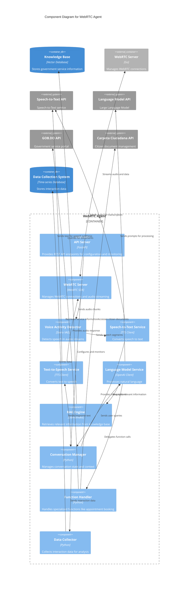
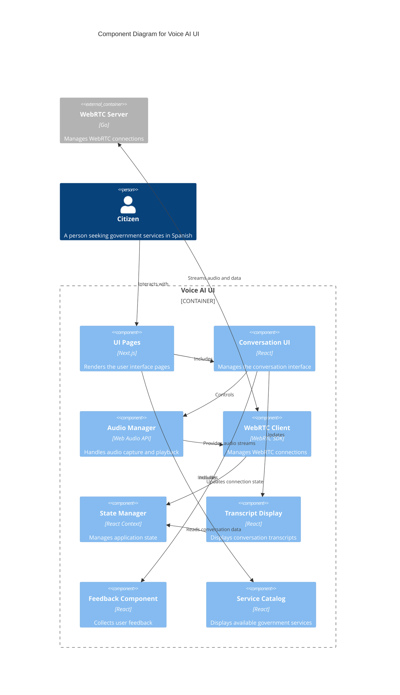
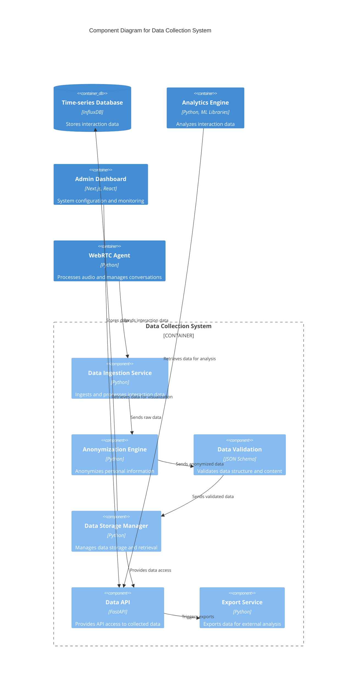
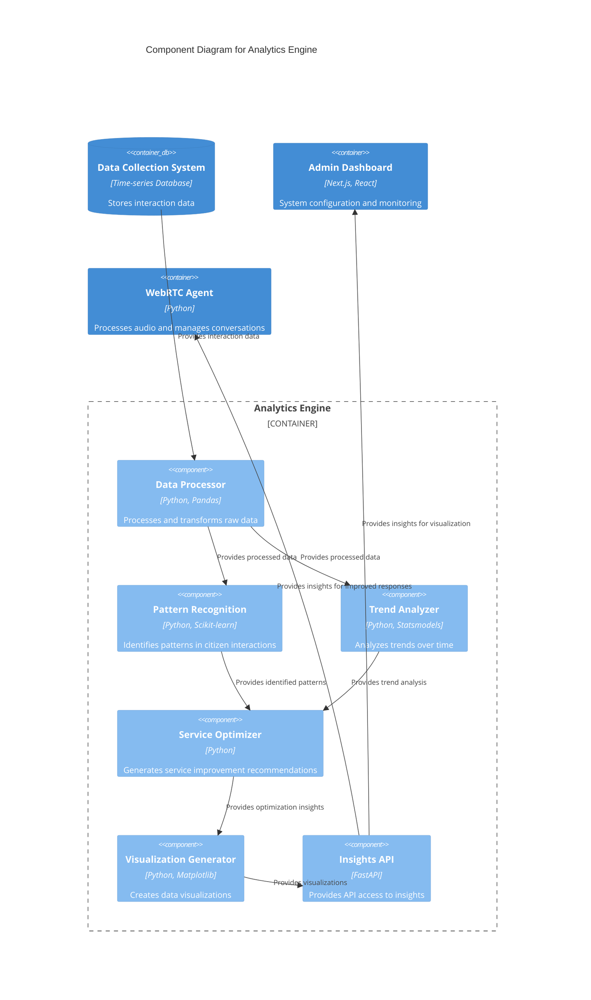

# 2.3 Component Diagram

## Overview

This document presents the Component diagram for the TAINA Voice AI system, following the C4 model for visualizing software architecture. While the [Container Diagram](./2.2_Container_Diagram.md) shows the high-level technical containers, this Component diagram zooms in further to show the internal components within each container and how they interact.

## Component Diagrams

### WebRTC Agent Components

### Voice AI UI Components

### Data Collection System Components

### Analytics Engine Components

## Component Descriptions

### WebRTC Agent Components

#### 1. API Server
**Technology**: FastAPI
**Description**: Provides REST API endpoints for configuration, monitoring, and management of the WebRTC Agent.
**Responsibilities**:
- Expose configuration endpoints
- Provide monitoring and metrics
- Handle administrative requests
- Authenticate API requests

#### 2. WebRTC Server
**Technology**: WebRTC SDK
**Description**: Manages WebRTC connections and audio streaming with the frontend.
**Responsibilities**:
- Connect to WebRTC server
- Join conversation rooms
- Handle audio streams
- Manage data channels

#### 3. Voice Activity Detector
**Technology**: Silero VAD
**Description**: Detects speech in audio streams to determine when a user is speaking.
**Responsibilities**:
- Process audio chunks
- Identify speech segments
- Filter out silence and background noise
- Trigger speech processing pipeline

#### 4. Speech-to-Text Service
**Technology**: TTS Client
**Description**: Converts speech to text using the TTS API.
**Responsibilities**:
- Send audio to TTS API
- Process transcription results
- Handle interim and final results
- Configure language settings (Spanish)

#### 5. Text-to-Speech Service
**Technology**: TTS Client
**Description**: Converts text to speech using the TTS API.
**Responsibilities**:
- Send text to TTS API
- Stream audio response
- Configure voice settings (Dominican Spanish)
- Handle TTS errors and fallbacks

#### 6. Language Model Service
**Technology**: OpenAI Client
**Description**: Processes natural language using the OpenAI API.
**Responsibilities**:
- Prepare conversation context
- Send prompts to OpenAI API
- Process responses
- Handle function calling
- Manage system prompts

#### 7. RAG Engine
**Technology**: LlamaIndex
**Description**: Retrieves relevant information from the knowledge base to enhance responses.
**Responsibilities**:
- Generate query embeddings
- Search vector database
- Format retrieved documents as context
- Provide citations and sources

#### 8. Conversation Manager
**Technology**: Python
**Description**: Manages conversation state and context throughout the interaction.
**Responsibilities**:
- Track conversation history
- Maintain user context
- Coordinate component interactions
- Handle conversation flow
- Manage timeouts and error states

#### 9. Function Handler
**Technology**: Python
**Description**: Handles specialized functions like appointment booking.
**Responsibilities**:
- Parse function call parameters
- Execute function logic
- Integrate with external systems
- Handle function errors
- Format function results

#### 10. Data Collector
**Technology**: Python
**Description**: Collects interaction data for analysis and improvement.
**Responsibilities**:
- Capture conversation data
- Extract relevant metrics
- Anonymize personal information
- Format data for storage
- Send data to Data Collection System

### Data Collection System Components

#### 1. Data Ingestion Service
**Technology**: Python
**Description**: Ingests and processes interaction data from various sources.
**Responsibilities**:
- Receive data from WebRTC Agent
- Process incoming data streams
- Handle data batching
- Ensure data reliability
- Manage ingestion queues

#### 2. Anonymization Engine
**Technology**: Python
**Description**: Anonymizes personal information to ensure privacy compliance.
**Responsibilities**:
- Detect personal identifiable information (PII)
- Apply anonymization techniques
- Maintain consistent anonymization
- Log anonymization activities
- Ensure GDPR compliance

#### 3. Data Validation
**Technology**: JSON Schema
**Description**: Validates data structure and content before storage.
**Responsibilities**:
- Validate data schema
- Check data integrity
- Identify missing fields
- Handle validation errors
- Ensure data quality

#### 4. Data Storage Manager
**Technology**: Python
**Description**: Manages data storage and retrieval operations.
**Responsibilities**:
- Write data to time-series database
- Optimize data storage
- Handle data retention policies
- Manage data partitioning
- Ensure data backup

#### 5. Data API
**Technology**: FastAPI
**Description**: Provides API access to collected data for analytics and reporting.
**Responsibilities**:
- Expose data query endpoints
- Implement data filtering
- Handle authentication and authorization
- Rate limit API access
- Document API endpoints

#### 6. Export Service
**Technology**: Python
**Description**: Exports data for external analysis and reporting.
**Responsibilities**:
- Generate data exports in various formats
- Schedule regular exports
- Implement export filters
- Secure exported data
- Track export activities

### Analytics Engine Components

#### 1. Data Processor
**Technology**: Python, Pandas
**Description**: Processes and transforms raw data for analysis.
**Responsibilities**:
- Clean and normalize data
- Transform data structures
- Handle missing values
- Feature engineering
- Prepare data for analysis

#### 2. Pattern Recognition
**Technology**: Python, Scikit-learn
**Description**: Identifies patterns in citizen interactions.
**Responsibilities**:
- Apply machine learning algorithms
- Detect common interaction patterns
- Identify service usage patterns
- Cluster similar interactions
- Generate pattern reports

#### 3. Trend Analyzer
**Technology**: Python, Statsmodels
**Description**: Analyzes trends in service usage and citizen needs over time.
**Responsibilities**:
- Perform time-series analysis
- Detect seasonal patterns
- Identify emerging trends
- Forecast future needs
- Generate trend reports

#### 4. Service Optimizer
**Technology**: Python
**Description**: Generates recommendations for service improvements.
**Responsibilities**:
- Analyze service performance
- Identify bottlenecks
- Generate optimization suggestions
- Prioritize improvement areas
- Create action recommendations

#### 5. Visualization Generator
**Technology**: Python, Matplotlib
**Description**: Creates data visualizations for insights communication.
**Responsibilities**:
- Generate charts and graphs
- Create interactive visualizations
- Format data for presentation
- Support multiple visualization types
- Customize visualization styles

#### 6. Insights API
**Technology**: FastAPI
**Description**: Provides API access to insights and recommendations.
**Responsibilities**:
- Expose insights endpoints
- Deliver recommendations
- Support dashboard integration
- Handle authentication
- Document API endpoints

## Key Interactions

### Speech Processing Flow

1. WebRTC Server receives audio stream from WebRTC
2. Audio chunks are passed to Voice Activity Detector
3. When speech is detected, audio segments are sent to Speech-to-Text Service
4. Speech-to-Text Service sends audio to TTS API
5. Transcription results are passed to Conversation Manager
6. Conversation Manager updates conversation state
7. Transcription is sent to Language Model Service for processing

### Response Generation Flow

1. Language Model Service receives transcription from Conversation Manager
2. If needed, Language Model Service requests information from RAG Engine
3. RAG Engine queries Knowledge Base for relevant documents
4. Language Model Service sends prompt with context to OpenAI API
5. Response from OpenAI is processed by Language Model Service
6. If function calling is detected, request is forwarded to Function Handler
7. Final response is sent to Conversation Manager
8. Conversation Manager sends response to Text-to-Speech Service
9. Text-to-Speech Service converts text to speech using TTS API
10. Audio response is streamed back through WebRTC Server to client

## Implementation Considerations

### Performance Optimization

- **Streaming Responses**: Both STT and TTS use streaming to reduce latency
- **Efficient VAD**: Voice Activity Detection is optimized to minimize processing delay
- **Caching**: Frequently accessed knowledge is cached to reduce database queries
- **Parallel Processing**: Independent components operate concurrently when possible

### Error Handling

- **Graceful Degradation**: System can fall back to simpler modes if components fail
- **Retry Logic**: Critical API calls implement exponential backoff and retry
- **Alternative Paths**: Multiple implementation variants for core functions
- **User Feedback**: Clear error messages and recovery options in the UI

### Security

- **API Key Management**: Secure storage and rotation of external API keys
- **Input Validation**: All user inputs are validated before processing
- **Authentication**: JWT-based authentication for all API endpoints
- **Secure WebRTC**: Encrypted media streams and secure signaling

## Next Steps

For information about how these components are deployed across infrastructure, refer to the [Deployment Diagram](./2.4_Deployment_Diagram.md) document.

For details on how the system integrates with external services, refer to the [System Integration](../integration/2.5_System_Integration.md) document.
