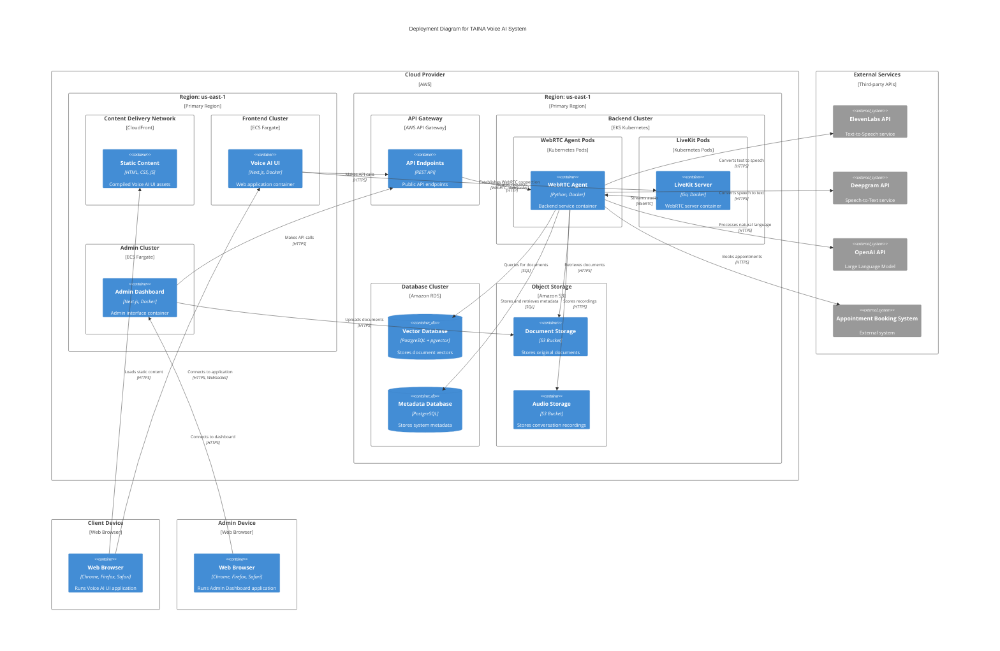

# 2.4 Deployment Diagram

## Overview

This document presents the Deployment diagram for the TAINA Voice AI system, completing the C4 model series for visualizing software architecture. The Deployment diagram shows how the software components are deployed across infrastructure elements in the production environment.

## Deployment Diagram

## Simplified Deployment Diagram

For those who prefer a simpler visualization, here's an alternative representation of the same deployment architecture:

```mermaid
graph TD
    subgraph cloud["Cloud Provider (AWS)"]
        subgraph frontend_region["Region: us-east-1 (Frontend)"]
            cdn[Content Delivery Network<br>CloudFront]
            frontend_cluster[Frontend Cluster<br>ECS Fargate]
            admin_cluster[Admin Cluster<br>ECS Fargate]
            
            static_content[Static Content<br>HTML, CSS, JS]
            voiceai_ui[Voice AI UI<br>Next.js, Docker]
            admin_dashboard[Admin Dashboard<br>Next.js, Docker]
            
            cdn --- static_content
            frontend_cluster --- voiceai_ui
            admin_cluster --- admin_dashboard
        end
        
        subgraph backend_region["Region: us-east-1 (Backend)"]
            api_gateway[API Gateway<br>AWS API Gateway]
            backend_cluster[Backend Cluster<br>EKS Kubernetes]
            database_cluster[Database Cluster<br>Amazon RDS]
            storage[Object Storage<br>Amazon S3]
            
            api_endpoints[API Endpoints<br>REST API]
            webrtc_agent[WebRTC Agent<br>Python, Docker]
            livekit_server[LiveKit Server<br>Go, Docker]
            vector_db[(Vector Database<br>PostgreSQL + pgvector)]
            metadata_db[(Metadata Database<br>PostgreSQL)]
            document_storage[Document Storage<br>S3 Bucket]
            audio_storage[Audio Storage<br>S3 Bucket]
            
            api_gateway --- api_endpoints
            backend_cluster --- webrtc_agent
            backend_cluster --- livekit_server
            database_cluster --- vector_db
            database_cluster --- metadata_db
            storage --- document_storage
            storage --- audio_storage
        end
    end
    
    subgraph external_services["External Services"]
        elevenlabs[ElevenLabs API<br>Text-to-Speech]
        deepgram[Deepgram API<br>Speech-to-Text]
        openai[OpenAI API<br>Language Model]
        appointment[Appointment Booking System]
    end
    
    subgraph client_devices["Client Devices"]
        browser[Web Browser<br>Chrome, Firefox, Safari]
        admin_browser[Admin Browser<br>Chrome, Firefox, Safari]
    end
    
    %% Connections
    browser -->|HTTPS| static_content
    browser -->|HTTPS, WebSocket| voiceai_ui
    admin_browser -->|HTTPS| admin_dashboard
    
    voiceai_ui -->|HTTPS| api_endpoints
    voiceai_ui -->|WebRTC, WebSocket| livekit_server
    
    api_endpoints -->|HTTP| webrtc_agent
    livekit_server -->|WebRTC| webrtc_agent
    
    webrtc_agent -->|SQL| vector_db
    webrtc_agent -->|SQL| metadata_db
    webrtc_agent -->|HTTPS| document_storage
    webrtc_agent -->|HTTPS| audio_storage
    
    webrtc_agent -->|HTTPS| elevenlabs
    webrtc_agent -->|HTTPS| deepgram
    webrtc_agent -->|HTTPS| openai
    webrtc_agent -->|HTTPS| appointment
    
    admin_dashboard -->|HTTPS| api_endpoints
    admin_dashboard -->|HTTPS| document_storage
    
    %% Styling
    classDef aws fill:#FF9900,stroke:#232F3E,color:white;
    classDef container fill:#1168BD,stroke:#0B4884,color:white;
    classDef database fill:#3B48CC,stroke:#2A3699,color:white;
    classDef external fill:#4CAF50,stroke:#388E3C,color:white;
    classDef client fill:#F44336,stroke:#D32F2F,color:white;
    
    class cdn,frontend_cluster,admin_cluster,api_gateway,backend_cluster,database_cluster,storage aws;
    class static_content,voiceai_ui,admin_dashboard,api_endpoints,webrtc_agent,livekit_server,document_storage,audio_storage container;
    class vector_db,metadata_db database;
    class elevenlabs,deepgram,openai,appointment external;
    class browser,admin_browser client;
```

## Deployment Environment Descriptions

### Cloud Infrastructure (AWS)

The TAINA Voice AI system is primarily deployed on AWS cloud infrastructure, with the following key components:

#### Frontend Region (us-east-1)

**Content Delivery Network (CloudFront)**
- Hosts static assets for the Voice AI UI
- Provides global low-latency access
- Implements caching for improved performance
- Enables HTTPS for secure content delivery

**Frontend Cluster (ECS Fargate)**
- Runs the Voice AI UI application containers
- Auto-scales based on demand
- Managed container orchestration
- Load balancing across multiple instances

**Admin Cluster (ECS Fargate)**
- Runs the Admin Dashboard application containers
- Isolated from frontend for security
- Restricted access through security groups
- Separate scaling policies for admin traffic

#### Backend Region (us-east-1)

**API Gateway**
- Provides public API endpoints
- Implements request throttling and quotas
- Handles API key validation
- Routes requests to appropriate services

**Backend Cluster (EKS Kubernetes)**
- Runs WebRTC Agent containers in pods
- Implements horizontal pod autoscaling
- Provides self-healing capabilities
- Enables rolling updates for zero-downtime deployments

**LiveKit Pods (Kubernetes)**
- Runs LiveKit Server containers
- Optimized for real-time communication
- Configured for low-latency networking
- Scaled independently from other backend services

**Database Cluster (Amazon RDS)**
- Vector Database (PostgreSQL with pgvector extension)
  - Stores document vectors for semantic search
  - Optimized for vector similarity queries
  - Configured with read replicas for scaling
  
- Metadata Database (PostgreSQL)
  - Stores system configuration and metadata
  - Manages user sessions and preferences
  - Tracks conversation history references
  - Maintains system audit logs

**Object Storage (Amazon S3)**
- Document Storage Bucket
  - Stores original government service documents
  - Versioning enabled for document history
  - Lifecycle policies for archiving
  
- Audio Storage Bucket
  - Stores conversation recordings (when enabled)
  - Implements retention policies
  - Encrypted at rest for security

### External Services

The system integrates with several external services:

**ElevenLabs API**
- Hosted by ElevenLabs
- Accessed via REST API
- Requires API key authentication
- Used for high-quality Spanish TTS

**Deepgram API**
- Hosted by Deepgram
- Accessed via REST API
- Requires API key authentication
- Used for Spanish speech recognition

**OpenAI API**
- Hosted by OpenAI
- Accessed via REST API
- Requires API key authentication
- Used for natural language processing

**Appointment Booking System**
- Hosted by government service provider
- Accessed via REST API
- Requires OAuth authentication
- Used for scheduling government service appointments

### Client Devices

**Web Browser**
- Runs on client devices (desktop, mobile)
- Supported browsers: Chrome, Firefox, Safari
- Requires WebRTC support
- Requires microphone permissions

**Admin Browser**
- Runs on administrator devices
- Supported browsers: Chrome, Firefox, Safari
- Requires secure network connection
- Enhanced security requirements

## Deployment Considerations

### Scalability

The deployment architecture is designed for scalability at multiple levels:

**Horizontal Scaling**
- WebRTC Agent pods scale horizontally based on CPU and memory metrics
- LiveKit Server pods scale based on active connection count
- Frontend containers scale based on request volume

**Vertical Scaling**
- Database instances can be upgraded to larger sizes as needed
- Kubernetes nodes can be provisioned with more resources

**Regional Scaling**
- Architecture supports multi-region deployment for global availability
- Content delivery network provides global edge caching

### High Availability

The system implements several high availability features:

**Multi-AZ Deployment**
- All critical components deployed across multiple availability zones
- Automatic failover for database instances
- Load balancing across healthy instances

**Self-Healing**
- Kubernetes health checks and automatic pod replacement
- ECS service auto-recovery
- RDS automated backups and point-in-time recovery

**Redundancy**
- Multiple instances of each service component
- Database read replicas for query distribution
- Redundant storage with cross-region replication

### Security

The deployment includes comprehensive security measures:

**Network Security**
- VPC isolation for backend services
- Security groups with least-privilege access
- Private subnets for databases and internal services
- WAF protection for public endpoints

**Data Security**
- Encryption in transit (TLS/HTTPS)
- Encryption at rest (S3, RDS)
- Key rotation policies
- Secure parameter storage (AWS Secrets Manager)

**Access Control**
- IAM roles with least privilege
- RBAC for Kubernetes resources
- Multi-factor authentication for admin access
- API key management and rotation

### Monitoring and Logging

The deployment includes robust monitoring and logging:

**Centralized Logging**
- CloudWatch Logs for application logs
- Structured logging format
- Log retention policies
- Log insights for analysis

**Monitoring**
- CloudWatch metrics for system performance
- Custom metrics for business KPIs
- Dashboards for system overview
- Alarms for critical thresholds

**Tracing**
- Distributed tracing across services
- Request ID propagation
- Performance bottleneck identification
- Error tracking and correlation

## Deployment Variants

### Development Environment

- Simplified deployment on lower-cost infrastructure
- Local development with Docker Compose
- Mocked external services where appropriate
- Shared database instances

### Staging Environment

- Mirrors production architecture at smaller scale
- Full integration with external service test environments
- Automated deployment from CI/CD pipeline
- Data sanitization for testing

### Production Environment

- Full-scale deployment as described in the diagram
- Strict security controls
- Regular backup and disaster recovery testing
- Performance optimization and tuning

## Deployment Process

The system is deployed using infrastructure as code and CI/CD pipelines:

1. **Infrastructure Provisioning**
   - Terraform for cloud resources
   - Kubernetes manifests for container orchestration
   - CloudFormation for AWS-specific resources

2. **Continuous Integration**
   - Automated testing of components
   - Container image building
   - Security scanning
   - Artifact versioning

3. **Continuous Deployment**
   - Automated deployment to development and staging
   - Manual approval for production deployment
   - Blue-green deployment strategy
   - Automated rollback capability

4. **Operational Procedures**
   - Runbooks for common operations
   - Incident response plan
   - Regular disaster recovery testing
   - Performance benchmarking

## Next Steps

For information about how the system integrates with external services, refer to the [System Integration](../integration/2.5_System_Integration.md) document.

For details on the API flows between components, refer to the [API Flow Diagrams](../integration/2.6_API_Flow_Diagrams.md) document.
