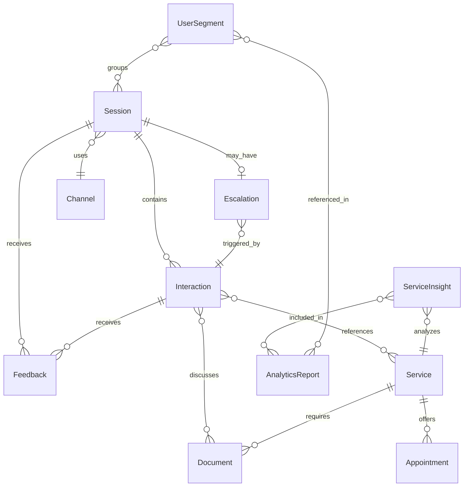
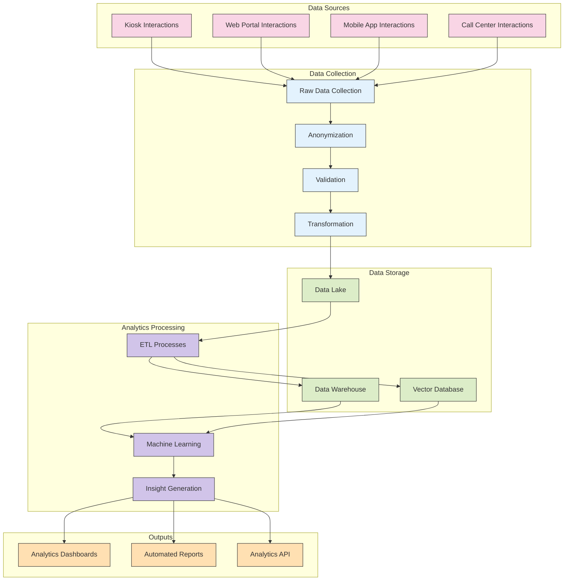

# 2.10 Data Schema

## Overview

This document defines the data schema for the TAINA Voice AI system's data collection and analytics capabilities. It outlines the structure, relationships, and attributes of the data collected across all deployment channels.

## Data Categories

The TAINA system collects and processes data in the following categories:

1. **Interaction Data:** Information about citizen interactions with the system
2. **Service Data:** Information about government services accessed
3. **User Feedback:** Explicit and implicit feedback from citizens
4. **System Performance:** Metrics related to system performance
5. **Analytics Data:** Derived insights and patterns

## Core Data Entities

### 1. Session

The Session entity represents a single interaction session between a citizen and the TAINA system.

#### Attributes

| Attribute | Type | Description | Example |
|-----------|------|-------------|---------|
| session_id | UUID | Unique identifier for the session | 550e8400-e29b-41d4-a716-446655440000 |
| channel_id | String | Deployment channel identifier | kiosk_123, web_portal, mobile_app |
| start_timestamp | DateTime | Session start time | 2025-03-03T14:30:45Z |
| end_timestamp | DateTime | Session end time | 2025-03-03T14:45:12Z |
| duration_seconds | Integer | Session duration in seconds | 870 |
| language | String | Primary language used | es, en, fr, ht |
| session_type | Enum | Type of session | information, appointment, document, escalation |
| completion_status | Enum | How the session ended | completed, abandoned, escalated, error |
| device_info | JSON | Device information | `{"type": "mobile", "os": "Android", "browser": "Chrome"}` |
| location_id | String | Physical location (for kiosks) | santo_domingo_office_1 |
| anonymized_user_id | String | Anonymized identifier for returning users | hashed_value |

#### Relationships

- One Session has many Interactions
- One Session has one Channel
- One Session may have one Escalation
- One Session has many Feedback items

### 2. Interaction

The Interaction entity represents a single turn in the conversation between the citizen and TAINA.

#### Attributes

| Attribute | Type | Description | Example |
|-----------|------|-------------|---------|
| interaction_id | UUID | Unique identifier for the interaction | 7b1e7a5c-8c0d-4f34-b2e9-3c1a0c2b4f5e |
| session_id | UUID | Reference to parent session | 550e8400-e29b-41d4-a716-446655440000 |
| timestamp | DateTime | When the interaction occurred | 2025-03-03T14:32:10Z |
| interaction_type | Enum | Type of interaction | query, response, clarification, confirmation |
| user_input | Text | Anonymized user input | "¿Cómo obtengo mi certificado de nacimiento?" |
| system_response | Text | System response | "Para obtener su certificado de nacimiento, debe..." |
| detected_intent | String | Identified user intent | get_birth_certificate |
| confidence_score | Float | Confidence in intent detection | 0.92 |
| entities | JSON | Extracted entities | `{"document_type": "birth_certificate"}`|
| response_time_ms | Integer | Time to generate response | 450 |
| turn_number | Integer | Position in conversation | 3 |

#### Relationships

- Many Interactions belong to one Session
- One Interaction may reference many Services
- One Interaction may have many Feedback items

### 3. Service

The Service entity represents a government service that was discussed or accessed during the interaction.

#### Attributes

| Attribute | Type | Description | Example |
|-----------|------|-------------|---------|
| service_id | String | Unique identifier for the service | birth_certificate_request |
| service_name | String | Human-readable service name | "Solicitud de Certificado de Nacimiento" |
| service_category | String | Category of the service | vital_records, taxes, licenses |
| ministry | String | Responsible government ministry | "Ministerio de Interior y Policía" |
| access_count | Integer | Number of times accessed | 1247 |
| completion_rate | Float | Rate of successful completions | 0.78 |
| average_duration | Integer | Average interaction duration | 540 |

#### Relationships

- One Service may be referenced in many Interactions
- One Service may have many Documents
- One Service may have many Appointments

### 4. Document

The Document entity represents a document that was discussed, requested, or provided during an interaction.

#### Attributes

| Attribute | Type | Description | Example |
|-----------|------|-------------|---------|
| document_id | String | Unique identifier for the document | birth_certificate |
| document_name | String | Human-readable document name | "Certificado de Nacimiento" |
| document_category | String | Category of the document | vital_records, identification, licenses |
| required_for | Array | Services requiring this document | ["passport_application", "school_enrollment"] |
| issuing_agency | String | Agency that issues the document | "Junta Central Electoral" |
| request_count | Integer | Number of times requested | 856 |
| explanation_count | Integer | Times explanation requested | 342 |

#### Relationships

- Many Documents may be referenced in one Service
- Many Documents may be referenced in one Interaction

### 5. Appointment

The Appointment entity represents an appointment that was scheduled or discussed during an interaction.

#### Attributes

| Attribute | Type | Description | Example |
|-----------|------|-------------|---------|
| appointment_id | UUID | Unique identifier for the appointment | 9f8e7d6c-5b4a-3c2d-1e0f-9a8b7c6d5e4f |
| service_id | String | Associated service | birth_certificate_request |
| location_id | String | Appointment location | santo_domingo_office_1 |
| scheduled_time | DateTime | Scheduled appointment time | 2025-03-10T09:30:00Z |
| duration_minutes | Integer | Expected duration | 30 |
| status | Enum | Appointment status | scheduled, completed, cancelled, no_show |
| channel_booked | String | Channel used for booking | kiosk, web, mobile, call_center |
| booking_timestamp | DateTime | When the appointment was booked | 2025-03-03T14:40:22Z |

#### Relationships

- Many Appointments may be associated with one Service
- Many Appointments may be referenced in one Session

### 6. Feedback

The Feedback entity represents explicit or implicit feedback provided by citizens.

#### Attributes

| Attribute | Type | Description | Example |
|-----------|------|-------------|---------|
| feedback_id | UUID | Unique identifier for the feedback | 1a2b3c4d-5e6f-7g8h-9i0j-1k2l3m4n5o6p |
| session_id | UUID | Associated session | 550e8400-e29b-41d4-a716-446655440000 |
| interaction_id | UUID | Associated interaction (optional) | 7b1e7a5c-8c0d-4f34-b2e9-3c1a0c2b4f5e |
| timestamp | DateTime | When feedback was provided | 2025-03-03T14:45:00Z |
| feedback_type | Enum | Type of feedback | explicit_rating, explicit_comment, implicit |
| rating | Integer | Numerical rating (1-5) | 4 |
| comment | Text | Text comment | "El sistema fue muy útil y rápido" |
| sentiment_score | Float | Analyzed sentiment (-1 to 1) | 0.8 |
| feedback_category | String | Category of feedback | usability, accuracy, speed, helpfulness |

#### Relationships

- Many Feedback items may be associated with one Session
- Many Feedback items may be associated with one Interaction

### 7. Escalation

The Escalation entity represents when a conversation was escalated to a human agent.

#### Attributes

| Attribute | Type | Description | Example |
|-----------|------|-------------|---------|
| escalation_id | UUID | Unique identifier for the escalation | 2c3d4e5f-6g7h-8i9j-0k1l-2m3n4o5p6q7r |
| session_id | UUID | Associated session | 550e8400-e29b-41d4-a716-446655440000 |
| interaction_id | UUID | Interaction that triggered escalation | 7b1e7a5c-8c0d-4f34-b2e9-3c1a0c2b4f5e |
| timestamp | DateTime | When escalation occurred | 2025-03-03T14:40:30Z |
| escalation_reason | Enum | Reason for escalation | user_requested, confidence_low, complex_issue, error |
| agent_id | String | ID of human agent (anonymized) | agent_123 |
| resolution_time | Integer | Time to resolve (seconds) | 420 |
| resolution_status | Enum | How the escalation was resolved | resolved, transferred, abandoned |

#### Relationships

- One Escalation belongs to one Session
- One Escalation is associated with one Interaction

### 8. Channel

The Channel entity represents a deployment channel through which citizens interact with TAINA.

#### Attributes

| Attribute | Type | Description | Example |
|-----------|------|-------------|---------|
| channel_id | String | Unique identifier for the channel | kiosk_123, web_portal, mobile_app |
| channel_type | Enum | Type of channel | kiosk, web, mobile, call_center |
| location | String | Physical location (if applicable) | "Santo Domingo Office" |
| device_type | String | Type of device | touchscreen, smartphone, desktop |
| software_version | String | Version of the software | 1.2.3 |
| active_hours | JSON | Hours when channel is active | `{"weekdays": "8:00-17:00", "weekend": "9:00-13:00"}` |

#### Relationships

- One Channel may have many Sessions
- One Channel may have many Devices (for kiosks)

## Analytical Entities

### 1. ServiceInsight

The ServiceInsight entity represents derived insights about government services.

#### Attributes

| Attribute | Type | Description | Example |
|-----------|------|-------------|---------|
| insight_id | UUID | Unique identifier for the insight | 3d4e5f6g-7h8i-9j0k-1l2m-3n4o5p6q7r8s |
| service_id | String | Associated service | birth_certificate_request |
| time_period | String | Time period of the insight | "2025-03", "2025-Q1" |
| insight_type | Enum | Type of insight | trend, anomaly, correlation, pattern |
| metric | String | Metric being analyzed | completion_rate, satisfaction, duration |
| value | Float | Numerical value | 0.82 |
| change | Float | Change from previous period | 0.05 |
| significance | Float | Statistical significance | 0.92 |
| description | Text | Human-readable description | "Significant increase in birth certificate requests" |
| related_services | Array | Services related to the insight | ["birth_certificate", "passport"] |
| action_recommendation | Text | Recommended action | "Increase capacity for birth certificate processing" |

#### Relationships

- One ServiceInsight is associated with one Service
- Many ServiceInsights may be part of one AnalyticsReport

### 2. UserSegment

The UserSegment entity represents groups of users with similar characteristics or behaviors.

#### Attributes

| Attribute | Type | Description | Example |
|-----------|------|-------------|---------|
| segment_id | UUID | Unique identifier for the segment | 4e5f6g7h-8i9j-0k1l-2m3n-4o5p6q7r8s9t |
| segment_name | String | Human-readable segment name | "First-time Users" |
| segment_criteria | JSON | Criteria defining the segment | `{"first_session": true}` |
| size | Integer | Number of users in segment | 1250 |
| creation_date | DateTime | When segment was created | 2025-03-01T00:00:00Z |
| last_updated | DateTime | When segment was last updated | 2025-03-04T12:00:00Z |
| common_services | Array | Common services used by segment | ["birth_certificate", "national_id"] |
| average_satisfaction | Float | Average satisfaction score | 4.2 |
| channel_preference | JSON | Channel usage distribution | `{"kiosk": 0.2, "web": 0.5, "mobile": 0.3}` |

#### Relationships

- One UserSegment may be referenced in many AnalyticsReports
- One UserSegment may be associated with many Sessions

### 3. AnalyticsReport

The AnalyticsReport entity represents a compiled report of analytics insights.

#### Attributes

| Attribute | Type | Description | Example |
|-----------|------|-------------|---------|
| report_id | UUID | Unique identifier for the report | 5f6g7h8i-9j0k-1l2m-3n4o-5p6q7r8s9t0u |
| report_name | String | Human-readable report name | "Monthly Service Performance Report" |
| time_period | String | Time period covered | "2025-03", "2025-Q1" |
| creation_date | DateTime | When report was created | 2025-04-01T09:00:00Z |
| report_type | Enum | Type of report | service_performance, user_behavior, trend_analysis |
| audience | String | Intended audience | "Service Managers" |
| summary | Text | Executive summary | "Overall service performance improved by 12% in March" |
| key_metrics | JSON | Key metrics highlighted | `{"completion_rate": 0.85, "satisfaction": 4.3}` |
| recommendations | Array | Action recommendations | ["Expand kiosk deployment", "Simplify birth certificate process"] |

#### Relationships

- One AnalyticsReport contains many ServiceInsights
- One AnalyticsReport may reference many UserSegments

## Data Relationships Diagram

## Data Flow

The following diagram illustrates how data flows through the TAINA system:

## Next Steps

For more detailed information on data collection and analytics, refer to:

- [Data Collection Overview](./2.9_Data_Collection_Overview.md)
- [Privacy and Security](./2.11_Privacy_and_Security.md)
- [Analytics Capabilities](./2.12_Analytics_Capabilities.md)
