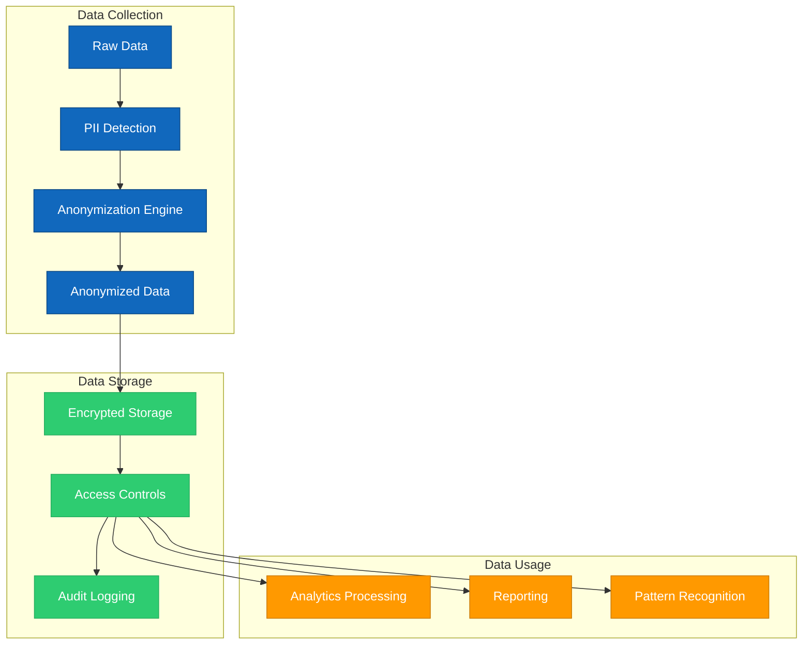

# 2.11 Privacy and Security

## Overview

This document outlines the privacy and security measures implemented in the TAINA Voice AI system to protect citizen data and ensure compliance with relevant regulations. Data privacy and security are fundamental to maintaining citizen trust and ensuring the ethical use of collected information.

## Privacy Principles

The TAINA system adheres to the following privacy principles:

### 1. Data Minimization

- Only collect data that is necessary for the system's legitimate purposes
- Avoid collecting excessive or irrelevant information
- Regularly review data collection practices to eliminate unnecessary collection

### 2. Purpose Limitation

- Only use data for the specific purposes for which it was collected
- Clearly define and document the purposes of data collection
- Obtain consent for new purposes not covered by the original collection

### 3. Storage Limitation

- Retain data only for as long as necessary for the defined purposes
- Implement automated data deletion processes for expired data
- Document retention periods for different types of data

### 4. Transparency

- Provide clear information to citizens about data collection practices
- Explain how data is used, stored, and protected
- Make privacy policies easily accessible across all channels

### 5. Citizen Rights

- Respect citizens' rights to access, correct, and delete their data
- Provide mechanisms for citizens to exercise these rights
- Respond to citizen requests in a timely manner

### 6. Privacy by Design

- Incorporate privacy considerations from the earliest stages of development
- Implement privacy-enhancing technologies and architectures
- Conduct privacy impact assessments for new features and changes

## Data Protection Measures

### 1. Anonymization

The TAINA system implements robust anonymization to protect citizen privacy:

#### Anonymization Techniques

- **PII Detection:** Automated identification of personally identifiable information
- **Data Masking:** Replacement of sensitive data with non-sensitive equivalents
- **Pseudonymization:** Replacement of identifying fields with artificial identifiers
- **Aggregation:** Combining data to prevent identification of individuals
- **Generalization:** Reducing precision of data to protect individual identities

#### Anonymization Process

1. **Data Intake:** Raw data is received from deployment channels
2. **PII Detection:** Automated systems identify potential PII
3. **Anonymization Application:** Appropriate techniques are applied to sensitive fields
4. **Validation:** Anonymized data is validated to ensure no PII remains
5. **Storage:** Only anonymized data is stored for analysis

### 2. Encryption

The TAINA system uses encryption to protect data:

#### Data in Transit

- **TLS 1.3:** All communications between components use TLS 1.3
- **End-to-End Encryption:** Communications between citizen devices and TAINA
- **VPN:** Secure VPN connections for administrative access

#### Data at Rest

- **Storage Encryption:** AES-256 encryption for all stored data
- **Key Management:** Secure key management with regular rotation
- **Encrypted Backups:** All backups are encrypted

### 3. Access Control

The TAINA system implements strict access controls:

#### Authentication

- **Multi-Factor Authentication:** Required for administrative access
- **Role-Based Access:** Access based on job responsibilities
- **Single Sign-On:** Integration with government identity systems
- **Session Management:** Automatic session timeouts and monitoring

#### Authorization

- **Principle of Least Privilege:** Users have only the access they need
- **Segregation of Duties:** Critical functions require multiple approvers
- **Attribute-Based Access:** Dynamic access based on user attributes and context
- **Regular Review:** Periodic review of access rights

### 4. Secure Development

The TAINA system is developed with security in mind:

- **Secure SDLC:** Security integrated throughout the development lifecycle
- **Code Reviews:** Security-focused code reviews
- **Dependency Management:** Regular updates of dependencies
- **Security Testing:** Automated and manual security testing
- **Vulnerability Management:** Process for addressing vulnerabilities

## Compliance Framework

### 1. Regulatory Compliance

The TAINA system is designed to comply with relevant regulations:

- **Data Protection Laws:** Compliance with Dominican Republic data protection laws
- **Government Standards:** Adherence to government security standards
- **International Best Practices:** Implementation of recognized security frameworks

### 2. Compliance Monitoring

The TAINA system includes mechanisms for monitoring compliance:

- **Automated Checks:** Regular automated compliance checks
- **Audit Logging:** Comprehensive logging of all data access
- **Regular Audits:** Periodic security and privacy audits
- **Compliance Reporting:** Regular reporting on compliance status

### 3. Incident Response

The TAINA system has a comprehensive incident response plan:

- **Detection:** Systems for detecting potential security incidents
- **Response Team:** Dedicated incident response team
- **Response Procedures:** Documented procedures for different types of incidents
- **Communication Plan:** Plan for communicating incidents to stakeholders
- **Post-Incident Analysis:** Process for learning from incidents

## Data Governance

### 1. Roles and Responsibilities

The following roles are responsible for data privacy and security:

- **Data Protection Officer:** Overall responsibility for data protection
- **Security Team:** Implementation and monitoring of security measures
- **Data Stewards:** Day-to-day management of data
- **System Administrators:** Technical implementation of security measures
- **All Staff:** Awareness and adherence to security policies

### 2. Policies and Procedures

The TAINA system is governed by comprehensive policies:

- **Data Protection Policy:** Overall approach to data protection
- **Security Policy:** Technical security requirements
- **Access Control Policy:** Rules for granting and revoking access
- **Incident Response Policy:** Procedures for handling security incidents
- **Data Retention Policy:** Rules for data retention and deletion

### 3. Training and Awareness

All personnel involved with TAINA receive training:

- **Security Awareness:** Basic security awareness for all staff
- **Role-Specific Training:** Specialized training for specific roles
- **Regular Updates:** Ongoing training to address new threats
- **Compliance Training:** Training on regulatory requirements

## Technical Security Measures

### 1. Network Security

The TAINA system implements network security measures:

- **Firewalls:** Next-generation firewalls to protect system boundaries
- **Network Segmentation:** Separation of different system components
- **Intrusion Detection/Prevention:** Systems to detect and prevent attacks
- **DDoS Protection:** Measures to mitigate denial of service attacks
- **Regular Scanning:** Vulnerability scanning of network infrastructure

### 2. Application Security

The TAINA system includes application security measures:

- **Input Validation:** Validation of all user inputs
- **Output Encoding:** Proper encoding of outputs to prevent injection
- **Authentication Controls:** Secure authentication mechanisms
- **Session Management:** Secure handling of user sessions
- **Error Handling:** Secure error handling to prevent information leakage

### 3. Infrastructure Security

The TAINA system is deployed on secure infrastructure:

- **Hardened Systems:** Servers configured according to security best practices
- **Patch Management:** Regular application of security patches
- **Secure Configuration:** Security-focused configuration management
- **Monitoring:** Continuous monitoring of infrastructure
- **Backup and Recovery:** Secure backup and recovery processes

## Privacy Impact Assessment

A Privacy Impact Assessment (PIA) has been conducted for the TAINA system:

### 1. Data Collection Assessment

| Data Category | Purpose | Sensitivity | Anonymization Method | Retention Period |
|---------------|---------|-------------|----------------------|------------------|
| Conversation Content | Service Improvement | High | Full Anonymization | 90 days |
| Service Usage | Service Planning | Medium | Aggregation | 1 year |
| User Feedback | Quality Improvement | Medium | Pseudonymization | 1 year |
| System Performance | Technical Optimization | Low | None Required | 30 days |

### 2. Risk Assessment

| Risk | Likelihood | Impact | Mitigation Measures |
|------|------------|--------|---------------------|
| Unauthorized Access | Low | High | Access Controls, Encryption, Monitoring |
| Data Breach | Low | High | Encryption, Secure Development, Incident Response |
| Re-identification | Low | High | Robust Anonymization, Data Minimization |
| Function Creep | Medium | Medium | Purpose Limitation, Governance Controls |
| Citizen Distrust | Medium | High | Transparency, Citizen Controls, Clear Communication |

### 3. Recommendations

The PIA resulted in the following recommendations:

1. **Enhanced Anonymization:** Implement additional anonymization techniques for high-risk data
2. **Regular Audits:** Conduct quarterly privacy audits
3. **Citizen Controls:** Develop interfaces for citizens to manage their data
4. **Training:** Increase privacy training for all staff
5. **Documentation:** Improve documentation of privacy practices

## Citizen Privacy Controls

The TAINA system provides citizens with controls over their data:

### 1. Consent Management

- **Initial Consent:** Clear consent process at first interaction
- **Granular Options:** Ability to consent to specific uses of data
- **Withdrawal:** Easy process for withdrawing consent
- **Record Keeping:** Secure records of consent decisions

### 2. Access and Control

- **Data Access:** Process for citizens to access their data
- **Correction:** Ability to correct inaccurate data
- **Deletion:** Process for requesting data deletion
- **Data Portability:** Ability to receive data in a portable format

### 3. Privacy Notices

- **Clear Language:** Privacy notices in plain, understandable language
- **Multi-Channel:** Notices available across all deployment channels
- **Just-in-Time:** Contextual privacy information at relevant points
- **Accessibility:** Notices accessible to all citizens

## Security Monitoring and Operations

### 1. Security Monitoring

The TAINA system includes comprehensive security monitoring:

- **SIEM Integration:** Security Information and Event Management
- **Anomaly Detection:** AI-based detection of unusual patterns
- **Alert Management:** Process for managing and responding to alerts
- **24/7 Monitoring:** Continuous security monitoring

### 2. Vulnerability Management

The TAINA system has a robust vulnerability management process:

- **Regular Scanning:** Automated vulnerability scanning
- **Penetration Testing:** Regular penetration testing
- **Responsible Disclosure:** Process for external vulnerability reporting
- **Patch Management:** Timely application of security patches

### 3. Security Operations

The TAINA system is supported by security operations:

- **Security Team:** Dedicated security personnel
- **Incident Response:** 24/7 incident response capability
- **Threat Intelligence:** Integration of threat intelligence
- **Regular Drills:** Practice of incident response procedures

## Third-Party Security

The TAINA system manages security with third parties:

### 1. Vendor Assessment

- **Security Review:** Assessment of vendor security practices
- **Contractual Requirements:** Security requirements in contracts
- **Regular Reassessment:** Periodic review of vendor security
- **Right to Audit:** Contractual right to audit vendor security

### 2. API Security

- **API Gateway:** Centralized API management and security
- **Authentication:** Strong authentication for API access
- **Rate Limiting:** Protection against API abuse
- **Input Validation:** Validation of all API inputs

### 3. Cloud Security

- **Shared Responsibility:** Clear definition of security responsibilities
- **Cloud Security Controls:** Implementation of cloud-specific security
- **Compliance Verification:** Verification of cloud provider compliance
- **Data Residency:** Control over data location

## Future Enhancements

Planned security and privacy enhancements include:

1. **Advanced Anonymization:** Implementation of differential privacy techniques
2. **Enhanced Citizen Controls:** More granular citizen privacy controls
3. **AI Ethics Framework:** Framework for ethical use of AI with citizen data
4. **Federated Learning:** Privacy-preserving machine learning techniques
5. **Zero Trust Architecture:** Implementation of zero trust security principles

## Conclusion

The TAINA system implements comprehensive privacy and security measures to protect citizen data while enabling the valuable functions of the system. These measures are continuously reviewed and improved to address evolving threats and requirements.

## Appendices

### A. Security Standards and Frameworks

- ISO 27001
- NIST Cybersecurity Framework
- OWASP Top 10
- CIS Controls

### B. Privacy Impact Assessment Methodology

- Assessment criteria
- Scoring methodology
- Mitigation strategies

### C. Incident Response Procedures

- Detection procedures
- Classification criteria
- Response workflows
- Communication templates

### D. Data Flow Diagrams

- Detailed data flows showing security controls
- Cross-border data transfers
- Data lifecycle management
