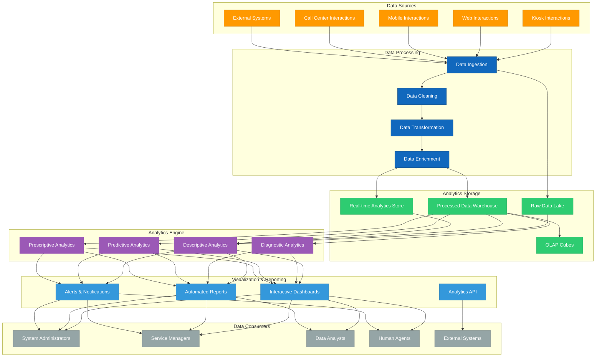

# 2.12 Analytics Capabilities

## Overview

This document outlines the analytics capabilities of the TAINA Voice AI system. These capabilities enable the system to derive valuable insights from citizen interactions, improve service delivery, and support data-driven decision-making for government services.

## Analytics Architecture

The TAINA analytics system is built on a modular architecture that processes data from all deployment channels and provides insights through various visualization and reporting interfaces.

## Analytics Types

The TAINA system provides four types of analytics capabilities:

### 1. Descriptive Analytics

Descriptive analytics answers the question "What happened?" by analyzing historical data to identify patterns and trends.

#### Key Capabilities

- **Interaction Volume Analysis:** Tracking the volume of citizen interactions across channels
- **Service Usage Metrics:** Measuring which government services are most frequently accessed
- **Demographic Analysis:** Understanding the demographics of citizens using the system
- **Temporal Analysis:** Analyzing usage patterns over time (hourly, daily, weekly, seasonal)
- **Channel Performance:** Comparing performance and usage across deployment channels
- **Completion Rate Analysis:** Measuring successful completion of citizen requests

#### Example Metrics

- Total interactions per day/week/month
- Most requested government services
- Average session duration
- Peak usage times
- Channel distribution of interactions
- Service completion rates

### 2. Diagnostic Analytics

Diagnostic analytics answers the question "Why did it happen?" by investigating the causes of patterns and behaviors.

#### Key Capabilities

- **Abandonment Analysis:** Identifying why citizens abandon interactions
- **Error Analysis:** Understanding the causes of errors and failures
- **Satisfaction Drivers:** Determining factors that influence citizen satisfaction
- **Performance Bottlenecks:** Identifying system performance issues
- **Correlation Analysis:** Finding relationships between different factors
- **Path Analysis:** Analyzing the paths citizens take through services

#### Example Metrics

- Abandonment reasons and rates
- Error frequency and patterns
- Satisfaction correlation factors
- System response time impact
- Service complexity impact
- Navigation path efficiency

### 3. Predictive Analytics

Predictive analytics answers the question "What will happen?" by using historical data to forecast future trends and behaviors.

#### Key Capabilities

- **Demand Forecasting:** Predicting future demand for government services
- **Seasonal Trend Prediction:** Anticipating seasonal variations in service needs
- **Citizen Behavior Prediction:** Forecasting how citizens will interact with services
- **Resource Requirement Forecasting:** Predicting resource needs for service delivery
- **Issue Prediction:** Identifying potential issues before they occur
- **Satisfaction Prediction:** Forecasting citizen satisfaction levels

#### Example Metrics

- Projected service demand by month
- Predicted peak usage periods
- Forecasted resource requirements
- Early warning indicators for issues
- Predicted satisfaction scores
- Estimated completion rates

### 4. Prescriptive Analytics

Prescriptive analytics answers the question "What should we do?" by recommending actions based on insights.

#### Key Capabilities

- **Service Optimization Recommendations:** Suggestions for improving service delivery
- **Resource Allocation Guidance:** Recommendations for optimal resource allocation
- **Content Improvement Suggestions:** Identifying knowledge base content that needs improvement
- **Proactive Intervention Opportunities:** Identifying opportunities for proactive citizen outreach
- **Policy Impact Simulation:** Simulating the impact of policy changes
- **Personalization Recommendations:** Suggestions for personalizing citizen experiences

#### Example Metrics

- Recommended staffing levels
- Suggested knowledge base updates
- Optimal deployment channel mix
- Prioritized improvement opportunities
- Simulated policy impact scores
- Personalization effectiveness predictions

## Analytics Dashboards

The TAINA system provides a range of dashboards tailored to different user roles:

### 1. Executive Dashboard

Designed for high-level decision-makers, this dashboard provides strategic insights into system performance and citizen service delivery.

#### Key Components

- **Service Performance Overview:** High-level metrics on service performance
- **Citizen Satisfaction Trends:** Trends in citizen satisfaction over time
- **Channel Comparison:** Performance comparison across deployment channels
- **Strategic KPIs:** Key performance indicators aligned with strategic goals
- **Resource Utilization:** Overview of system resource utilization
- **Predictive Insights:** Key forecasts and predictions

### 2. Operational Dashboard

Designed for day-to-day management of the TAINA system, this dashboard focuses on operational metrics and real-time performance.

#### Key Components

- **Real-time System Status:** Current system performance and status
- **Active Sessions:** Number and distribution of active sessions
- **Error Monitoring:** Real-time error tracking and alerts
- **Resource Utilization:** Current usage of system resources
- **Queue Status:** Status of human agent queues and escalations
- **Daily Performance Metrics:** Key metrics for the current day

### 3. Service Manager Dashboard

Designed for government service managers, this dashboard provides insights into specific service performance and citizen needs.

#### Key Components

- **Service Usage Metrics:** Detailed metrics on service usage
- **Citizen Feedback:** Feedback specific to the service
- **Service Completion Rates:** Rates of successful service completion
- **Common Issues:** Frequently encountered issues with the service
- **Improvement Opportunities:** Identified opportunities for service improvement
- **Citizen Journey Visualization:** Visual representation of citizen journeys

### 4. Analytics Workbench

Designed for data analysts, this interactive environment allows for deep exploration and analysis of the data.

#### Key Components

- **Ad-hoc Query Interface:** Interface for custom data queries
- **Advanced Visualization Tools:** Tools for creating custom visualizations
- **Data Export Capabilities:** Functions for exporting data for external analysis
- **Statistical Analysis Tools:** Tools for performing statistical analyses
- **Cohort Analysis:** Tools for analyzing specific citizen cohorts
- **Hypothesis Testing:** Capabilities for testing hypotheses

## Reporting Capabilities

The TAINA system provides comprehensive reporting capabilities:

### 1. Scheduled Reports

- **Daily Performance Reports:** Daily summary of key performance metrics
- **Weekly Service Reports:** Weekly analysis of service performance
- **Monthly Trend Reports:** Monthly analysis of trends and patterns
- **Quarterly Strategic Reports:** Quarterly reports aligned with strategic objectives
- **Annual Review Reports:** Comprehensive annual review of system performance

### 2. Ad-hoc Reports

- **Custom Query Reports:** Reports based on custom data queries
- **Incident Analysis Reports:** Detailed analysis of specific incidents
- **Service Deep Dive Reports:** In-depth analysis of specific services
- **Comparative Analysis Reports:** Comparison of different time periods or channels
- **Impact Assessment Reports:** Assessment of the impact of changes or initiatives

### 3. Automated Alerts

- **Performance Threshold Alerts:** Alerts when performance falls below thresholds
- **Anomaly Detection Alerts:** Alerts for unusual patterns or behaviors
- **Predictive Alerts:** Alerts based on predictive models
- **Resource Utilization Alerts:** Alerts for high resource utilization
- **Security and Privacy Alerts:** Alerts for potential security or privacy issues

## Analytics Use Cases

The TAINA analytics capabilities support a range of use cases:

### 1. Service Improvement

- **Identifying Pain Points:** Finding areas where citizens struggle with services
- **Content Gap Analysis:** Identifying missing or inadequate information
- **Process Optimization:** Streamlining service delivery processes
- **Language Optimization:** Improving language and terminology for clarity
- **Channel Optimization:** Optimizing the deployment channel mix

### 2. Resource Planning

- **Staffing Optimization:** Optimizing human agent staffing levels
- **Infrastructure Planning:** Planning system infrastructure based on demand
- **Knowledge Base Investment:** Prioritizing knowledge base development
- **Channel Investment:** Guiding investment in deployment channels
- **Training Needs Identification:** Identifying training needs for human agents

### 3. Citizen Experience Enhancement

- **Personalization Opportunities:** Identifying opportunities for personalization
- **Journey Optimization:** Streamlining citizen journeys through services
- **Proactive Service Delivery:** Enabling proactive service recommendations
- **Satisfaction Improvement:** Targeting improvements to increase satisfaction
- **Accessibility Enhancement:** Improving accessibility for all citizens

### 4. Policy and Program Development

- **Service Demand Analysis:** Understanding demand for different services
- **Impact Assessment:** Assessing the impact of policy changes
- **Citizen Needs Identification:** Identifying emerging citizen needs
- **Program Effectiveness Evaluation:** Evaluating the effectiveness of programs
- **Cross-Service Insights:** Identifying relationships between different services

## Data Integration

The TAINA analytics system integrates data from various sources:

### 1. Internal Data Sources

- **Interaction Data:** Data from citizen interactions with TAINA
- **Knowledge Base Data:** Data about the knowledge base content and usage
- **System Performance Data:** Data about system technical performance
- **Human Agent Data:** Data from human agent interactions
- **Feedback Data:** Explicit and implicit feedback from citizens

### 2. External Data Sources

- **Government Service Data:** Data from government service systems
- **Demographic Data:** Demographic data for context and analysis
- **Geographic Data:** Geographic data for location-based analysis
- **Temporal Data:** Calendar data for temporal analysis
- **External Event Data:** Data about external events that may impact service demand

## Advanced Analytics Capabilities

The TAINA system includes advanced analytics capabilities:

### 1. Natural Language Processing

- **Topic Modeling:** Identifying common topics in citizen interactions
- **Sentiment Analysis:** Analyzing the sentiment of citizen interactions
- **Intent Recognition Patterns:** Analyzing patterns in intent recognition
- **Language Usage Analysis:** Analyzing language patterns and terminology
- **Question Pattern Analysis:** Identifying common question patterns

### 2. Machine Learning Models

- **Citizen Behavior Models:** Models of citizen behavior and preferences
- **Service Demand Models:** Models for predicting service demand
- **Satisfaction Prediction Models:** Models for predicting citizen satisfaction
- **Resource Requirement Models:** Models for predicting resource requirements
- **Issue Prediction Models:** Models for predicting potential issues

### 3. Pattern Recognition

- **Temporal Patterns:** Identifying patterns over time
- **Behavioral Patterns:** Identifying patterns in citizen behavior
- **Service Usage Patterns:** Identifying patterns in service usage
- **Error Patterns:** Identifying patterns in system errors
- **Feedback Patterns:** Identifying patterns in citizen feedback

## Analytics Implementation Considerations

### 1. Technical Considerations

- **Scalability:** Ability to handle growing data volumes
- **Performance:** Efficient processing of large datasets
- **Real-time vs. Batch:** Balance of real-time and batch processing
- **Data Storage:** Appropriate storage solutions for different data types
- **Processing Architecture:** Distributed processing for complex analytics

### 2. Privacy and Security

- **Data Anonymization:** Ensuring all analytics data is properly anonymized
- **Access Controls:** Restricting access to analytics based on roles
- **Audit Trails:** Maintaining audit trails of analytics access
- **Data Minimization:** Using only necessary data for analytics
- **Purpose Limitation:** Using data only for specified purposes

For detailed information on privacy and security measures, see [Privacy and Security](./2.11_Privacy_and_Security.md).

### 3. Governance

- **Data Quality Management:** Ensuring the quality of analytics data
- **Metadata Management:** Maintaining comprehensive metadata
- **Version Control:** Tracking versions of analytics models and reports
- **Documentation:** Documenting analytics processes and models
- **Change Management:** Managing changes to analytics capabilities

## Future Enhancements

Planned enhancements to the analytics capabilities include:

1. **Advanced AI Analytics:** Deep learning models for complex pattern recognition
2. **Predictive Service Recommendations:** Proactive service suggestions based on predictive models
3. **Real-time Personalization:** Real-time personalization of citizen experiences
4. **Federated Analytics:** Distributed analytics across government agencies
5. **Explainable AI:** More transparent and explainable AI models
6. **Citizen Analytics Portal:** Self-service analytics for citizens

## Conclusion

The TAINA analytics capabilities provide powerful tools for understanding citizen interactions, improving government services, and supporting data-driven decision-making. These capabilities are designed to balance the need for insights with the imperative of protecting citizen privacy.

## Appendices

### A. Analytics Metrics Dictionary

- Detailed definitions of all analytics metrics
- Calculation methodologies
- Interpretation guidelines

### B. Dashboard Specifications

- Detailed specifications for each dashboard
- Widget descriptions
- Data sources and refresh rates

### C. Report Templates

- Templates for standard reports
- Report generation schedules
- Distribution lists

### D. Data Dictionary

- Definitions of all data elements used in analytics
- Data sources and lineage
- Data quality metrics
