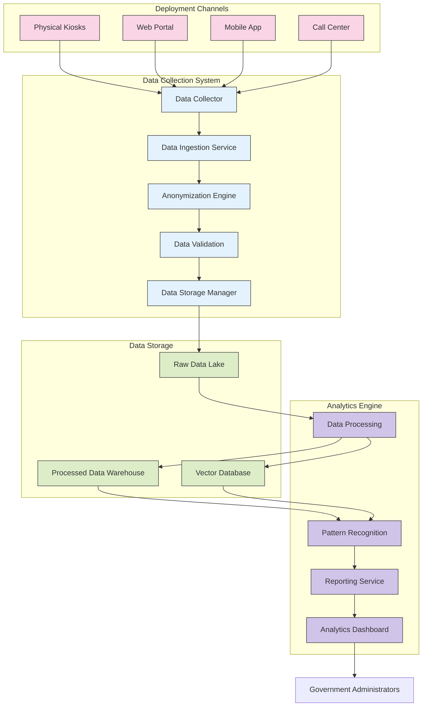

# 2.9 Data Collection Overview

## Introduction

The TAINA Voice AI system includes robust data collection capabilities designed to capture citizen interactions across all deployment channels. This data is used to improve the system's performance, identify patterns in citizen needs, and provide insights to government agencies for service improvement.

This document provides a high-level overview of the data collection architecture, the types of data collected, and how this data is processed and analyzed.

## Data Collection Architecture

## Data Collection Process

### 1. Data Capture

The system captures data from all citizen interactions across the following channels:

- **Physical Kiosks:** Located in government offices and public spaces
- **Web Portal:** Integration with GOB.DO web platform
- **Mobile App:** Integration with Carpeta Ciudadana mobile application
- **Call Center:** Integration with government call center systems

### 2. Data Ingestion

The Data Ingestion Service processes incoming data with the following steps:

1. **Collection:** Raw data is collected from all channels in real-time
2. **Validation:** Data is validated for completeness and format
3. **Anonymization:** PII is anonymized according to privacy policies
4. **Transformation:** Data is transformed into a standardized format
5. **Storage:** Processed data is stored in appropriate data stores

### 3. Data Processing

The Data Processing system performs the following operations:

1. **Enrichment:** Adding metadata and context to raw interactions
2. **Aggregation:** Combining related data points
3. **Classification:** Categorizing interactions by topic and intent
4. **Vectorization:** Creating embeddings for semantic search
5. **Analysis:** Extracting insights and patterns

## Types of Data Collected

### 1. Conversation Data

- **Transcripts:** Text of citizen-AI conversations (anonymized)
- **Intents:** Identified citizen intents for each interaction
- **Topics:** Main topics discussed in conversations
- **Sentiment:** Sentiment analysis of citizen interactions
- **Entity Recognition:** Extracted entities from conversations

### 2. Interaction Data

- **Session Information:** Duration, timestamp, channel
- **Navigation Paths:** How citizens navigate through conversations
- **Completion Rates:** Whether citizens achieved their goals
- **Escalation Events:** When and why conversations were escalated to human agents
- **Error Events:** System errors or recognition failures

### 3. Service Data

- **Service Types:** Government services discussed or requested
- **Appointment Data:** Appointment scheduling metrics (anonymized)
- **Document Requests:** Types of documents citizens inquire about
- **Frequency Analysis:** Most common service requests
- **Geographic Distribution:** Regional patterns in service requests

## Data Privacy and Security

The data collection system implements the following privacy and security measures:

### Privacy Measures

1. **Anonymization:** PII is anonymized at the point of collection
2. **Consent Management:** Clear consent processes before data collection
3. **Data Minimization:** Only collecting necessary data
4. **Retention Policies:** Clear policies for data retention and deletion
5. **Access Controls:** Strict controls on who can access what data

### Security Measures

1. **Encryption:** Data encrypted at rest and in transit
2. **Access Logging:** Comprehensive logging of all data access
3. **Secure Storage:** Secure data storage with appropriate controls
4. **Compliance:** Adherence to relevant data protection regulations
5. **Regular Audits:** Security and privacy audits of the data collection system

## Data Analytics Capabilities

The analytics engine provides the following capabilities:

### 1. Descriptive Analytics

- **Usage Metrics:** System usage patterns and trends
- **Performance Metrics:** System performance and response times
- **Service Popularity:** Most requested government services
- **Channel Preferences:** Usage patterns across different channels

### 2. Diagnostic Analytics

- **Error Analysis:** Root cause analysis of system errors
- **Escalation Analysis:** Reasons for human agent escalations
- **Satisfaction Analysis:** Factors affecting citizen satisfaction
- **Bottleneck Identification:** Identifying process bottlenecks

### 3. Predictive Analytics

- **Demand Forecasting:** Predicting future service demand
- **Trend Prediction:** Identifying emerging citizen needs
- **Seasonal Patterns:** Identifying seasonal variations in service requests
- **Resource Planning:** Optimizing resource allocation

### 4. Prescriptive Analytics

- **Service Improvement:** Recommendations for service enhancements
- **Process Optimization:** Suggestions for streamlining government processes
- **Content Recommendations:** Identifying knowledge base gaps
- **Training Recommendations:** Areas where the AI needs additional training

## Data Governance

The data collection system operates under the following governance framework:

1. **Data Ownership:** Clear definition of data ownership and stewardship
2. **Quality Standards:** Defined standards for data quality and completeness
3. **Compliance Framework:** Adherence to relevant regulations and standards
4. **Review Process:** Regular review of data collection practices
5. **Transparency:** Clear documentation of data usage and processing

## Next Steps

For more detailed information on the data collection and analytics capabilities, refer to:

- [Data Schema](./2.10_Data_Schema.md)
- [Privacy and Security](./2.11_Privacy_and_Security.md)
- [Analytics Capabilities](./2.12_Analytics_Capabilities.md)
