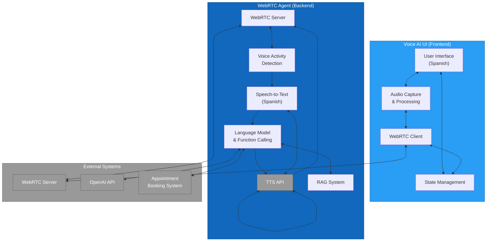
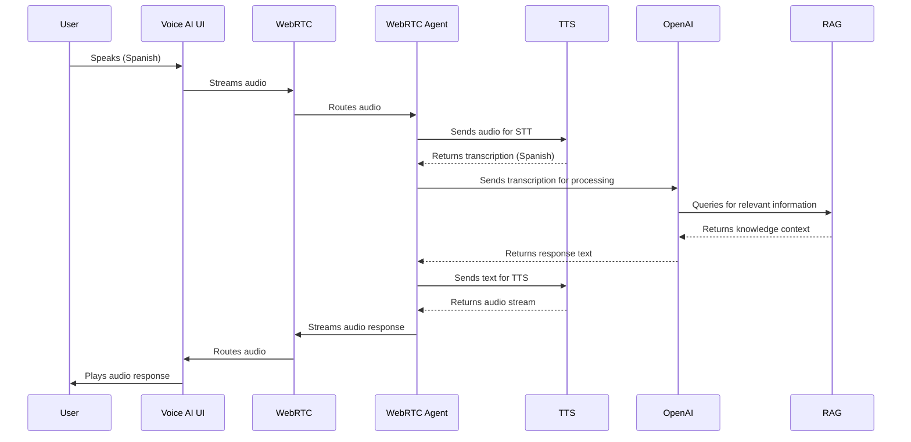
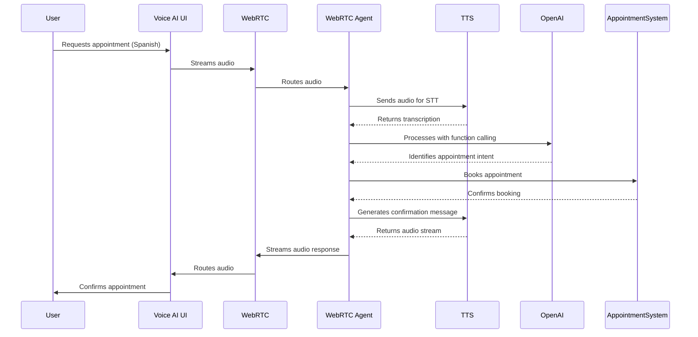

# 2.5 System Integration

## Overview

This document details how the TAINA Voice AI system's components integrate with each other and with external systems. It focuses on the communication patterns, data exchange formats, and integration points between the Voice AI UI (frontend) and the WebRTC Agent (backend), as well as their interactions with external services.

## System Integration Diagram

## Integration Points

### 1. Frontend to Backend Integration

The Voice AI UI (frontend) and WebRTC Agent (backend) integrate primarily through WebRTC, a WebRTC server that facilitates real-time audio communication.

#### Key Integration Points:

1. **WebRTC Connection**
   - **Protocol**: WebRTC over WebSockets
   - **Server**: WebRTC
   - **Authentication**: JWT tokens generated by the backend
   - **Data Format**: Real-time audio streams and data channels

2. **Room Management**
   - The frontend connects to a WebRTC room
   - The backend joins the same room as a participant
   - Room names are typically based on session identifiers

3. **Data Channels**
   - Used for sending metadata and control messages
   - JSON format for structured data exchange
   - Includes transcription results and system status updates

### 2. Backend to External Services Integration

The WebRTC Agent integrates with several external services to provide its functionality:

#### Speech-to-Text Integration (TTS)

- **Integration Method**: REST API
- **Authentication**: API Key
- **Request Format**: Audio stream or chunks
- **Response Format**: JSON with transcription results
- **Configuration**:
  - Language: Spanish (`es`)
  - Model: Enhanced
  - Features: Punctuation, interim results

#### Text-to-Speech Integration (TTS)

- **Integration Method**: REST API and WebSocket for streaming
- **Authentication**: API Key
- **Request Format**: JSON with text and voice parameters
- **Response Format**: Audio stream (MP3)
- **Configuration**:
  - Voice ID: Custom Dominican Spanish voice
  - Model: eleven_multilingual_v2
  - Sample Rate: 44100Hz
  - Format: MP3

#### Language Model Integration (OpenAI)

- **Integration Method**: REST API
- **Authentication**: API Key
- **Request Format**: JSON with prompt and parameters
- **Response Format**: JSON with generated text
- **Configuration**:
  - Model: gpt-4o-mini
  - Temperature: 0.7
  - Function Calling: Enabled

#### Appointment Booking Integration

- **Integration Method**: Webhook
- **Authentication**: API Key or OAuth
- **Request Format**: JSON with appointment details
- **Response Format**: JSON with confirmation status
- **Data Exchange**:
  - Citizen information
  - Appointment time and date
  - Service type
  - Confirmation status

### 3. RAG System Integration

The Retrieval-Augmented Generation (RAG) system is integrated within the backend:

- **Vector Database**: Local storage with LlamaIndex
- **Document Source**: Markdown files in knowledge_data directory
- **Query Interface**: Internal Python API
- **Response Format**: Text with citations
- **Integration Method**: Direct function calls

## Data Flow Sequences

### Voice Interaction Flow

### Appointment Booking Flow

## Technical Details

### WebRTC Configuration

- **ICE Servers**: STUN and TURN servers for NAT traversal
- **Media Constraints**:
  - Audio: Enabled, 16kHz sample rate, mono
  - Video: Disabled
- **Data Channel Configuration**:
  - Ordered: true
  - MaxRetransmits: 3

### WebRTC Integration

- **Server**: Hosted WebRTC instance
- **Client Libraries**:
  - Frontend: WebRTC Client SDK for Web
  - Backend: WebRTC Server SDK for Python
- **Room Configuration**:
  - Max Participants: 2 (client and agent)
  - Timeout: 30 minutes

### Security Considerations

1. **Authentication**:
   - JWT tokens with short expiration
   - Server-side token generation
   - HTTPS for all API calls

2. **Data Protection**:
   - End-to-end encryption for WebRTC streams
   - TLS for all API communications
   - No persistent storage of conversation audio

3. **API Key Management**:
   - Keys stored in environment variables
   - Different keys for development and production
   - Regular key rotation

## Implementation Variants

The system supports different implementation variants for certain components:

### TTS Variants

1. **TTS TTS**:
   - Primary implementation
   - High-quality Spanish voice
   - Streaming capability

2. **OpenAI TTS**:
   - Fallback implementation
   - Lower latency
   - Limited voice options

### RAG Variants

1. **Chat Engine RAG**:
   - Conversational context preservation
   - Multi-turn interactions

2. **Query Engine RAG**:
   - Direct factual responses
   - Higher precision for specific queries

3. **Retrieval Engine RAG**:
   - Dynamic system prompt enhancement
   - More comprehensive context

## Deployment Considerations

1. **Network Requirements**:
   - Low-latency connection for WebRTC
   - Sufficient bandwidth for audio streaming
   - Reliable internet connection

2. **Scaling**:
   - WebRTC server can be scaled horizontally
   - Multiple agent instances can be deployed
   - Load balancing for high traffic

3. **Monitoring**:
   - WebRTC connection quality metrics
   - API response times
   - Error rates and types

## Next Steps

For more detailed information on the API interactions, refer to the [API Flow Diagrams](./2.6_API_Flow_Diagrams.md) document, which provides sequence diagrams for each major API interaction.
