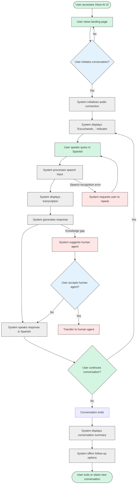

# 4.1 Conversation Flow

## Overview

This document illustrates the user flow for voice conversations with the TAINA Voice AI system. It details the step-by-step process from initial user interaction to conversation completion, highlighting the user experience, system responses, and decision points throughout the conversation journey.

## Primary Conversation Flow

The following diagram illustrates the standard conversation flow between a user and the Voice AI system:

## Detailed Flow Steps

### 1. Initial Access and Connection

1. **User Access**
   - User navigates to the Voice AI UI web application
   - System displays landing page with welcome message in Spanish
   - UI shows "Iniciar Conversación" button prominently

2. **Conversation Initiation**
   - User clicks "Iniciar Conversación" button
   - System requests microphone permission if not previously granted
   - System establishes WebRTC connection with backend
   - UI transitions to conversation mode

3. **Connection Confirmation**
   - System displays connection status indicator
   - Visual feedback confirms successful connection
   - UI shows "Escuchando..." indicator with animated microphone icon

### 2. User Input and Processing

1. **Speech Input**
   - User speaks query in Spanish
   - System captures audio through WebRTC
   - UI displays visual feedback indicating audio is being received
   - Optional: Real-time volume visualization

2. **Speech Processing**
   - System sends audio to Deepgram API for transcription
   - UI displays "Procesando..." indicator
   - System applies language detection to confirm Spanish input
   - System performs noise filtering and enhancement if needed

3. **Transcription Display**
   - System displays transcribed text in UI
   - Text appears in a conversational bubble format
   - Transcription is marked as "Usuario:" to distinguish from system responses

### 3. Response Generation and Delivery

1. **Response Generation**
   - System processes transcription with LLM
   - System retrieves relevant information from knowledge base
   - System formulates response in Spanish
   - UI displays "Generando respuesta..." indicator

2. **Response Delivery**
   - System sends response text to ElevenLabs for TTS
   - Audio response plays through user's speakers
   - UI displays text response in conversation bubble
   - Response is marked as "Taína:" to distinguish from user input
   - Visual indicator shows when system is speaking

3. **Follow-up Prompting**
   - After response completion, system returns to listening mode
   - UI displays "¿Algo más en lo que pueda ayudarle?" prompt
   - System displays "Escuchando..." indicator again
   - Optional quick-action buttons appear for common follow-ups

### 4. Conversation Continuation or Completion

1. **Continuation**
   - If user speaks again, system returns to the Speech Input step
   - Context from previous exchanges is maintained
   - System adjusts responses based on conversation history

2. **Completion**
   - User indicates conversation completion (explicit statement or timeout)
   - System acknowledges end of conversation
   - UI displays conversation summary
   - System offers options for follow-up actions (e.g., email transcript, schedule appointment)

3. **Post-Conversation**
   - System saves conversation transcript for analytics
   - UI offers option to start new conversation
   - System provides feedback mechanism for conversation quality

## Alternative Flows

### Error Handling

1. **Connection Issues**
   - If WebRTC connection fails, UI displays error message
   - System offers reconnection option
   - User can retry connection
   - Fallback to text-only mode if audio connection cannot be established

2. **Speech Recognition Errors**
   - If transcription confidence is low, system requests clarification
   - UI displays "No pude entender bien. ¿Puede repetirlo?"
   - System may suggest possible interpretations
   - After multiple failures, system offers alternative input methods

3. **Knowledge Gaps**
   - If system cannot answer query with high confidence, it acknowledges limitation
   - UI displays "No tengo suficiente información sobre eso"
   - System offers to connect with human agent
   - System suggests related topics it can help with

4. **Technical Failures**
   - If any API service fails (Deepgram, OpenAI, ElevenLabs)
   - System implements graceful degradation
   - UI displays appropriate error message
   - System offers alternative methods to continue

### Special Cases

1. **Human Agent Transfer**
   - User requests human agent or system determines need for escalation
   - System confirms transfer request
   - UI displays "Conectando con un agente humano..."
   - System transfers conversation context to human agent interface
   - Human agent continues conversation with full history

2. **Multi-turn Clarification**
   - System needs additional information to answer query
   - UI displays specific questions to clarify user intent
   - System guides user through structured information gathering
   - Once sufficient information is collected, system provides comprehensive response

3. **Appointment Scheduling**
   - User requests to schedule appointment
   - System initiates appointment scheduling flow
   - UI displays available time slots
   - System confirms appointment details
   - System sends confirmation to user via preferred method

## UI Elements and Visual Feedback

### Key UI Components

1. **Conversation Container**
   - Central area displaying conversation history
   - Alternating user and system message bubbles
   - Clear visual distinction between user and system messages
   - Automatic scrolling to most recent messages

2. **Status Indicators**
   - Connection status (connected/disconnected)
   - Audio status (listening/processing/speaking)
   - Visual feedback for voice activity detection
   - Error indicators when applicable

3. **Control Panel**
   - Microphone mute/unmute button
   - Volume control for system voice
   - End conversation button
   - Settings access for voice preferences

4. **Accessibility Features**
   - High contrast mode option
   - Text size adjustment
   - Screen reader compatibility
   - Keyboard navigation support

### Visual Feedback Principles

1. **Real-time Responsiveness**
   - Immediate visual feedback for user actions
   - Animated transitions between states
   - Progress indicators for longer processes
   - Clear signaling of system state changes

2. **Intuitive Signaling**
   - Color coding for different conversation states
   - Consistent iconography throughout interface
   - Visual cues that match audio cues
   - Attention-directing animations for important elements

## Voice and Tone Guidelines

### System Voice Characteristics

1. **Professional but Approachable**
   - Formal language appropriate for government service context
   - Warm and helpful tone
   - Avoids overly technical jargon unless necessary

2. **Clear and Concise**
   - Short, direct sentences
   - Logical organization of information
   - Emphasis on key points
   - Appropriate pacing with natural pauses

3. **Culturally Appropriate**
   - Spanish language optimized for Dominican dialect
   - Culturally relevant examples and references
   - Appropriate formality level (usted vs. tú)
   - Recognition of local terminology for government services

### Response Patterns

1. **Acknowledgment**
   - System acknowledges user input before responding
   - Confirmation phrases vary to sound natural
   - Examples: "Entiendo su pregunta sobre...", "Con respecto a su consulta sobre..."

2. **Information Delivery**
   - Structured from general to specific
   - Important information presented first
   - Complex information broken into digestible chunks
   - Follow-up offers for additional details

3. **Clarification Requests**
   - Polite phrasing when requesting clarification
   - Specific about what information is needed
   - Offers examples of expected responses
   - Explains why additional information is helpful

## Conclusion

This conversation flow document serves as a comprehensive guide for implementing the user interaction experience in the TAINA Voice AI system. It ensures consistent, intuitive, and effective communication between citizens and the system across all deployment channels.

The flow is designed to be flexible enough to handle various user needs while maintaining a structured approach to information gathering and delivery. By following these guidelines, the system will provide a natural, helpful, and efficient experience for citizens seeking government service assistance.
