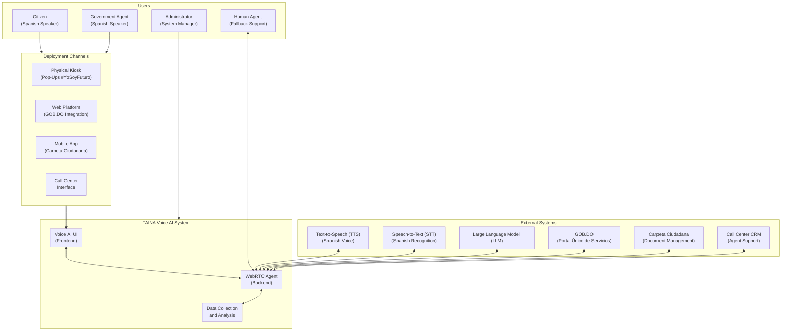
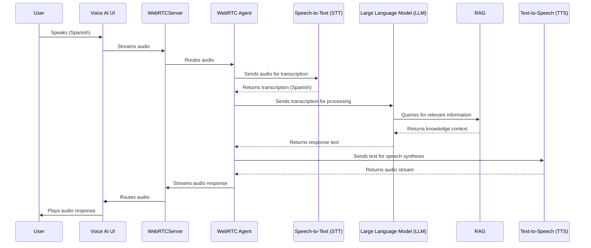
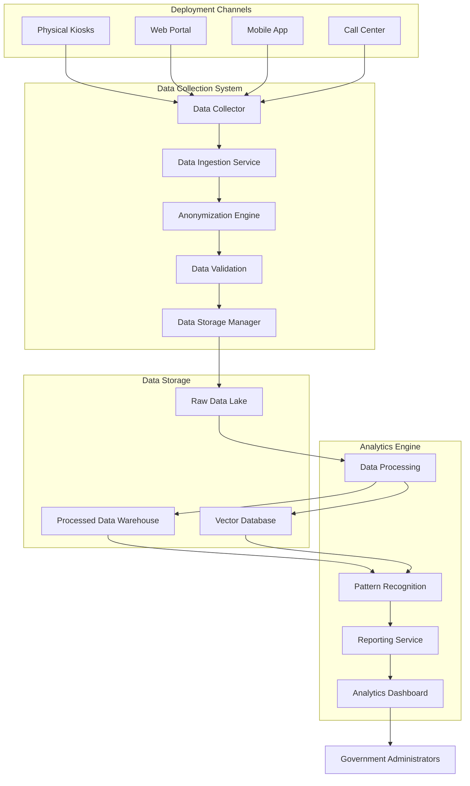

# TAINA: AI-Powered Citizen Interaction System for Government Services

## Transforming Public Service Delivery Through Intelligent Voice Assistance

**Authors:**
- GENIA
- [Conceptual Author 1]
- [Conceptual Author 2]
- José D'Andrade (Architect and Independent Developer)

## Executive Summary

The TAINA system represents a groundbreaking advancement in government service delivery, leveraging artificial intelligence to create a seamless, accessible, and efficient interface between citizens and government services. This whitepaper details the architecture, implementation, and benefits of the TAINA system, which forms the cornerstone of the "IA para la Ciudadanía" (AI for Citizenship) initiative in the Dominican Republic.

TAINA is designed as a multi-channel deployment system that provides consistent service across physical kiosks, web platforms, mobile applications, and call centers. By centralizing data collection and processing through these intelligent interaction points, TAINA not only assists citizens in accessing government services but also generates valuable insights to continuously improve service delivery.

## 1. Introduction

### 1.1 Background

The digital transformation of government services has become a priority for nations worldwide. Citizens increasingly expect the same level of service and convenience from government agencies that they receive from private sector organizations. However, the complexity of government services, combined with varying levels of digital literacy among citizens, creates significant challenges for digital government initiatives.

The Dominican Republic has embarked on an ambitious program called "IA para la Ciudadanía" to address these challenges by leveraging artificial intelligence to create more accessible, efficient, and personalized government services. TAINA (Tecnología de Asistencia Inteligente y Navegación Avanzada) is the technological implementation of this vision.

### 1.2 Vision and Objectives

TAINA is designed with the following objectives:

- **Accessibility**: Provide equal access to government services for all citizens, regardless of digital literacy or physical location
- **Efficiency**: Streamline service delivery and reduce the time and effort required to access government services
- **Personalization**: Deliver personalized service recommendations based on citizen needs and history
- **Data-Driven Improvement**: Collect and analyze interaction data to continuously improve government services
- **Multi-Channel Consistency**: Ensure a consistent experience across all interaction channels
- **Human-AI Collaboration**: Combine AI capabilities with human support for complex cases

### 1.3 Key Features

TAINA offers the following key features:

- **Natural Language Interaction**: Conversational interface in Spanish that understands Dominican dialect and expressions
- **Multi-Channel Deployment**: Consistent experience across physical kiosks, web, mobile, and call centers
- **Government Service Integration**: Seamless integration with existing government systems and services
- **Appointment Booking**: Ability to schedule appointments with government agencies
- **Document Management**: Access to citizen documents through secure integration
- **Data Collection and Analysis**: Robust data collection and analytics capabilities
- **Human Fallback**: Escalation to human agents for complex cases

## 2. System Architecture

TAINA employs a modern, scalable architecture designed to handle high volumes of citizen interactions while maintaining security, privacy, and performance.

### 2.1 High-Level Architecture

### 2.2 Component Architecture

TAINA consists of the following main components:

#### 2.2.1 Voice AI UI (Frontend)

The frontend component provides the user interface for citizens to interact with TAINA. It is built using Next.js and React, with a focus on accessibility and usability. The UI is entirely in Spanish, while the underlying code is in English for maintainability.

Key features of the Voice AI UI include:
- Real-time audio streaming using WebRTC
- Responsive design for different devices and screen sizes
- Accessibility features for users with disabilities
- Support for both voice and text input
- Visual feedback on system state (listening, processing, speaking)

#### 2.2.2 WebRTC Agent (Backend)

The backend component processes audio streams, manages conversations, and coordinates with external services. It is built using Python and FastAPI, with a focus on performance and scalability.

Key features of the WebRTC Agent include:
- Voice activity detection for natural conversation flow
- Speech-to-text processing for Spanish language
- Natural language understanding and generation
- Retrieval-augmented generation (RAG) for accurate responses
- Function calling for service integration
- Text-to-speech conversion with Dominican Spanish voice

#### 2.2.3 Knowledge Base

The knowledge base stores government service information, documents, and frequently asked questions in a vector format that enables semantic search. It is used by the WebRTC Agent to retrieve relevant information when responding to user queries.

Key features of the Knowledge Base include:
- Vector-based storage for semantic search
- Support for multiple document types and formats
- Metadata management for source attribution
- Regular updates from government service documentation

#### 2.2.4 Data Collection System

The data collection system securely captures citizen interaction data for analysis. It implements robust privacy and security measures to protect citizen information.

Key features of the Data Collection System include:
- Real-time data capture from all interaction channels
- Data anonymization and privacy protection
- Secure storage and access controls
- Compliance with data protection regulations

#### 2.2.5 Analytics Engine

The analytics engine processes collected data to generate insights and improve system performance. It employs machine learning techniques to identify patterns and trends in citizen interactions.

Key features of the Analytics Engine include:
- Descriptive analytics for usage patterns
- Diagnostic analytics for system performance
- Predictive analytics for service demand
- Prescriptive analytics for service improvement

### 2.3 Integration Architecture

TAINA integrates with several external systems to provide its functionality:

#### 2.3.1 Speech-to-Text Integration (STT)

TAINA uses Speech-to-Text (STT) technology for converting speech to text, with specific configuration for Spanish language recognition. The integration uses REST API calls with audio streaming for real-time transcription.

#### 2.3.2 Text-to-Speech Integration (TTS)

TAINA uses Text-to-Speech (TTS) technology for converting text to speech, with a custom Dominican Spanish voice. The integration uses REST API calls with streaming audio response for natural-sounding speech.

#### 2.3.3 Large Language Model Integration (LLM)

TAINA uses Large Language Model (LLM) technology for natural language understanding and generation. The integration uses REST API calls with function calling capabilities for service integration.

#### 2.3.4 Government Service Integration

TAINA integrates with government systems including GOB.DO (the government service portal), Carpeta Ciudadana (document management), and the Call Center CRM. These integrations enable TAINA to provide accurate information, access citizen documents, and coordinate with human agents.

## 3. Deployment Channels

TAINA is designed for deployment across multiple channels to maximize accessibility and reach.

### 3.1 Physical Kiosks (Pop-Ups #YoSoyFuturo)

Physical kiosks are deployed in high-traffic areas such as shopping centers and government offices. These kiosks provide touchscreen interfaces and voice interaction capabilities, allowing citizens to access government services without requiring personal devices.

Key features of the kiosk deployment include:
- Touchscreen interface with voice capability
- Privacy screens to protect sensitive information
- Accessibility features for users with disabilities
- Secure session management and data handling

### 3.2 Web Platform (GOB.DO Integration)

TAINA is integrated into the GOB.DO web portal, providing assistance to citizens as they navigate government services online. The web integration appears as a chat widget that can be expanded into a full conversation interface.

Key features of the web deployment include:
- Responsive design for different devices
- Persistent conversation state during navigation
- Integration with existing user accounts
- Support for both voice and text interaction

### 3.3 Mobile Application (Carpeta Ciudadana)

TAINA is integrated into the Carpeta Ciudadana mobile application, providing on-the-go assistance to citizens. The mobile integration leverages device capabilities such as microphone access and push notifications.

Key features of the mobile deployment include:
- Native mobile experience
- Background audio processing
- Push notifications for updates
- Integration with device contacts and calendar

### 3.4 Call Center Integration

TAINA is integrated into the government call center systems, providing assistance to human agents and directly to citizens. The call center integration enables seamless handoff between AI and human agents.

Key features of the call center deployment include:
- Agent assistance interface
- Citizen direct interaction
- Call recording and transcription
- Seamless escalation to human agents

## 4. Data Collection and Analysis

A core capability of TAINA is its robust data collection and analysis system, which enables continuous improvement of government services.

### 4.1 Data Collection Architecture

### 4.2 Types of Data Collected

TAINA collects the following types of data:

#### 4.2.1 Conversation Data

- Transcripts (anonymized)
- Intents and topics
- Sentiment analysis
- Entity recognition

#### 4.2.2 Interaction Data

- Session information
- Navigation paths
- Completion rates
- Escalation events
- Error events

#### 4.2.3 Service Data

- Service types requested
- Appointment scheduling metrics
- Document requests
- Geographic distribution of requests

### 4.3 Analytics Capabilities

TAINA's analytics engine provides the following capabilities:

#### 4.3.1 Descriptive Analytics

- Usage metrics and trends
- Performance metrics
- Service popularity
- Channel preferences

#### 4.3.2 Diagnostic Analytics

- Error analysis
- Escalation analysis
- Satisfaction analysis
- Bottleneck identification

#### 4.3.3 Predictive Analytics

- Demand forecasting
- Trend prediction
- Seasonal patterns
- Resource planning

#### 4.3.4 Prescriptive Analytics

- Service improvement recommendations
- Process optimization suggestions
- Content gap identification
- Training recommendations

## 5. Privacy and Security

TAINA implements robust privacy and security measures to protect citizen data and ensure compliance with regulations.

### 5.1 Privacy Measures

- Data anonymization at collection
- Consent management
- Data minimization
- Clear retention policies
- Access controls

### 5.2 Security Measures

- Encryption at rest and in transit
- Comprehensive access logging
- Secure storage
- Regular security audits
- Compliance with data protection regulations

## 6. Implementation and Testing

### 6.1 Development Approach

TAINA is developed using an agile methodology, with regular sprints and continuous integration/continuous deployment (CI/CD) practices. The development process includes:

- User-centered design
- Test-driven development
- Continuous integration
- Automated testing
- Regular user feedback

### 6.2 Testing Partnership

TAINA is tested in partnership with the University of the Caribbean (UNICARIBE), which provides a representative user group for system evaluation. The testing process includes:

- Usability testing
- Performance testing
- Security testing
- Accessibility testing
- User satisfaction surveys

## 7. Benefits and Impact

### 7.1 Citizen Benefits

- Improved access to government services
- Reduced wait times and bureaucracy
- Personalized service recommendations
- Multi-channel access options
- Enhanced user experience

### 7.2 Government Benefits

- Reduced administrative burden
- Data-driven service improvement
- Resource optimization
- Increased citizen satisfaction
- Enhanced digital government capabilities

### 7.3 Social Impact

- Digital inclusion
- Reduced barriers to government services
- Improved government transparency
- Enhanced citizen participation
- Support for vulnerable populations

## 8. Future Directions

TAINA is designed for continuous evolution and improvement. Future directions include:

- Enhanced personalization capabilities
- Expanded service integration
- Advanced analytics and prediction
- Biometric authentication
- Expanded deployment channels

## 9. Conclusion

TAINA represents a significant advancement in the digital transformation of government services. By combining artificial intelligence, voice interaction, and data analytics, TAINA creates a more accessible, efficient, and personalized government service experience for citizens.

The multi-channel deployment approach ensures that all citizens can benefit from TAINA, regardless of their digital literacy or access to technology. The robust data collection and analysis capabilities enable continuous improvement of government services based on actual citizen needs and behaviors.

As the cornerstone of the "IA para la Ciudadanía" initiative, TAINA demonstrates how artificial intelligence can be leveraged to create more responsive and citizen-centered government services. The system not only improves the efficiency of service delivery but also enhances the overall relationship between citizens and government.

## References

1. "AI for Citizenship: System Plan," Dominican Republic Government, 2025.
3. "Voice User Interface Design Best Practices," Nielsen Norman Group, 2023.
4. "Data Privacy in Government AI Systems," International Data Protection Authority, 2024.
5. "Multi-Channel Service Delivery in Digital Government," OECD Digital Government Studies, 2022.
