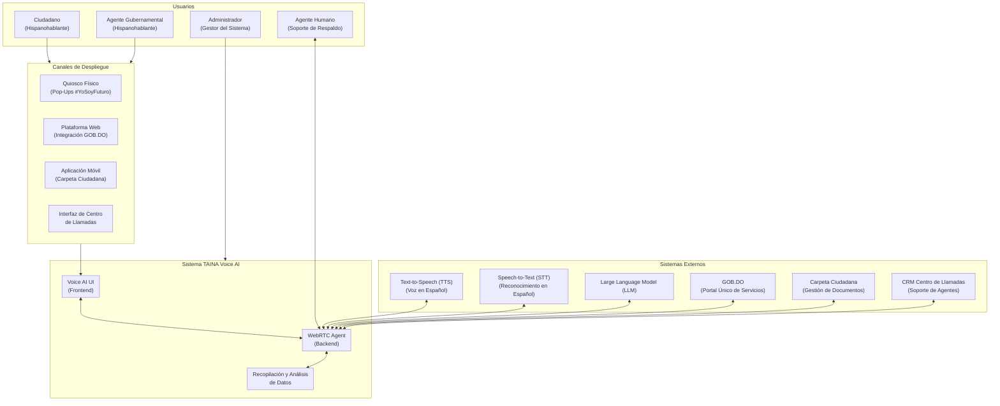
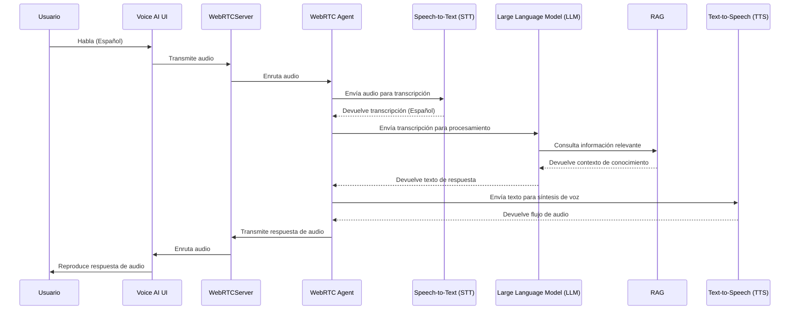
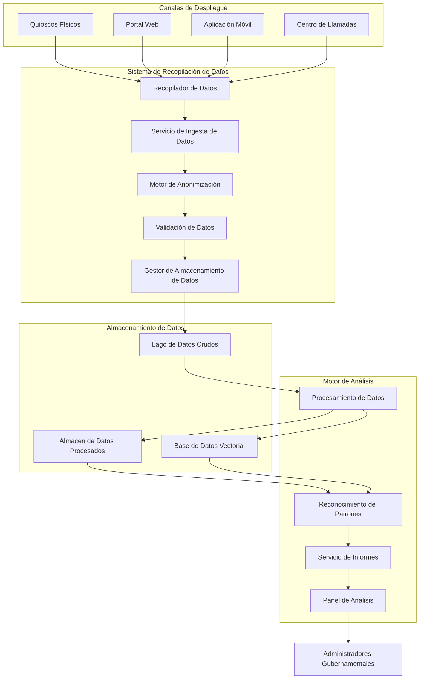

# TAINA: Sistema de Interacción Ciudadana Impulsado por IA para Servicios Gubernamentales

## Transformando la Prestación de Servicios Públicos a Través de Asistencia de Voz Inteligente

**Autores:**
- GENIA
- [Autor Conceptual 1]
- [Autor Conceptual 2]
- José D'Andrade (Arquitecto y Desarrollador Independiente)

## Resumen Ejecutivo

El sistema TAINA representa un avance revolucionario en la prestación de servicios gubernamentales, aprovechando la inteligencia artificial para crear una interfaz fluida, accesible y eficiente entre los ciudadanos y los servicios gubernamentales. Este documento técnico detalla la arquitectura, implementación y beneficios del sistema TAINA, que forma la piedra angular de la iniciativa "IA para la Ciudadanía" en la República Dominicana.

TAINA está diseñado como un sistema de despliegue multicanal que proporciona un servicio consistente a través de quioscos físicos, plataformas web, aplicaciones móviles y centros de llamadas. Al centralizar la recopilación y el procesamiento de datos a través de estos puntos de interacción inteligentes, TAINA no solo ayuda a los ciudadanos a acceder a los servicios gubernamentales, sino que también genera información valiosa para mejorar continuamente la prestación de servicios.

## 1. Introducción

### 1.1 Antecedentes

La transformación digital de los servicios gubernamentales se ha convertido en una prioridad para las naciones de todo el mundo. Los ciudadanos esperan cada vez más el mismo nivel de servicio y conveniencia de las agencias gubernamentales que reciben de las organizaciones del sector privado. Sin embargo, la complejidad de los servicios gubernamentales, combinada con los diversos niveles de alfabetización digital entre los ciudadanos, crea desafíos significativos para las iniciativas de gobierno digital.

La República Dominicana ha emprendido un ambicioso programa llamado "IA para la Ciudadanía" para abordar estos desafíos aprovechando la inteligencia artificial para crear servicios gubernamentales más accesibles, eficientes y personalizados. TAINA (Tecnología de Asistencia Inteligente y Navegación Avanzada) es la implementación tecnológica de esta visión.

### 1.2 Visión y Objetivos

TAINA está diseñado con los siguientes objetivos:

- **Accesibilidad**: Proporcionar acceso equitativo a los servicios gubernamentales para todos los ciudadanos, independientemente de su alfabetización digital o ubicación física
- **Eficiencia**: Agilizar la prestación de servicios y reducir el tiempo y esfuerzo necesarios para acceder a los servicios gubernamentales
- **Personalización**: Entregar recomendaciones de servicios personalizadas basadas en las necesidades e historial del ciudadano
- **Mejora Basada en Datos**: Recopilar y analizar datos de interacción para mejorar continuamente los servicios gubernamentales
- **Consistencia Multicanal**: Asegurar una experiencia consistente en todos los canales de interacción
- **Colaboración Humano-IA**: Combinar capacidades de IA con soporte humano para casos complejos

### 1.3 Características Principales

TAINA ofrece las siguientes características principales:

- **Interacción en Lenguaje Natural**: Interfaz conversacional en español que comprende el dialecto y expresiones dominicanas
- **Despliegue Multicanal**: Experiencia consistente a través de quioscos físicos, web, móvil y centros de llamadas
- **Integración de Servicios Gubernamentales**: Integración perfecta con sistemas y servicios gubernamentales existentes
- **Reserva de Citas**: Capacidad para programar citas con agencias gubernamentales
- **Gestión de Documentos**: Acceso a documentos ciudadanos a través de integración segura
- **Recopilación y Análisis de Datos**: Capacidades robustas de recopilación y análisis de datos
- **Respaldo Humano**: Escalamiento a agentes humanos para casos complejos

## 2. Arquitectura del Sistema

TAINA emplea una arquitectura moderna y escalable diseñada para manejar altos volúmenes de interacciones ciudadanas mientras mantiene la seguridad, privacidad y rendimiento.

### 2.1 Arquitectura de Alto Nivel

### 2.2 Arquitectura de Componentes

TAINA consta de los siguientes componentes principales:

#### 2.2.1 Voice AI UI (Frontend)

El componente frontend proporciona la interfaz de usuario para que los ciudadanos interactúen con TAINA. Está construido utilizando Next.js y React, con un enfoque en accesibilidad y usabilidad. La interfaz de usuario está completamente en español, mientras que el código subyacente está en inglés para facilitar el mantenimiento.

Características clave de Voice AI UI incluyen:
- Transmisión de audio en tiempo real utilizando WebRTC
- Diseño responsivo para diferentes dispositivos y tamaños de pantalla
- Características de accesibilidad para usuarios con discapacidades
- Soporte para entrada de voz y texto
- Retroalimentación visual sobre el estado del sistema (escuchando, procesando, hablando)

#### 2.2.2 WebRTC Agent (Backend)

El componente backend procesa flujos de audio, gestiona conversaciones y coordina con servicios externos. Está construido utilizando Python y FastAPI, con un enfoque en rendimiento y escalabilidad.

Características clave del WebRTC Agent incluyen:
- Detección de actividad de voz para un flujo de conversación natural
- Procesamiento de voz a texto para el idioma español
- Comprensión y generación de lenguaje natural
- Generación aumentada por recuperación (RAG) para respuestas precisas
- Llamada a funciones para integración de servicios
- Conversión de texto a voz con voz española dominicana

#### 2.2.3 Base de Conocimiento

La base de conocimiento almacena información de servicios gubernamentales, documentos y preguntas frecuentes en un formato vectorial que permite búsquedas semánticas. Es utilizada por el WebRTC Agent para recuperar información relevante al responder a consultas de usuarios.

Características clave de la Base de Conocimiento incluyen:
- Almacenamiento basado en vectores para búsqueda semántica
- Soporte para múltiples tipos y formatos de documentos
- Gestión de metadatos para atribución de fuentes
- Actualizaciones regulares desde la documentación de servicios gubernamentales

#### 2.2.4 Sistema de Recopilación de Datos

El sistema de recopilación de datos captura de forma segura los datos de interacción ciudadana para su análisis. Implementa medidas robustas de privacidad y seguridad para proteger la información ciudadana.

Características clave del Sistema de Recopilación de Datos incluyen:
- Captura de datos en tiempo real desde todos los canales de interacción
- Anonimización de datos y protección de privacidad
- Almacenamiento seguro y controles de acceso
- Cumplimiento con regulaciones de protección de datos

#### 2.2.5 Motor de Análisis

El motor de análisis procesa los datos recopilados para generar insights y mejorar el rendimiento del sistema. Emplea técnicas de aprendizaje automático para identificar patrones y tendencias en las interacciones ciudadanas.

Características clave del Motor de Análisis incluyen:
- Análisis descriptivo para patrones de uso
- Análisis diagnóstico para rendimiento del sistema
- Análisis predictivo para demanda de servicios
- Análisis prescriptivo para mejora de servicios

### 2.3 Arquitectura de Integración

TAINA se integra con varios sistemas externos para proporcionar su funcionalidad:

#### 2.3.1 Integración de Speech-to-Text (STT)

TAINA utiliza tecnología Speech-to-Text (STT) para convertir voz a texto, con configuración específica para reconocimiento del idioma español. La integración utiliza llamadas API REST con transmisión de audio para transcripción en tiempo real.

#### 2.3.2 Integración de Text-to-Speech (TTS)

TAINA utiliza tecnología Text-to-Speech (TTS) para convertir texto a voz, con una voz personalizada en español dominicano. La integración utiliza llamadas API REST con respuesta de audio en streaming para voz de sonido natural.

#### 2.3.3 Integración de Large Language Model (LLM)

TAINA utiliza tecnología Large Language Model (LLM) para comprensión y generación de lenguaje natural. La integración utiliza llamadas API REST con capacidades de llamada a funciones para integración de servicios.

#### 2.3.4 Integración de Servicios Gubernamentales

TAINA se integra con sistemas gubernamentales incluyendo GOB.DO (el portal de servicios gubernamentales), Carpeta Ciudadana (gestión de documentos) y el CRM del Centro de Llamadas. Estas integraciones permiten a TAINA proporcionar información precisa, acceder a documentos ciudadanos y coordinar con agentes humanos.

## 3. Canales de Despliegue

TAINA está diseñado para despliegue a través de múltiples canales para maximizar la accesibilidad y alcance.

### 3.1 Quioscos Físicos (Pop-Ups #YoSoyFuturo)

Los quioscos físicos se despliegan en áreas de alto tráfico como centros comerciales y oficinas gubernamentales. Estos quioscos proporcionan interfaces de pantalla táctil y capacidades de interacción por voz, permitiendo a los ciudadanos acceder a servicios gubernamentales sin requerir dispositivos personales.

Características clave del despliegue en quioscos incluyen:
- Interfaz de pantalla táctil con capacidad de voz
- Pantallas de privacidad para proteger información sensible
- Características de accesibilidad para usuarios con discapacidades
- Gestión segura de sesiones y manejo de datos

### 3.2 Plataforma Web (Integración GOB.DO)

TAINA está integrado en el portal web GOB.DO, proporcionando asistencia a los ciudadanos mientras navegan por los servicios gubernamentales en línea. La integración web aparece como un widget de chat que puede expandirse a una interfaz de conversación completa.

Características clave del despliegue web incluyen:
- Diseño responsivo para diferentes dispositivos
- Estado de conversación persistente durante la navegación
- Integración con cuentas de usuario existentes
- Soporte para interacción por voz y texto

### 3.3 Aplicación Móvil (Carpeta Ciudadana)

TAINA está integrado en la aplicación móvil Carpeta Ciudadana, proporcionando asistencia en movimiento a los ciudadanos. La integración móvil aprovecha las capacidades del dispositivo como acceso al micrófono y notificaciones push.

Características clave del despliegue móvil incluyen:
- Experiencia móvil nativa
- Procesamiento de audio en segundo plano
- Notificaciones push para actualizaciones
- Integración con contactos y calendario del dispositivo

### 3.4 Integración con Centro de Llamadas

TAINA está integrado en los sistemas de centro de llamadas gubernamentales, proporcionando asistencia a agentes humanos y directamente a ciudadanos. La integración con el centro de llamadas permite una transferencia perfecta entre agentes de IA y humanos.

Características clave del despliegue en centro de llamadas incluyen:
- Interfaz de asistencia para agentes
- Interacción directa con ciudadanos
- Grabación y transcripción de llamadas
- Escalamiento sin problemas a agentes humanos

## 4. Recopilación y Análisis de Datos

Una capacidad central de TAINA es su robusto sistema de recopilación y análisis de datos, que permite la mejora continua de los servicios gubernamentales.

### 4.1 Arquitectura de Recopilación de Datos

### 4.2 Tipos de Datos Recopilados

TAINA recopila los siguientes tipos de datos:

#### 4.2.1 Datos de Conversación

- Transcripciones (anonimizadas)
- Intenciones y temas
- Análisis de sentimiento
- Reconocimiento de entidades

#### 4.2.2 Datos de Interacción

- Información de sesión
- Rutas de navegación
- Tasas de finalización
- Eventos de escalamiento
- Eventos de error

#### 4.2.3 Datos de Servicio

- Tipos de servicios solicitados
- Métricas de programación de citas
- Solicitudes de documentos
- Distribución geográfica de solicitudes

### 4.3 Capacidades Analíticas

El motor de análisis de TAINA proporciona las siguientes capacidades:

#### 4.3.1 Análisis Descriptivo

- Métricas y tendencias de uso
- Métricas de rendimiento
- Popularidad de servicios
- Preferencias de canal

#### 4.3.2 Análisis Diagnóstico

- Análisis de errores
- Análisis de escalamiento
- Análisis de satisfacción
- Identificación de cuellos de botella

#### 4.3.3 Análisis Predictivo

- Previsión de demanda
- Predicción de tendencias
- Patrones estacionales
- Planificación de recursos

#### 4.3.4 Análisis Prescriptivo

- Recomendaciones de mejora de servicios
- Sugerencias de optimización de procesos
- Identificación de brechas de contenido
- Recomendaciones de capacitación

## 5. Privacidad y Seguridad

TAINA implementa medidas robustas de privacidad y seguridad para proteger los datos ciudadanos y asegurar el cumplimiento de regulaciones.

### 5.1 Medidas de Privacidad

- Anonimización de datos en la recopilación
- Gestión de consentimiento
- Minimización de datos
- Políticas claras de retención
- Controles de acceso

### 5.2 Medidas de Seguridad

- Cifrado en reposo y en tránsito
- Registro completo de accesos
- Almacenamiento seguro
- Auditorías de seguridad regulares
- Cumplimiento con regulaciones de protección de datos

## 6. Implementación y Pruebas

### 6.1 Enfoque de Desarrollo

TAINA se desarrolla utilizando una metodología ágil, con sprints regulares y prácticas de integración continua/despliegue continuo (CI/CD). El proceso de desarrollo incluye:

- Diseño centrado en el usuario
- Desarrollo guiado por pruebas
- Integración continua
- Pruebas automatizadas
- Retroalimentación regular de usuarios

### 6.2 Asociación de Pruebas

TAINA se prueba en asociación con la Universidad del Caribe (UNICARIBE), que proporciona un grupo de usuarios representativo para la evaluación del sistema. El proceso de pruebas incluye:

- Pruebas de usabilidad
- Pruebas de rendimiento
- Pruebas de seguridad
- Pruebas de accesibilidad
- Encuestas de satisfacción de usuarios

## 7. Beneficios e Impacto

### 7.1 Beneficios para el Ciudadano

- Mejor acceso a servicios gubernamentales
- Reducción de tiempos de espera y burocracia
- Recomendaciones de servicios personalizadas
- Opciones de acceso multicanal
- Experiencia de usuario mejorada

### 7.2 Beneficios para el Gobierno

- Reducción de carga administrativa
- Mejora de servicios basada en datos
- Optimización de recursos
- Mayor satisfacción ciudadana
- Capacidades mejoradas de gobierno digital

### 7.3 Impacto Social

- Inclusión digital
- Reducción de barreras a servicios gubernamentales
- Mejora de transparencia gubernamental
- Mayor participación ciudadana
- Apoyo a poblaciones vulnerables

## 8. Direcciones Futuras

TAINA está diseñado para evolución y mejora continuas. Las direcciones futuras incluyen:

- Capacidades mejoradas de personalización
- Integración de servicios expandida
- Análisis avanzado y predicción
- Autenticación biométrica
- Canales de despliegue expandidos

## 9. Conclusión

TAINA representa un avance significativo en la transformación digital de los servicios gubernamentales. Al combinar inteligencia artificial, interacción por voz y análisis de datos, TAINA crea una experiencia de servicio gubernamental más accesible, eficiente y personalizada para los ciudadanos.

El enfoque de despliegue multicanal asegura que todos los ciudadanos puedan beneficiarse de TAINA, independientemente de su alfabetización digital o acceso a tecnología. Las robustas capacidades de recopilación y análisis de datos permiten la mejora continua de los servicios gubernamentales basada en las necesidades y comportamientos reales de los ciudadanos.

Como piedra angular de la iniciativa "IA para la Ciudadanía", TAINA demuestra cómo la inteligencia artificial puede ser aprovechada para crear servicios gubernamentales más receptivos y centrados en el ciudadano. El sistema no solo mejora la eficiencia de la prestación de servicios, sino que también mejora la relación general entre los ciudadanos y el gobierno.

## Referencias

1. "IA para la Ciudadanía: Plan del Sistema," Gobierno de la República Dominicana, 2025.
3. "Mejores Prácticas de Diseño de Interfaces de Usuario de Voz," Nielsen Norman Group, 2023.
4. "Privacidad de Datos en Sistemas de IA Gubernamentales," Autoridad Internacional de Protección de Datos, 2024.
5. "Prestación de Servicios Multicanal en Gobierno Digital," Estudios de Gobierno Digital de la OCDE, 2022.
