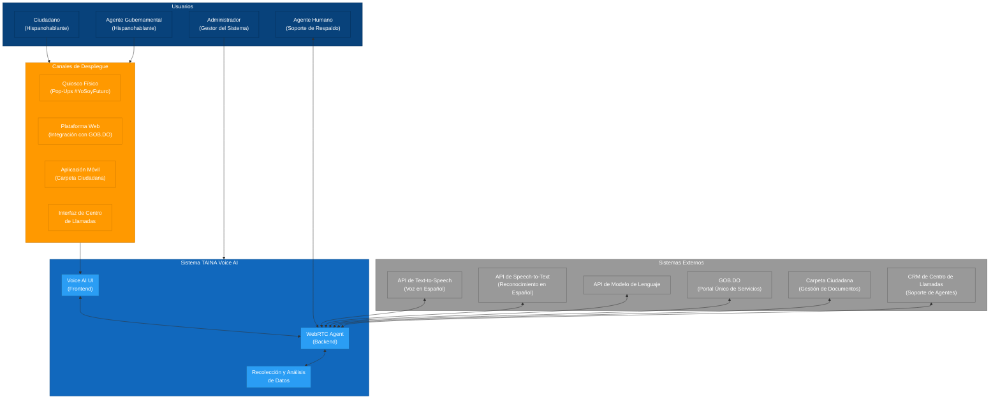

# 2.1 Diagrama de Contexto

## Visión General

Este documento presenta el Diagrama de Contexto para el sistema TAINA Voice AI, siguiendo el modelo C4 para visualizar la arquitectura de software. El Diagrama de Contexto proporciona una vista de alto nivel del sistema y sus interacciones con usuarios y sistemas externos.

## Diagrama

## Componentes

### Usuarios

1. **Ciudadano (Hispanohablante)**
   - Ciudadano regular que busca servicios gubernamentales
   - Interactúa con TAINA para acceder a servicios e información gubernamental
   - Se comunica en español

2. **Agente Gubernamental (Hispanohablante)**
   - Miembro del personal que asiste a los ciudadanos
   - Utiliza el sistema para ayudar a los ciudadanos a navegar por los servicios gubernamentales
   - Se comunica en español

3. **Administrador (Gestor del Sistema)**
   - Personal técnico responsable de la gestión del sistema
   - Configura y monitorea el sistema TAINA
   - Gestiona la base de conocimientos y la configuración del sistema

4. **Agente Humano (Soporte de Respaldo)**
   - Agente humano que proporciona soporte para casos complejos
   - Recibe escalaciones del sistema de IA
   - Proporciona asistencia especializada a los ciudadanos

### Sistema TAINA Voice AI

1. **Voice AI UI (Frontend)**
   - Interfaz de usuario basada en web
   - Proporciona interfaz conversacional en español
   - Captura entrada de audio y reproduce salida de audio
   - Muestra transcripciones de conversaciones e información de servicios

2. **WebRTC Agent (Backend)**
   - Procesa audio y gestiona conversaciones
   - Se integra con APIs externas para procesamiento de voz y lenguaje
   - Recupera información de la base de conocimientos
   - Maneja la lógica de negocio y la ejecución de funciones

3. **Recolección y Análisis de Datos**
   - Recolecta y analiza datos de interacción
   - Identifica patrones y tendencias en las necesidades de los ciudadanos
   - Genera insights para la mejora de servicios
   - Proporciona recomendaciones basadas en datos

### Sistemas Externos

1. **API de Text-to-Speech (Voz en Español)**
   - Convierte texto a voz natural en español
   - Soporta acento español dominicano
   - Proporciona salida de voz para la conversación

2. **API de Speech-to-Text (Reconocimiento en Español)**
   - Convierte voz en español a texto
   - Maneja varios dialectos y acentos del español
   - Proporciona transcripción en tiempo real

3. **API de Modelo de Lenguaje**
   - Procesa comprensión y generación de lenguaje natural
   - Maneja contexto de conversación y reconocimiento de intención
   - Genera respuestas apropiadas basadas en consultas ciudadanas

4. **GOB.DO (Portal Único de Servicios)**
   - Portal de servicios gubernamentales
   - Proporciona información sobre servicios gubernamentales
   - Ofrece registro y seguimiento de servicios

5. **Carpeta Ciudadana (Gestión de Documentos)**
   - Sistema de gestión de documentos ciudadanos
   - Almacena y recupera documentos ciudadanos
   - Proporciona acceso seguro a documentos

6. **CRM de Centro de Llamadas (Soporte de Agentes)**
   - Sistema de gestión de relaciones con clientes del centro de llamadas
   - Gestiona asignaciones de agentes del centro de llamadas
   - Rastrea interacciones ciudadanas e historial de casos

### Canales de Despliegue

1. **Quiosco Físico (Pop-Ups #YoSoyFuturo)**
   - Instalación física en oficinas gubernamentales y espacios públicos
   - Proporciona interfaz táctil y de voz
   - Ofrece acceso directo a TAINA en ubicaciones públicas

2. **Plataforma Web (Integración con GOB.DO)**
   - Integración con portal web gubernamental
   - Proporciona acceso basado en navegador a TAINA
   - Ofrece experiencia fluida con servicios gubernamentales existentes

3. **Aplicación Móvil (Carpeta Ciudadana)**
   - Integración con aplicación móvil gubernamental
   - Proporciona acceso a TAINA en movimiento
   - Ofrece interfaz optimizada para móviles

4. **Interfaz de Centro de Llamadas**
   - Integración con sistemas de centro de llamadas
   - Proporciona interfaz de asistencia para agentes
   - Ofrece soporte con humano en el ciclo

## Insights Clave

1. **Despliegue Multicanal**
   - TAINA está diseñado para despliegue a través de múltiples canales
   - Experiencia consistente en quioscos físicos, web, móvil y centros de llamadas
   - Se adapta a diferentes contextos de interacción y capacidades de dispositivos

2. **Integración de Servicios Gubernamentales**
   - Integración profunda con sistemas gubernamentales existentes
   - Acceso fluido a información de servicios gubernamentales
   - Recuperación y envío seguro de documentos

3. **Insights Basados en Datos**
   - Recolección y análisis de datos de interacción ciudadana
   - Reconocimiento de patrones para mejora de servicios
   - Aprendizaje y optimización continuos

4. **Colaboración Humano-IA**
   - Escalación fluida a agentes humanos cuando sea necesario
   - Preservación de contexto durante transferencias
   - Aumento de capacidades de agentes humanos

5. **Accesibilidad e Inclusión**
   - Diseño con prioridad en español para ciudadanos dominicanos
   - Soporte para varios dialectos y acentos del español
   - Múltiples puntos de acceso para garantizar amplia accesibilidad
