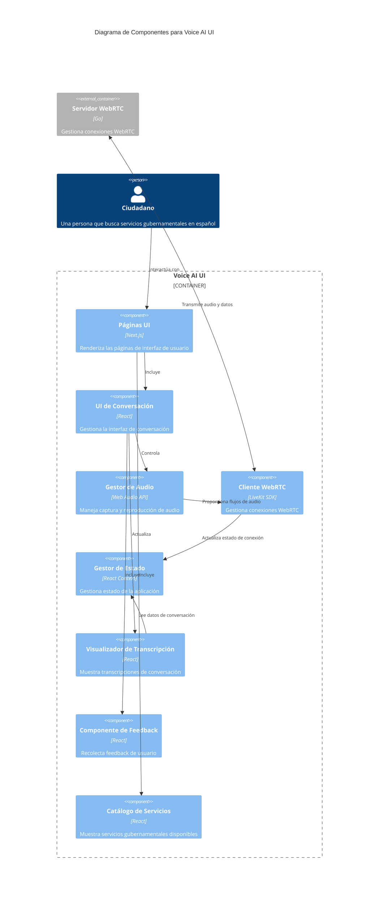
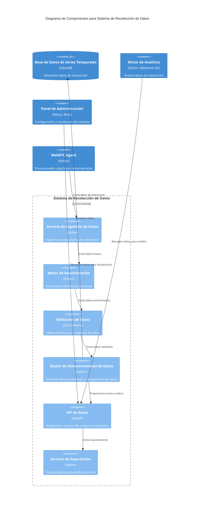
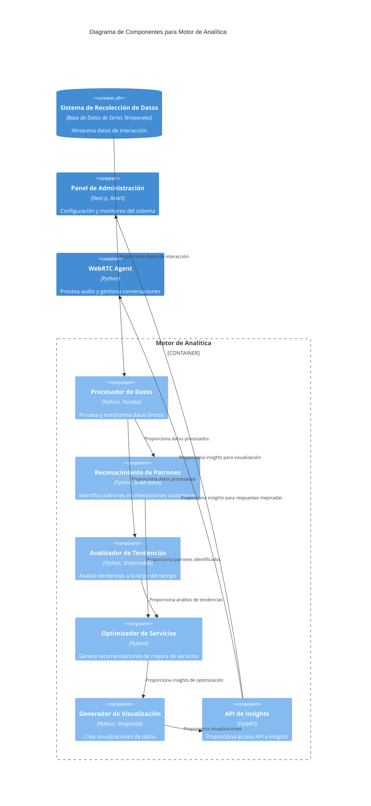

# 2.3 Diagrama de Componentes

## Visión General

Este documento presenta el Diagrama de Componentes para el sistema TAINA Voice AI, siguiendo el modelo C4 para visualizar la arquitectura de software. Mientras que el [Diagrama de Contenedores](./2.2_Container_Diagram.md) muestra los contenedores técnicos de alto nivel, este Diagrama de Componentes profundiza aún más para mostrar los componentes internos dentro de cada contenedor y cómo interactúan.

## Diagramas de Componentes

### Componentes del WebRTC Agent

```mermaid
C4Component
    title Diagrama de Componentes para WebRTC Agent

    Container_Boundary(webrtc_agent, "WebRTC Agent") {
        Component(api_server, "Servidor API", "FastAPI", "Proporciona endpoints API REST para configuración y monitoreo")
        Component(webrtc_server, "Servidor WebRTC", "LiveKit SDK", "Gestiona conexiones WebRTC y streaming de audio")
        Component(vad_processor, "Detector de Actividad de Voz", "Silero VAD", "Detecta habla en flujos de audio")
        Component(stt_service, "Servicio de Speech-to-Text", "Cliente Deepgram", "Convierte voz a texto")
        Component(tts_service, "Servicio de Text-to-Speech", "Cliente ElevenLabs", "Convierte texto a voz")
        Component(llm_service, "Servicio de Modelo de Lenguaje", "Cliente OpenAI", "Procesa lenguaje natural")
        Component(rag_engine, "Motor RAG", "LlamaIndex", "Recupera información relevante de la base de conocimiento")
        Component(conversation_manager, "Gestor de Conversación", "Python", "Gestiona estado y contexto de conversación")
        Component(function_handler, "Manejador de Funciones", "Python", "Maneja funciones especializadas como reserva de citas")
        Component(data_collector, "Recolector de Datos", "Python", "Recolecta datos de interacción para análisis")
    }

    ContainerDb(knowledge_base, "Base de Conocimiento", "Base de Datos Vectorial", "Almacena información de servicios gubernamentales")
    Container_Ext(webrtc_server_ext, "Servidor WebRTC", "Go", "Gestiona conexiones WebRTC")
    System_Ext(elevenlabs, "API de Text-to-Speech", "Servicio de Text-to-Speech")
    System_Ext(deepgram, "API de Speech-to-Text", "Servicio de Speech-to-Text")
    System_Ext(llm_api, "API de Modelo de Lenguaje", "Modelo de Lenguaje Grande")
    System_Ext(gobdo, "API de GOB.DO", "Portal de servicios gubernamentales")
    System_Ext(carpeta, "API de Carpeta Ciudadana", "Gestión de documentos ciudadanos")
    ContainerDb(data_collection, "Sistema de Recolección de Datos", "Base de Datos de Series Temporales", "Almacena datos de interacción")

    %% Relaciones internas
    Rel(api_server, conversation_manager, "Configura y monitorea")
    Rel(webrtc_server, vad_processor, "Envía fragmentos de audio")
    Rel(vad_processor, stt_service, "Envía segmentos de habla")
    Rel(stt_service, conversation_manager, "Proporciona transcripciones")
    Rel(conversation_manager, llm_service, "Envía consultas de usuario")
    Rel(llm_service, rag_engine, "Solicita información relevante")
    Rel(rag_engine, knowledge_base, "Consulta documentos")
    Rel(llm_service, function_handler, "Delega llamadas a funciones")
    Rel(conversation_manager, tts_service, "Envía texto de respuesta")
    Rel(tts_service, webrtc_server, "Proporciona respuesta de audio")
    Rel(conversation_manager, data_collector, "Envía datos de interacción")
    Rel(data_collector, data_collection, "Almacena datos")

    %% Relaciones externas
    BiRel(webrtc_server, webrtc_server_ext, "Transmite audio y datos")
    Rel(stt_service, deepgram, "Envía audio para transcripción")
    Rel(tts_service, elevenlabs, "Envía texto para síntesis de voz")
    Rel(llm_service, llm_api, "Envía prompts para procesamiento")
    Rel(function_handler, gobdo, "Recupera información de servicios")
    Rel(function_handler, carpeta, "Accede a documentos ciudadanos")
```

### Componentes de Voice AI UI

### Componentes del Sistema de Recolección de Datos

### Componentes del Motor de Analítica

## Descripciones de Componentes

### Componentes del WebRTC Agent

#### 1. Servidor API
**Tecnología**: FastAPI
**Descripción**: Proporciona endpoints API REST para configuración, monitoreo y gestión del WebRTC Agent.
**Responsabilidades**:
- Exponer endpoints de configuración
- Proporcionar monitoreo y métricas
- Manejar solicitudes administrativas
- Autenticar solicitudes API

#### 2. Servidor WebRTC
**Tecnología**: LiveKit SDK
**Descripción**: Gestiona conexiones WebRTC y streaming de audio con el frontend.
**Responsabilidades**:
- Conectar al servidor LiveKit
- Unirse a salas de conversación
- Manejar flujos de audio
- Gestionar canales de datos

#### 3. Detector de Actividad de Voz
**Tecnología**: Silero VAD
**Descripción**: Detecta habla en flujos de audio para determinar cuándo un usuario está hablando.
**Responsabilidades**:
- Procesar fragmentos de audio
- Identificar segmentos de habla
- Filtrar silencio y ruido de fondo
- Activar pipeline de procesamiento de habla

#### 4. Servicio de Speech-to-Text
**Tecnología**: Cliente Deepgram
**Descripción**: Convierte voz a texto usando la API de Deepgram.
**Responsabilidades**:
- Enviar audio a la API de Deepgram
- Procesar resultados de transcripción
- Manejar resultados intermedios y finales
- Configurar ajustes de idioma (español)

#### 5. Servicio de Text-to-Speech
**Tecnología**: Cliente ElevenLabs
**Descripción**: Convierte texto a voz usando la API de ElevenLabs.
**Responsabilidades**:
- Enviar texto a la API de ElevenLabs
- Transmitir respuesta de audio
- Configurar ajustes de voz (español dominicano)
- Manejar errores de TTS y alternativas

#### 6. Servicio de Modelo de Lenguaje
**Tecnología**: Cliente OpenAI
**Descripción**: Procesa lenguaje natural usando la API de OpenAI.
**Responsabilidades**:
- Preparar contexto de conversación
- Enviar prompts a la API de OpenAI
- Procesar respuestas
- Manejar llamadas a funciones
- Gestionar prompts del sistema

#### 7. Motor RAG
**Tecnología**: LlamaIndex
**Descripción**: Recupera información relevante de la base de conocimiento para mejorar respuestas.
**Responsabilidades**:
- Generar embeddings de consulta
- Buscar en base de datos vectorial
- Formatear documentos recuperados como contexto
- Proporcionar citas y fuentes

#### 8. Gestor de Conversación
**Tecnología**: Python
**Descripción**: Gestiona estado y contexto de conversación a lo largo de la interacción.
**Responsabilidades**:
- Rastrear historial de conversación
- Mantener contexto de usuario
- Coordinar interacciones de componentes
- Manejar flujo de conversación
- Gestionar tiempos de espera y estados de error

#### 9. Manejador de Funciones
**Tecnología**: Python
**Descripción**: Maneja funciones especializadas como reserva de citas.
**Responsabilidades**:
- Analizar parámetros de llamada a función
- Ejecutar lógica de función
- Integrarse con sistemas externos
- Manejar errores de función
- Formatear resultados de función

#### 10. Recolector de Datos
**Tecnología**: Python
**Descripción**: Recolecta datos de interacción para análisis y mejora.
**Responsabilidades**:
- Capturar datos de conversación
- Extraer métricas relevantes
- Anonimizar información personal
- Formatear datos para almacenamiento
- Enviar datos al Sistema de Recolección de Datos

### Componentes del Sistema de Recolección de Datos

#### 1. Servicio de Ingestión de Datos
**Tecnología**: Python
**Descripción**: Ingiere y procesa datos de interacción de varias fuentes.
**Responsabilidades**:
- Recibir datos del WebRTC Agent
- Procesar flujos de datos entrantes
- Manejar procesamiento por lotes de datos
- Asegurar fiabilidad de datos
- Gestionar colas de ingestión

#### 2. Motor de Anonimización
**Tecnología**: Python
**Descripción**: Anonimiza información personal para asegurar cumplimiento de privacidad.
**Responsabilidades**:
- Detectar información personal identificable (PII)
- Aplicar técnicas de anonimización
- Mantener anonimización consistente
- Registrar actividades de anonimización
- Asegurar cumplimiento con GDPR

#### 3. Validación de Datos
**Tecnología**: JSON Schema
**Descripción**: Valida estructura y contenido de datos antes del almacenamiento.
**Responsabilidades**:
- Validar esquema de datos
- Verificar integridad de datos
- Identificar campos faltantes
- Manejar errores de validación
- Asegurar calidad de datos

#### 4. Gestor de Almacenamiento de Datos
**Tecnología**: Python
**Descripción**: Gestiona operaciones de almacenamiento y recuperación de datos.
**Responsabilidades**:
- Escribir datos en base de datos de series temporales
- Optimizar almacenamiento de datos
- Manejar políticas de retención de datos
- Gestionar particionamiento de datos
- Asegurar respaldo de datos

#### 5. API de Datos
**Tecnología**: FastAPI
**Descripción**: Proporciona acceso API a datos recolectados para analítica y reportes.
**Responsabilidades**:
- Exponer endpoints de consulta de datos
- Implementar filtrado de datos
- Manejar autenticación y autorización
- Limitar tasa de acceso API
- Documentar endpoints API

#### 6. Servicio de Exportación
**Tecnología**: Python
**Descripción**: Exporta datos para análisis y reportes externos.
**Responsabilidades**:
- Generar exportaciones de datos en varios formatos
- Programar exportaciones regulares
- Implementar filtros de exportación
- Asegurar datos exportados
- Rastrear actividades de exportación

### Componentes del Motor de Analítica

#### 1. Procesador de Datos
**Tecnología**: Python, Pandas
**Descripción**: Procesa y transforma datos brutos para análisis.
**Responsabilidades**:
- Limpiar y normalizar datos
- Transformar estructuras de datos
- Manejar valores faltantes
- Ingeniería de características
- Preparar datos para análisis

#### 2. Reconocimiento de Patrones
**Tecnología**: Python, Scikit-learn
**Descripción**: Identifica patrones en interacciones ciudadanas.
**Responsabilidades**:
- Aplicar algoritmos de aprendizaje automático
- Detectar patrones comunes de interacción
- Identificar patrones de uso de servicios
- Agrupar interacciones similares
- Generar informes de patrones

#### 3. Analizador de Tendencias
**Tecnología**: Python, Statsmodels
**Descripción**: Analiza tendencias en uso de servicios y necesidades ciudadanas a lo largo del tiempo.
**Responsabilidades**:
- Realizar análisis de series temporales
- Detectar patrones estacionales
- Identificar tendencias emergentes
- Pronosticar necesidades futuras
- Generar informes de tendencias

#### 4. Optimizador de Servicios
**Tecnología**: Python
**Descripción**: Genera recomendaciones para mejoras de servicios.
**Responsabilidades**:
- Analizar rendimiento de servicios
- Identificar cuellos de botella
- Generar sugerencias de optimización
- Priorizar áreas de mejora
- Crear recomendaciones de acción

#### 5. Generador de Visualización
**Tecnología**: Python, Matplotlib
**Descripción**: Crea visualizaciones de datos para comunicación de insights.
**Responsabilidades**:
- Generar gráficos y diagramas
- Crear visualizaciones interactivas
- Formatear datos para presentación
- Soportar múltiples tipos de visualización
- Personalizar estilos de visualización

#### 6. API de Insights
**Tecnología**: FastAPI
**Descripción**: Proporciona acceso API a insights y recomendaciones.
**Responsabilidades**:
- Exponer endpoints de insights
- Entregar recomendaciones
- Soportar integración con dashboard
- Manejar autenticación
- Documentar endpoints API

## Interacciones Clave

### Flujo de Procesamiento de Voz

1. El Servidor WebRTC recibe flujo de audio desde LiveKit
2. Los fragmentos de audio se pasan al Detector de Actividad de Voz
3. Cuando se detecta habla, los segmentos de audio se envían al Servicio de Speech-to-Text
4. El Servicio de Speech-to-Text envía audio a la API de Deepgram
5. Los resultados de transcripción se pasan al Gestor de Conversación
6. El Gestor de Conversación actualiza el estado de conversación
7. La transcripción se envía al Servicio de Modelo de Lenguaje para procesamiento

### Flujo de Generación de Respuesta

1. El Servicio de Modelo de Lenguaje recibe transcripción del Gestor de Conversación
2. Si es necesario, el Servicio de Modelo de Lenguaje solicita información del Motor RAG
3. El Motor RAG consulta la Base de Conocimiento para documentos relevantes
4. El Servicio de Modelo de Lenguaje envía prompt con contexto a la API de OpenAI
5. La respuesta de OpenAI es procesada por el Servicio de Modelo de Lenguaje
6. Si se detecta llamada a función, la solicitud se reenvía al Manejador de Funciones
7. La respuesta final se envía al Gestor de Conversación
8. El Gestor de Conversación envía respuesta al Servicio de Text-to-Speech
9. El Servicio de Text-to-Speech convierte texto a voz usando la API de ElevenLabs
10. La respuesta de audio se transmite de vuelta a través del Servidor WebRTC al cliente

## Consideraciones de Implementación

### Optimización de Rendimiento

- **Respuestas en Streaming**: Tanto STT como TTS usan streaming para reducir latencia
- **VAD Eficiente**: La Detección de Actividad de Voz está optimizada para minimizar retraso de procesamiento
- **Caché**: El conocimiento frecuentemente accedido se almacena en caché para reducir consultas a base de datos
- **Procesamiento Paralelo**: Los componentes independientes operan concurrentemente cuando es posible

### Manejo de Errores

- **Degradación Elegante**: El sistema puede recurrir a modos más simples si los componentes fallan
- **Lógica de Reintento**: Las llamadas API críticas implementan backoff exponencial y reintento
- **Rutas Alternativas**: Múltiples variantes de implementación para funciones centrales
- **Feedback de Usuario**: Mensajes de error claros y opciones de recuperación en la UI

### Seguridad

- **Gestión de Claves API**: Almacenamiento seguro y rotación de claves API externas
- **Validación de Entrada**: Todas las entradas de usuario son validadas antes del procesamiento
- **Autenticación**: Autenticación basada en JWT para todos los endpoints API
- **WebRTC Seguro**: Flujos de medios encriptados y señalización segura

## Próximos Pasos

Para información sobre cómo estos componentes se despliegan a través de la infraestructura, consulte el documento [Diagrama de Despliegue](./2.4_Deployment_Diagram.md).

Para detalles sobre cómo el sistema se integra con servicios externos, consulte el documento [Integración de Sistema](../integration/2.5_System_Integration.md).
