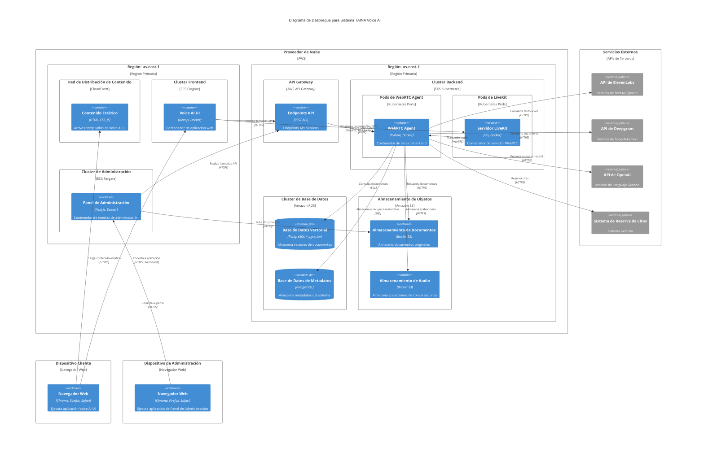

# 2.4 Diagrama de Despliegue

## Visión General

Este documento presenta el Diagrama de Despliegue para el sistema TAINA Voice AI, completando la serie del modelo C4 para visualizar la arquitectura de software. El Diagrama de Despliegue muestra cómo los componentes de software se despliegan a través de los elementos de infraestructura en el entorno de producción.

## Diagrama de Despliegue

## Diagrama de Despliegue Simplificado

Para aquellos que prefieren una visualización más simple, aquí hay una representación alternativa de la misma arquitectura de despliegue:

```mermaid
graph TD
    subgraph cloud["Proveedor de Nube (AWS)"]
        subgraph frontend_region["Región: us-east-1 (Frontend)"]
            cdn[Red de Distribución de Contenido<br>CloudFront]
            frontend_cluster[Cluster Frontend<br>ECS Fargate]
            admin_cluster[Cluster de Administración<br>ECS Fargate]
            
            static_content[Contenido Estático<br>HTML, CSS, JS]
            voiceai_ui[Voice AI UI<br>Next.js, Docker]
            admin_dashboard[Panel de Administración<br>Next.js, Docker]
            
            cdn --- static_content
            frontend_cluster --- voiceai_ui
            admin_cluster --- admin_dashboard
        end
        
        subgraph backend_region["Región: us-east-1 (Backend)"]
            api_gateway[API Gateway<br>AWS API Gateway]
            backend_cluster[Cluster Backend<br>EKS Kubernetes]
            database_cluster[Cluster de Base de Datos<br>Amazon RDS]
            storage[Almacenamiento de Objetos<br>Amazon S3]
            
            api_endpoints[Endpoints API<br>REST API]
            webrtc_agent[WebRTC Agent<br>Python, Docker]
            livekit_server[Servidor LiveKit<br>Go, Docker]
            vector_db[(Base de Datos Vectorial<br>PostgreSQL + pgvector)]
            metadata_db[(Base de Datos de Metadatos<br>PostgreSQL)]
            document_storage[Almacenamiento de Documentos<br>Bucket S3]
            audio_storage[Almacenamiento de Audio<br>Bucket S3]
            
            api_gateway --- api_endpoints
            backend_cluster --- webrtc_agent
            backend_cluster --- livekit_server
            database_cluster --- vector_db
            database_cluster --- metadata_db
            storage --- document_storage
            storage --- audio_storage
        end
    end
    
    subgraph external_services["Servicios Externos"]
        elevenlabs[API de ElevenLabs<br>Text-to-Speech]
        deepgram[API de Deepgram<br>Speech-to-Text]
        openai[API de OpenAI<br>Modelo de Lenguaje]
        appointment[Sistema de Reserva de Citas]
    end
    
    subgraph client_devices["Dispositivos Cliente"]
        browser[Navegador Web<br>Chrome, Firefox, Safari]
        admin_browser[Navegador de Administración<br>Chrome, Firefox, Safari]
    end
    
    %% Conexiones
    browser -->|HTTPS| static_content
    browser -->|HTTPS, WebSocket| voiceai_ui
    admin_browser -->|HTTPS| admin_dashboard
    
    voiceai_ui -->|HTTPS| api_endpoints
    voiceai_ui -->|WebRTC, WebSocket| livekit_server
    
    api_endpoints -->|HTTP| webrtc_agent
    livekit_server -->|WebRTC| webrtc_agent
    
    webrtc_agent -->|SQL| vector_db
    webrtc_agent -->|SQL| metadata_db
    webrtc_agent -->|HTTPS| document_storage
    webrtc_agent -->|HTTPS| audio_storage
    
    webrtc_agent -->|HTTPS| elevenlabs
    webrtc_agent -->|HTTPS| deepgram
    webrtc_agent -->|HTTPS| openai
    webrtc_agent -->|HTTPS| appointment
    
    admin_dashboard -->|HTTPS| api_endpoints
    admin_dashboard -->|HTTPS| document_storage
    
    %% Estilo
    classDef aws fill:#FF9900,stroke:#232F3E,color:white;
    classDef container fill:#1168BD,stroke:#0B4884,color:white;
    classDef database fill:#3B48CC,stroke:#2A3699,color:white;
    classDef external fill:#4CAF50,stroke:#388E3C,color:white;
    classDef client fill:#F44336,stroke:#D32F2F,color:white;
    
    class cdn,frontend_cluster,admin_cluster,api_gateway,backend_cluster,database_cluster,storage aws;
    class static_content,voiceai_ui,admin_dashboard,api_endpoints,webrtc_agent,livekit_server,document_storage,audio_storage container;
    class vector_db,metadata_db database;
    class elevenlabs,deepgram,openai,appointment external;
    class browser,admin_browser client;
```

## Descripciones de Entornos de Despliegue

### Infraestructura en la Nube (AWS)

El sistema TAINA Voice AI se despliega principalmente en infraestructura de nube AWS, con los siguientes componentes clave:

#### Región Frontend (us-east-1)

**Red de Distribución de Contenido (CloudFront)**
- Entrega contenido estático a usuarios globalmente
- Reduce latencia mediante caché en ubicaciones de borde
- Proporciona terminación SSL y protección DDoS
- Optimizado para entrega de activos web (HTML, CSS, JS)

**Cluster Frontend (ECS Fargate)**
- Ejecuta contenedores de aplicación Voice AI UI
- Escalado automático basado en demanda
- Sin servidores para gestionar
- Balanceo de carga integrado

**Cluster de Administración (ECS Fargate)**
- Ejecuta contenedores de Panel de Administración
- Aislado del cluster frontend por seguridad
- Acceso restringido a redes autorizadas
- Configurado para alta disponibilidad

#### Región Backend (us-east-1)

**API Gateway**
- Proporciona endpoints API unificados
- Maneja autenticación y autorización
- Implementa limitación de tasa y cuotas
- Registra y monitorea solicitudes API

**Cluster Backend (EKS Kubernetes)**
- Orquesta contenedores de servicios backend
- Proporciona alta disponibilidad y tolerancia a fallos
- Permite despliegues continuos y actualizaciones graduales
- Gestiona recursos de computación de manera eficiente

**Pods de WebRTC Agent (Kubernetes)**
- Ejecuta contenedores de WebRTC Agent
- Escalado horizontal para manejar múltiples conversaciones
- Configurado para procesamiento de audio en tiempo real
- Optimizado para baja latencia

**Pods de LiveKit (Kubernetes)**
- Ejecuta contenedores de Servidor LiveKit
- Optimizado para comunicación en tiempo real
- Configurado para redes de baja latencia
- Escalado independientemente de otros servicios backend

**Cluster de Base de Datos (Amazon RDS)**
- Aloja bases de datos PostgreSQL
- Configurado para alta disponibilidad con réplicas de lectura
- Respaldos automatizados y recuperación de desastres
- Optimizado para consultas vectoriales (pgvector)

**Almacenamiento de Objetos (Amazon S3)**
- Almacena documentos y grabaciones de audio
- Proporciona durabilidad y disponibilidad de datos
- Políticas de ciclo de vida para gestión de datos
- Acceso controlado mediante políticas IAM

### Servicios Externos

**API de ElevenLabs**
- Proporciona servicios de Text-to-Speech
- Soporta voces en español dominicano
- Optimizado para síntesis de voz natural
- Accesible a través de API REST

**API de Deepgram**
- Proporciona servicios de Speech-to-Text
- Soporta reconocimiento de voz en español
- Optimizado para transcripción en tiempo real
- Accesible a través de API REST

**API de OpenAI**
- Proporciona servicios de procesamiento de lenguaje natural
- Soporta modelos de lenguaje grande multilingües
- Optimizado para comprensión y generación de texto
- Accesible a través de API REST

**Sistema de Reserva de Citas**
- Sistema externo para gestión de citas
- Integrado mediante API REST
- Proporciona disponibilidad y confirmación de citas
- Soporta notificaciones y recordatorios

### Dispositivos Cliente

**Navegadores Web**
- Chrome, Firefox, Safari en dispositivos de usuario final
- Ejecuta aplicación Voice AI UI
- Maneja captura y reproducción de audio
- Establece conexiones WebRTC con el backend

**Navegadores de Administración**
- Chrome, Firefox, Safari en dispositivos de administradores
- Ejecuta aplicación de Panel de Administración
- Proporciona herramientas de configuración y monitoreo
- Acceso restringido mediante autenticación

## Consideraciones de Seguridad

### Seguridad de Red

- Todas las comunicaciones externas utilizan HTTPS
- Conexiones WebRTC encriptadas de extremo a extremo
- Redes privadas virtuales (VPC) para aislamiento de servicios
- Grupos de seguridad y ACLs para control de acceso a nivel de red
- Balanceadores de carga configurados con políticas de seguridad

### Seguridad de Datos

- Encriptación en reposo para todos los datos almacenados
- Encriptación en tránsito para todas las comunicaciones
- Gestión segura de claves mediante AWS KMS
- Políticas de acceso mínimo privilegio
- Auditoría y registro de acceso a datos

### Autenticación y Autorización

- Autenticación basada en JWT para usuarios y servicios
- Control de acceso basado en roles (RBAC)
- Integración con proveedores de identidad
- Sesiones con tiempo de expiración
- Políticas de contraseñas seguras

## Monitoreo y Observabilidad

### Métricas y Alertas

- Monitoreo de salud de servicios y endpoints
- Alertas para condiciones anómalas
- Métricas de rendimiento y utilización
- Dashboards operacionales
- Notificaciones automáticas

### Logging y Trazabilidad

- Logs centralizados para todos los componentes
- Trazas distribuidas para seguimiento de solicitudes
- Correlación de eventos entre servicios
- Retención de logs configurable
- Análisis de logs para detección de problemas

## Mantenimiento y Operaciones

### Estrategia de Respaldo

- Respaldos automatizados de bases de datos
- Respaldos incrementales de almacenamiento de objetos
- Retención de respaldos configurable
- Procedimientos de recuperación documentados
- Pruebas regulares de restauración

### Actualizaciones y Parches

- Ventanas de mantenimiento programadas
- Estrategia de actualización gradual
- Procedimientos de rollback
- Pruebas de regresión automatizadas
- Monitoreo post-despliegue

### Recuperación de Desastres

- Estrategia de recuperación de desastres documentada
- Objetivos de punto de recuperación (RPO) definidos
- Objetivos de tiempo de recuperación (RTO) definidos
- Pruebas regulares de respaldo y recuperación
- Optimización y ajuste de rendimiento

## Proceso de Despliegue

El sistema se despliega utilizando infraestructura como código y pipelines CI/CD:

1. **Aprovisionamiento de Infraestructura**
   - Terraform para recursos en la nube
   - Manifiestos Kubernetes para orquestación de contenedores
   - AWS CloudFormation para servicios AWS específicos
   - Gestión de secretos mediante AWS Secrets Manager

2. **Pipeline de Integración Continua**
   - Pruebas automatizadas para cada commit
   - Análisis de código estático
   - Construcción de imágenes Docker
   - Escaneo de vulnerabilidades

3. **Pipeline de Despliegue Continuo**
   - Despliegue automatizado a entornos de desarrollo
   - Promoción manual a entornos de prueba y producción
   - Despliegues canary para validación
   - Rollback automatizado en caso de fallos

4. **Gestión de Configuración**
   - Configuración externalizada
   - Variables de entorno para configuración específica de entorno
   - Gestión de secretos segura
   - Versionado de configuración
