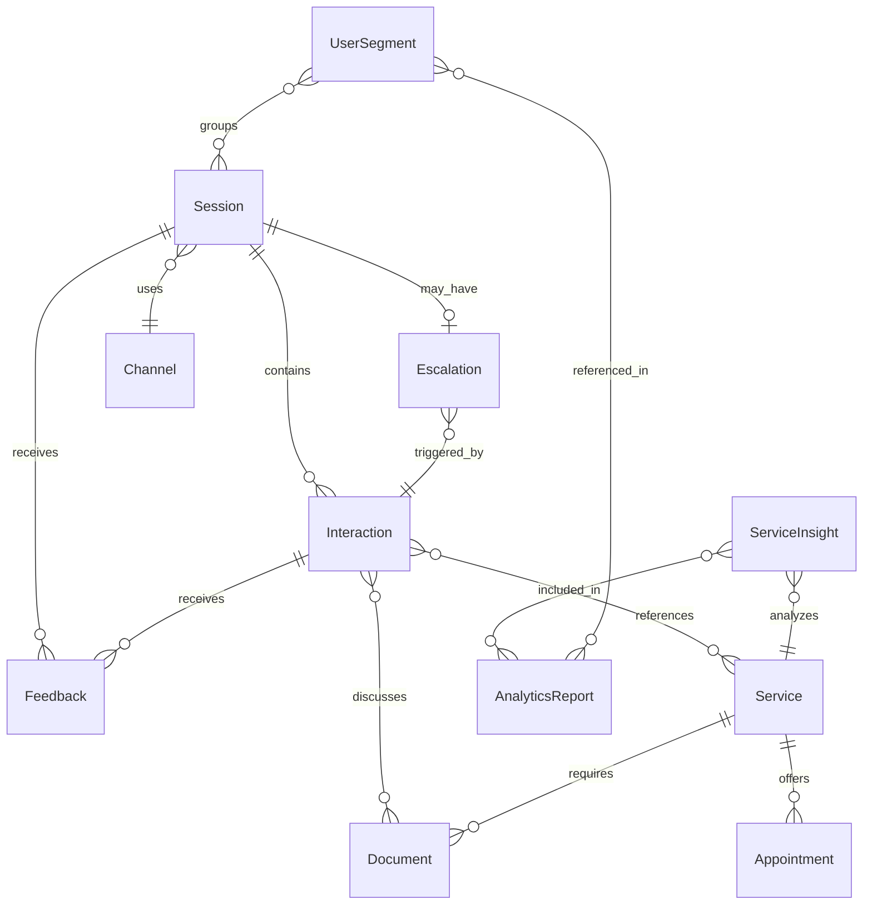
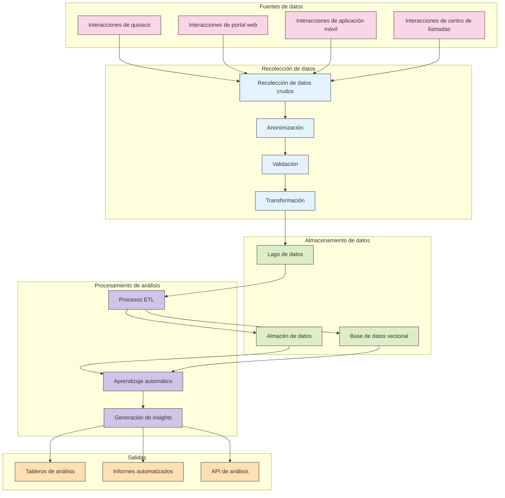

# 2.10 Esquema de Datos

## Visión General

Este documento define el esquema de datos para las capacidades de recolección y análisis de datos del sistema TAINA Voice AI. Describe la estructura, relaciones y atributos de los datos recopilados a través de todos los canales de implementación.

## Categorías de Datos

El sistema TAINA recopila y procesa datos en las siguientes categorías:

1. **Datos de Interacción:** Información sobre las interacciones de los ciudadanos con el sistema
2. **Datos de Servicio:** Información sobre los servicios gubernamentales accedidos
3. **Retroalimentación del Usuario:** Retroalimentación explícita e implícita de los ciudadanos
4. **Rendimiento del Sistema:** Métricas relacionadas con el rendimiento del sistema
5. **Datos Analíticos:** Insights y patrones derivados

## Entidades de Datos Principales

### 1. Sesión

La entidad Sesión representa una única sesión de interacción entre un ciudadano y el sistema TAINA.

#### Atributos

| Attribute | Type | Description | Example |
|-----------|------|-------------|---------|
| session_id | UUID | Identificador único para la sesión | 550e8400-e29b-41d4-a716-446655440000 |
| channel_id | String | Identificador del canal de implementación | kiosk_123, web_portal, mobile_app |
| start_timestamp | DateTime | Hora de inicio de la sesión | 2025-03-03T14:30:45Z |
| end_timestamp | DateTime | Hora de finalización de la sesión | 2025-03-03T14:45:12Z |
| duration_seconds | Integer | Duración de la sesión en segundos | 870 |
| language | String | Idioma principal utilizado | es, en, fr, ht |
| session_type | Enum | Tipo de sesión | information, appointment, document, escalation |
| completion_status | Enum | Cómo terminó la sesión | completed, abandoned, escalated, error |
| device_info | JSON | Información del dispositivo | `{"type": "mobile", "os": "Android", "browser": "Chrome"}` |
| location_id | String | Ubicación física (para quioscos) | santo_domingo_office_1 |
| anonymized_user_id | String | Identificador anonimizado para usuarios recurrentes | hashed_value |

#### Relaciones

- Una Sesión tiene muchas Interacciones
- Una Sesión tiene un Canal
- Una Sesión puede tener una Escalación
- Una Sesión tiene muchos elementos de Retroalimentación

### 2. Interacción

La entidad Interacción representa un único turno en la conversación entre el ciudadano y TAINA.

#### Atributos

| Attribute | Type | Description | Example |
|-----------|------|-------------|---------|
| interaction_id | UUID | Identificador único para la interacción | 7b1e7a5c-8c0d-4f34-b2e9-3c1a0c2b4f5e |
| session_id | UUID | Referencia a la sesión padre | 550e8400-e29b-41d4-a716-446655440000 |
| timestamp | DateTime | Cuándo ocurrió la interacción | 2025-03-03T14:32:10Z |
| interaction_type | Enum | Tipo de interacción | query, response, clarification, confirmation |
| user_input | Text | Entrada del usuario anonimizada | "¿Cómo obtengo mi certificado de nacimiento?" |
| system_response | Text | Respuesta del sistema | "Para obtener su certificado de nacimiento, debe..." |
| detected_intent | String | Intención del usuario identificada | get_birth_certificate |
| confidence_score | Float | Confianza en la detección de intención | 0.92 |
| entities | JSON | Entidades extraídas | `{"document_type": "birth_certificate"}`|
| response_time_ms | Integer | Tiempo para generar respuesta | 450 |
| turn_number | Integer | Posición en la conversación | 3 |

#### Relaciones

- Muchas Interacciones pertenecen a una Sesión
- Una Interacción puede hacer referencia a muchos Servicios
- Una Interacción puede tener muchos elementos de Retroalimentación

### 3. Servicio

La entidad Servicio representa un servicio gubernamental que fue discutido o accedido durante la interacción.

#### Atributos

| Attribute | Type | Description | Example |
|-----------|------|-------------|---------|
| service_id | String | Identificador único para el servicio | birth_certificate_request |
| service_name | String | Nombre legible del servicio | "Solicitud de Certificado de Nacimiento" |
| service_category | String | Categoría del servicio | vital_records, taxes, licenses |
| ministry | String | Ministerio gubernamental responsable | "Ministerio de Interior y Policía" |
| access_count | Integer | Número de veces accedido | 1247 |
| completion_rate | Float | Tasa de completados exitosos | 0.78 |
| average_duration | Integer | Duración promedio de interacción | 540 |

#### Relaciones

- Un Servicio puede ser referenciado en muchas Interacciones
- Un Servicio puede tener muchos Documentos
- Un Servicio puede tener muchas Citas

### 4. Document

La entidad Documento representa un documento que fue discutido, solicitado o proporcionado durante una interacción.

#### Atributos

| Attribute | Type | Description | Example |
|-----------|------|-------------|---------|
| document_id | String | Identificador único para el documento | birth_certificate |
| document_name | String | Nombre legible del documento | "Certificado de Nacimiento" |
| document_category | String | Categoría del documento | vital_records, identification, licenses |
| required_for | Array | Servicios que requieren este documento | ["passport_application", "school_enrollment"] |
| issuing_agency | String | Agencia que emite el documento | "Junta Central Electoral" |
| request_count | Integer | Número de veces solicitado | 856 |
| explanation_count | Integer | Veces que se solicitó explicación | 342 |

#### Relaciones

- Muchos Documentos pueden ser referenciados en un Servicio
- Muchos Documentos pueden ser referenciados en una Interacción

### 5. Cita

La entidad Cita representa una cita que fue programada o discutida durante una interacción.

#### Atributos

| Attribute | Type | Description | Example |
|-----------|------|-------------|---------|
| appointment_id | UUID | Identificador único para la cita | 9f8e7d6c-5b4a-3c2d-1e0f-9a8b7c6d5e4f |
| service_id | String | Servicio asociado | birth_certificate_request |
| location_id | String | Ubicación de la cita | santo_domingo_office_1 |
| scheduled_time | DateTime | Hora programada para la cita | 2025-03-10T09:30:00Z |
| duration_minutes | Integer | Duración esperada | 30 |
| status | Enum | Estado de la cita | scheduled, completed, cancelled, no_show |
| channel_booked | String | Canal utilizado para reservar | kiosk, web, mobile, call_center |
| booking_timestamp | DateTime | Cuándo se reservó la cita | 2025-03-03T14:40:22Z |

#### Relaciones

- Muchas Citas pueden estar asociadas con un Servicio
- Muchas Citas pueden ser referenciadas en una Sesión

### 6. Retroalimentación

La entidad Retroalimentación representa retroalimentación explícita o implícita proporcionada por los ciudadanos.

#### Atributos

| Attribute | Type | Description | Example |
|-----------|------|-------------|---------|
| feedback_id | UUID | Identificador único para la retroalimentación | 1a2b3c4d-5e6f-7g8h-9i0j-1k2l3m4n5o6p |
| session_id | UUID | Sesión asociada | 550e8400-e29b-41d4-a716-446655440000 |
| interaction_id | UUID | Interacción asociada (opcional) | 7b1e7a5c-8c0d-4f34-b2e9-3c1a0c2b4f5e |
| timestamp | DateTime | Cuándo se proporcionó la retroalimentación | 2025-03-03T14:45:00Z |
| feedback_type | Enum | Tipo de retroalimentación | explicit_rating, explicit_comment, implicit |
| rating | Integer | Calificación numérica (1-5) | 4 |
| comment | Text | Comentario de texto | "El sistema fue muy útil y rápido" |
| sentiment_score | Float | Puntuación de sentimiento (-1 a 1) | 0.8 |
| feedback_category | String | Categoría de retroalimentación | usability, accuracy, speed, helpfulness |

#### Relaciones

- Muchas Retroalimentaciones pueden estar asociadas con una Sesión
- Muchas Retroalimentaciones pueden estar asociadas con una Interacción

### 7. Escalación

La entidad Escalación representa cuando una conversación fue escalada a un agente humano.

#### Atributos

| Attribute | Type | Description | Example |
|-----------|------|-------------|---------|
| escalation_id | UUID | Identificador único para la escalación | 2c3d4e5f-6g7h-8i9j-0k1l-2m3n4o5p6q7r |
| session_id | UUID | Sesión asociada | 550e8400-e29b-41d4-a716-446655440000 |
| interaction_id | UUID | Interacción que desencadenó la escalación | 7b1e7a5c-8c0d-4f34-b2e9-3c1a0c2b4f5e |
| timestamp | DateTime | Cuándo ocurrió la escalación | 2025-03-03T14:40:30Z |
| escalation_reason | Enum | Razón para la escalación | user_requested, confidence_low, complex_issue, error |
| agent_id | String | ID del agente humano (anonimizado) | agent_123 |
| resolution_time | Integer | Tiempo para resolver (segundos) | 420 |
| resolution_status | Enum | Cómo se resolvió la escalación | resolved, transferred, abandoned |

#### Relaciones

- Una Escalación pertenece a una Sesión
- Una Escalación está asociada con una Interacción

### 8. Canal

La entidad Canal representa un canal de implementación a través del cual los ciudadanos interactúan con TAINA.

#### Atributos

| Attribute | Type | Description | Example |
|-----------|------|-------------|---------|
| channel_id | String | Identificador único para el canal | kiosk_123, web_portal, mobile_app |
| channel_type | Enum | Tipo de canal | kiosk, web, mobile, call_center |
| location | String | Ubicación física (si corresponde) | "Santo Domingo Office" |
| device_type | String | Tipo de dispositivo | touchscreen, smartphone, desktop |
| software_version | String | Versión del software | 1.2.3 |
| active_hours | JSON | Horas en que el canal está activo | `{"weekdays": "8:00-17:00", "weekend": "9:00-13:00"}` |

#### Relaciones

- Un Canal puede tener muchas Sesiones
- Un Canal puede tener muchos Dispositivos (para quioscos)

## Entidades Analíticas

### 1. ServiceInsight

La entidad ServiceInsight representa insights derivados sobre servicios gubernamentales.

#### Atributos

| Attribute | Type | Description | Example |
|-----------|------|-------------|---------|
| insight_id | UUID | Identificador único para el insight | 3d4e5f6g-7h8i-9j0k-1l2m-3n4o5p6q7r8s |
| service_id | String | Servicio asociado | birth_certificate_request |
| time_period | String | Período de tiempo del insight | "2025-03", "2025-Q1" |
| insight_type | Enum | Tipo de insight | trend, anomaly, correlation, pattern |
| metric | String | Métrica analizada | completion_rate, satisfaction, duration |
| value | Float | Valor numérico | 0.82 |
| change | Float | Cambio desde el período anterior | 0.05 |
| significance | Float | Significancia estadística | 0.92 |
| description | Text | Descripción legible | "Aumento significativo en solicitudes de certificado de nacimiento" |
| related_services | Array | Servicios relacionados con el insight | ["birth_certificate", "passport"] |
| action_recommendation | Text | Recomendación de acción | "Aumentar capacidad para procesar certificados de nacimiento" |

#### Relaciones

- Un ServiceInsight está asociado con un Servicio
- Muchos ServiceInsights pueden estar incluidos en un AnalyticsReport

### 2. UserSegment

La entidad UserSegment representa grupos de usuarios con características o comportamientos similares.

#### Atributos

| Attribute | Type | Description | Example |
|-----------|------|-------------|---------|
| segment_id | UUID | Identificador único para el segmento | 4e5f6g7h-8i9j-0k1l-2m3n-4o5p6q7r8s9t |
| segment_name | String | Nombre legible del segmento | "Usuarios primerizos" |
| segment_criteria | JSON | Criterios que definen el segmento | `{"first_session": true}` |
| size | Integer | Número de usuarios en el segmento | 1250 |
| creation_date | DateTime | Cuándo se creó el segmento | 2025-03-01T00:00:00Z |
| last_updated | DateTime | Cuándo se actualizó el segmento por última vez | 2025-03-04T12:00:00Z |
| common_services | Array | Servicios comunes utilizados por el segmento | ["birth_certificate", "national_id"] |
| average_satisfaction | Float | Calificación de satisfacción promedio | 4.2 |
| channel_preference | JSON | Distribución de uso de canales | `{"kiosk": 0.2, "web": 0.5, "mobile": 0.3}` |

#### Relaciones

- Un UserSegment puede estar referenciado en muchos AnalyticsReports
- Un UserSegment puede estar asociado con muchas Sesiones

### 3. AnalyticsReport

La entidad AnalyticsReport representa un informe compilado de insights analíticos.

#### Atributos

| Attribute | Type | Description | Example |
|-----------|------|-------------|---------|
| report_id | UUID | Identificador único para el informe | 5f6g7h8i-9j0k-1l2m-3n4o-5p6q7r8s9t0u |
| report_name | String | Nombre legible del informe | "Informe mensual de rendimiento de servicios" |
| time_period | String | Período de tiempo cubierto | "2025-03", "2025-Q1" |
| creation_date | DateTime | Cuándo se creó el informe | 2025-04-01T09:00:00Z |
| report_type | Enum | Tipo de informe | service_performance, user_behavior, trend_analysis |
| audience | String | Audiencia destinataria | "Gerentes de servicios" |
| summary | Text | Resumen ejecutivo | "El rendimiento general de los servicios mejoró un 12% en marzo" |
| key_metrics | JSON | Métricas clave resaltadas | `{"completion_rate": 0.85, "satisfaction": 4.3}` |
| recommendations | Array | Recomendaciones de acción | ["Ampliar la implementación de quioscos", "Simplificar el proceso de certificado de nacimiento"] |

#### Relaciones

- Un AnalyticsReport contiene muchos ServiceInsights
- Un AnalyticsReport puede referenciar muchos UserSegments

## Diagrama de Relaciones de Datos

## Flujo de Datos

El siguiente diagrama ilustra cómo fluyen los datos a través del sistema TAINA:

## Pasos siguientes

Para obtener más información detallada sobre la recolección y análisis de datos, consulte:

- [Visión general de la recolección de datos](./2.9_Data_Collection_Overview.md)
- [Privacidad y seguridad](./2.11_Privacy_and_Security.md)
- [Capacidades de análisis](./2.12_Analytics_Capabilities.md)
