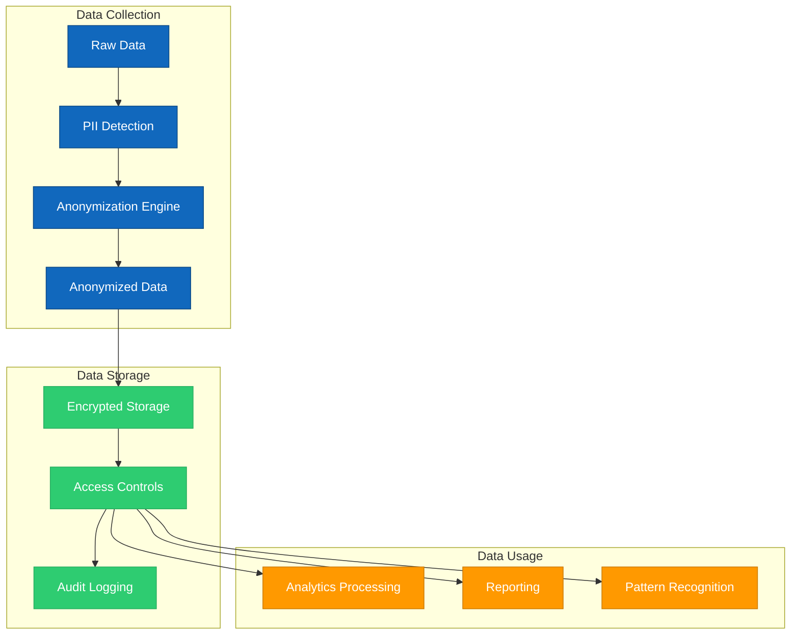

# 2.11 Privacidad y Seguridad

## Visión General

Este documento describe las medidas de privacidad y seguridad implementadas en el sistema TAINA Voice AI para proteger los datos de los ciudadanos y garantizar el cumplimiento de las regulaciones relevantes. La privacidad y seguridad de los datos son fundamentales para mantener la confianza de los ciudadanos y asegurar el uso ético de la información recopilada.

## Principios de Privacidad

El sistema TAINA se adhiere a los siguientes principios de privacidad:

### 1. Minimización de Datos

- Solo recopilar datos que sean necesarios para los propósitos legítimos del sistema
- Evitar la recopilación de información excesiva o irrelevante
- Revisar regularmente las prácticas de recopilación de datos para eliminar la recopilación innecesaria

### 2. Limitación de Propósito

- Solo utilizar los datos para los propósitos específicos para los que fueron recopilados
- Definir y documentar claramente los propósitos de la recopilación de datos
- Obtener consentimiento para nuevos propósitos no cubiertos por la recopilación original

### 3. Limitación de Almacenamiento

- Retener los datos solo por el tiempo necesario para los propósitos definidos
- Implementar procesos automatizados de eliminación de datos para datos caducados
- Documentar los períodos de retención para diferentes tipos de datos

### 4. Transparencia

- Proporcionar información clara a los ciudadanos sobre las prácticas de recopilación de datos
- Explicar cómo se utilizan, almacenan y protegen los datos
- Hacer que las políticas de privacidad sean fácilmente accesibles en todos los canales

### 5. Derechos de los Ciudadanos

- Respetar los derechos de los ciudadanos para acceder, corregir y eliminar sus datos
- Proporcionar mecanismos para que los ciudadanos ejerzan estos derechos
- Responder a las solicitudes de los ciudadanos de manera oportuna

### 6. Privacidad por Diseño

- Incorporar consideraciones de privacidad desde las primeras etapas del desarrollo
- Implementar tecnologías y arquitecturas que mejoren la privacidad
- Realizar evaluaciones de impacto de privacidad para nuevas características y cambios

## Medidas de Protección de Datos

### 1. Anonimización

El sistema TAINA implementa una anonimización robusta para proteger la privacidad de los ciudadanos:

#### Técnicas de Anonimización

- **Detección de PII:** Identificación automatizada de información de identificación personal
- **Enmascaramiento de Datos:** Reemplazo de datos sensibles con equivalentes no sensibles
- **Seudonimización:** Reemplazo de campos de identificación con identificadores artificiales
- **Agregación:** Combinación de datos para prevenir la identificación de individuos
- **Generalización:** Reducción de la precisión de los datos para proteger identidades individuales

#### Proceso de Anonimización

1. **Ingesta de Datos:** Los datos sin procesar se reciben de los canales de implementación
2. **Detección de PII:** Los sistemas automatizados identifican posible PII
3. **Aplicación de Anonimización:** Se aplican técnicas apropiadas a los campos sensibles
4. **Validación:** Los datos anonimizados se validan para asegurar que no quede PII
5. **Almacenamiento:** Solo los datos anonimizados se almacenan para análisis

### 2. Cifrado

El sistema TAINA utiliza cifrado para proteger los datos:

#### Datos en Tránsito

- **TLS 1.3:** Todas las comunicaciones entre componentes utilizan TLS 1.3
- **Cifrado de Extremo a Extremo:** Comunicaciones entre dispositivos de ciudadanos y TAINA
- **VPN:** Conexiones VPN seguras para acceso administrativo

#### Datos en Reposo

- **Cifrado de Almacenamiento:** Cifrado AES-256 para todos los datos almacenados
- **Gestión de Claves:** Gestión segura de claves con rotación regular
- **Copias de Seguridad Cifradas:** Todas las copias de seguridad están cifradas

### 3. Control de Acceso

El sistema TAINA implementa controles de acceso estrictos:

#### Autenticación

- **Autenticación Multifactor:** Requerida para acceso administrativo
- **Acceso Basado en Roles:** Acceso basado en responsabilidades laborales
- **Inicio de Sesión Único:** Integración con sistemas de identidad gubernamentales
- **Gestión de Sesiones:** Tiempos de espera automáticos de sesión y monitoreo

#### Autorización

- **Principio de Privilegio Mínimo:** Los usuarios tienen solo el acceso que necesitan
- **Segregación de Funciones:** Las funciones críticas requieren múltiples aprobadores
- **Acceso Basado en Atributos:** Acceso dinámico basado en atributos de usuario y contexto
- **Revisión Regular:** Revisión periódica de derechos de acceso

### 4. Desarrollo Seguro

El sistema TAINA se desarrolla con la seguridad en mente:

- **SDLC Seguro:** Seguridad integrada a lo largo del ciclo de vida del desarrollo
- **Revisiones de Código:** Revisiones de código enfocadas en seguridad
- **Gestión de Dependencias:** Actualizaciones regulares de dependencias
- **Pruebas de Seguridad:** Pruebas de seguridad automatizadas y manuales
- **Gestión de Vulnerabilidades:** Proceso para abordar vulnerabilidades

## Medidas Técnicas de Seguridad

### 1. Seguridad de Red

El sistema TAINA implementa medidas de seguridad de red:

- **Firewalls:** Firewalls de próxima generación para proteger los límites del sistema
- **Segmentación de Red:** Separación de diferentes componentes del sistema
- **Detección/Prevención de Intrusiones:** Sistemas para detectar y prevenir ataques
- **Protección DDoS:** Medidas para mitigar ataques de denegación de servicio
- **Escaneo Regular:** Escaneo de vulnerabilidades de la infraestructura de red

### 2. Seguridad de Aplicaciones

El sistema TAINA incluye medidas de seguridad de aplicaciones:

- **Validación de Entrada:** Validación de todas las entradas de usuario
- **Codificación de Salida:** Codificación adecuada de salidas para prevenir inyecciones
- **Controles de Autenticación:** Mecanismos seguros de autenticación
- **Gestión de Sesiones:** Manejo seguro de sesiones de usuario
- **Manejo de Errores:** Manejo seguro de errores para prevenir fugas de información

### 3. Seguridad de Infraestructura

El sistema TAINA se implementa en una infraestructura segura:

- **Sistemas Endurecidos:** Servidores configurados según las mejores prácticas de seguridad
- **Gestión de Parches:** Aplicación regular de parches de seguridad
- **Configuración Segura:** Gestión de configuración enfocada en seguridad
- **Monitoreo:** Monitoreo continuo de la infraestructura
- **Respaldo y Recuperación:** Procesos seguros de respaldo y recuperación

## Evaluación de Impacto de Privacidad

Se ha realizado una Evaluación de Impacto de Privacidad (PIA) para el sistema TAINA:

### 1. Evaluación de Recopilación de Datos

| Categoría de Datos | Propósito | Sensibilidad | Método de Anonimización | Período de Retención |
|---------------|---------|-------------|----------------------|------------------|
| Contenido de Conversación | Mejora del Servicio | Alta | Anonimización Completa | 90 días |
| Uso del Servicio | Planificación del Servicio | Media | Agregación | 1 año |
| Retroalimentación del Usuario | Mejora de Calidad | Media | Seudonimización | 1 año |
| Rendimiento del Sistema | Optimización Técnica | Baja | No Requerida | 30 días |

### 2. Evaluación de Riesgos

| Riesgo | Probabilidad | Impacto | Medidas de Mitigación |
|------|------------|--------|---------------------|
| Acceso No Autorizado | Baja | Alto | Controles de Acceso, Cifrado, Monitoreo |
| Filtración de Datos | Baja | Alto | Cifrado, Desarrollo Seguro, Respuesta a Incidentes |
| Re-identificación | Baja | Alto | Anonimización Robusta, Minimización de Datos |
| Desviación de Función | Media | Media | Limitación de Propósito, Controles de Gobernanza |
| Desconfianza Ciudadana | Media | Alta | Transparencia, Controles Ciudadanos, Comunicación Clara |

### 3. Recomendaciones

La PIA resultó en las siguientes recomendaciones:

1. **Anonimización Mejorada:** Implementar técnicas adicionales de anonimización para datos de alto riesgo
2. **Auditorías Regulares:** Realizar auditorías de privacidad trimestrales
3. **Controles Ciudadanos:** Desarrollar interfaces para que los ciudadanos gestionen sus datos
4. **Capacitación:** Aumentar la capacitación en privacidad para todo el personal
5. **Documentación:** Mejorar la documentación de prácticas de privacidad

## Marco de Cumplimiento

### 1. Cumplimiento Regulatorio

El sistema TAINA está diseñado para cumplir con las regulaciones relevantes:

- **Leyes de Protección de Datos:** Cumplimiento con las leyes de protección de datos de la República Dominicana
- **Estándares Gubernamentales:** Adherencia a los estándares de seguridad gubernamentales
- **Mejores Prácticas Internacionales:** Implementación de marcos de seguridad reconocidos

### 2. Monitoreo de Cumplimiento

El sistema TAINA incluye mecanismos para monitorear el cumplimiento:

- **Verificaciones Automatizadas:** Verificaciones automatizadas regulares de cumplimiento
- **Registro de Auditoría:** Registro exhaustivo de todos los accesos a datos
- **Auditorías Regulares:** Auditorías periódicas de seguridad y privacidad
- **Informes de Cumplimiento:** Informes regulares sobre el estado de cumplimiento

### 3. Respuesta a Incidentes

El sistema TAINA tiene un plan integral de respuesta a incidentes:

- **Detección:** Sistemas para detectar posibles incidentes de seguridad
- **Equipo de Respuesta:** Equipo dedicado de respuesta a incidentes
- **Procedimientos de Respuesta:** Procedimientos documentados para diferentes tipos de incidentes
- **Plan de Comunicación:** Plan para comunicar incidentes a las partes interesadas
- **Análisis Post-Incidente:** Proceso para aprender de los incidentes

## Gobernanza de Datos

### 1. Roles y Responsabilidades

Los siguientes roles son responsables de la privacidad y seguridad de los datos:

- **Oficial de Protección de Datos:** Responsabilidad general de la protección de datos
- **Equipo de Seguridad:** Implementación y monitoreo de medidas de seguridad
- **Administradores de Datos:** Gestión diaria de los datos
- **Administradores de Sistemas:** Implementación técnica de medidas de seguridad
- **Todo el Personal:** Conciencia y adherencia a las políticas de seguridad

### 2. Políticas y Procedimientos

El sistema TAINA se rige por políticas integrales:

- **Política de Protección de Datos:** Enfoque general para la protección de datos
- **Política de Seguridad:** Requisitos técnicos de seguridad
- **Política de Control de Acceso:** Reglas para otorgar y revocar acceso
- **Política de Respuesta a Incidentes:** Procedimientos para manejar incidentes de seguridad

## Controles de Privacidad para Ciudadanos

El sistema TAINA proporciona a los ciudadanos controles sobre sus datos:

### 1. Gestión de Consentimiento

- **Consentimiento Inicial:** Proceso claro de consentimiento en la primera interacción
- **Opciones Granulares:** Capacidad de consentir usos específicos de datos
- **Retiro:** Proceso sencillo para retirar el consentimiento
- **Mantenimiento de Registros:** Registros seguros de decisiones de consentimiento

### 2. Acceso y Control

- **Acceso a Datos:** Proceso para que los ciudadanos accedan a sus datos
- **Corrección:** Capacidad para corregir datos inexactos
- **Eliminación:** Proceso para solicitar la eliminación de datos
- **Portabilidad de Datos:** Capacidad para recibir datos en un formato portable

### 3. Avisos de Privacidad

- **Lenguaje Claro:** Avisos de privacidad en lenguaje sencillo y comprensible
- **Multicanal:** Avisos disponibles en todos los canales de implementación
- **Justo a Tiempo:** Información contextual de privacidad en puntos relevantes
- **Accesibilidad:** Avisos accesibles para todos los ciudadanos

## Monitoreo y Operaciones de Seguridad

### 1. Monitoreo de Seguridad

El sistema TAINA incluye un monitoreo integral de seguridad:

- **Integración SIEM:** Gestión de Información y Eventos de Seguridad
- **Detección de Anomalías:** Detección basada en IA de patrones inusuales
- **Gestión de Alertas:** Proceso para gestionar y responder a alertas
- **Monitoreo 24/7:** Monitoreo continuo de seguridad

### 2. Gestión de Vulnerabilidades

El sistema TAINA tiene un proceso robusto de gestión de vulnerabilidades:

- **Escaneo Regular:** Escaneo automatizado de vulnerabilidades
- **Pruebas de Penetración:** Pruebas regulares de penetración
- **Divulgación Responsable:** Proceso para reportes externos de vulnerabilidades
- **Gestión de Parches:** Aplicación oportuna de parches de seguridad

### 3. Operaciones de Seguridad

El sistema TAINA cuenta con el apoyo de operaciones de seguridad:

- **Equipo de Seguridad:** Personal dedicado a la seguridad
- **Respuesta a Incidentes:** Capacidad de respuesta a incidentes 24/7
- **Inteligencia de Amenazas:** Integración de inteligencia de amenazas
- **Simulacros Regulares:** Práctica de procedimientos de respuesta a incidentes

## Seguridad de Terceros

El sistema TAINA gestiona la seguridad con terceros:

### 1. Evaluación de Proveedores

- **Revisión de Seguridad:** Evaluación de prácticas de seguridad de proveedores
- **Requisitos Contractuales:** Requisitos de seguridad en contratos
- **Reevaluación Regular:** Revisión periódica de la seguridad de proveedores
- **Derecho a Auditar:** Derecho contractual para auditar la seguridad de proveedores

### 2. Seguridad de API

- **Puerta de Enlace API:** Gestión centralizada de API y seguridad
- **Autenticación:** Autenticación fuerte para acceso a API
- **Limitación de Tasa:** Protección contra abuso de API
- **Validación de Entrada:** Validación de todas las entradas de API

### 3. Seguridad en la Nube

- **Responsabilidad Compartida:** Definición clara de responsabilidades de seguridad
- **Controles de Seguridad en la Nube:** Implementación de seguridad específica para la nube
- **Verificación de Cumplimiento:** Verificación del cumplimiento del proveedor de la nube
- **Residencia de Datos:** Control sobre la ubicación de datos

## Mejoras Futuras

Las mejoras planificadas de seguridad y privacidad incluyen:

1. **Anonimización Avanzada:** Implementación de técnicas de privacidad diferencial
2. **Controles Ciudadanos Mejorados:** Controles de privacidad más granulares para ciudadanos
3. **Marco Ético de IA:** Marco para el uso ético de IA con datos de ciudadanos
4. **Aprendizaje Federado:** Técnicas de aprendizaje automático que preservan la privacidad
5. **Arquitectura de Confianza Cero:** Implementación de principios de seguridad de confianza cero

## Conclusión

El sistema TAINA implementa medidas integrales de privacidad y seguridad para proteger los datos de los ciudadanos mientras permite las valiosas funciones del sistema. Estas medidas se revisan y mejoran continuamente para abordar amenazas y requisitos en evolución.

## Apéndices

### A. Estándares y Marcos de Seguridad

- ISO 27001
- Marco de Ciberseguridad NIST
- OWASP Top 10
- Controles CIS

### B. Metodología de Evaluación de Impacto de Privacidad

- Criterios de evaluación
- Metodología de puntuación
- Estrategias de mitigación

### C. Procedimientos de Respuesta a Incidentes

- Procedimientos de detección
- Criterios de clasificación
- Flujos de trabajo de respuesta
- Plantillas de comunicación

### D. Diagramas de Flujo de Datos

- Flujos de datos detallados que muestran controles de seguridad
- Transferencias transfronterizas de datos
- Gestión del ciclo de vida de los datos
