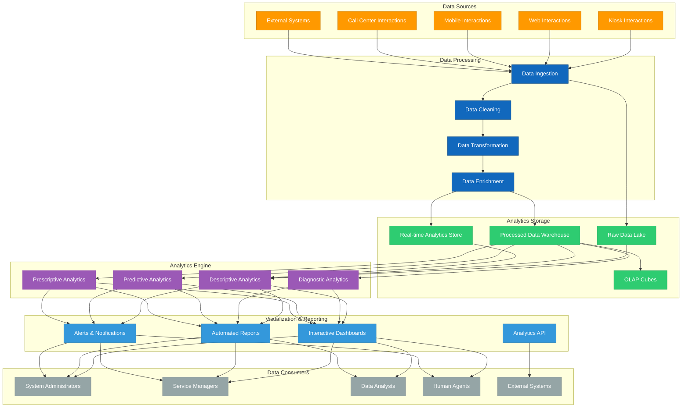

# 2.12 Capacidades Analíticas

## Visión General

Este documento describe las capacidades analíticas del sistema TAINA Voice AI. Estas capacidades permiten al sistema obtener información valiosa de las interacciones con los ciudadanos, mejorar la prestación de servicios y apoyar la toma de decisiones basada en datos para los servicios gubernamentales.

## Arquitectura Analítica

El sistema analítico de TAINA está construido sobre una arquitectura modular que procesa datos de todos los canales de implementación y proporciona información a través de varias interfaces de visualización y reportes.

## Tipos de Análisis

El sistema TAINA proporciona cuatro tipos de capacidades analíticas:

### 1. Análisis Descriptivo

El análisis descriptivo responde a la pregunta "¿Qué sucedió?" mediante el análisis de datos históricos para identificar patrones y tendencias.

#### Capacidades Clave

- **Análisis de Volumen de Interacción:** Seguimiento del volumen de interacciones ciudadanas a través de los canales
- **Métricas de Uso de Servicios:** Medición de qué servicios gubernamentales se acceden con mayor frecuencia
- **Análisis Demográfico:** Comprensión de la demografía de los ciudadanos que utilizan el sistema
- **Análisis Temporal:** Análisis de patrones de uso a lo largo del tiempo (por hora, diario, semanal, estacional)
- **Rendimiento de Canales:** Comparación del rendimiento y uso entre los canales de implementación
- **Análisis de Tasa de Finalización:** Medición de la finalización exitosa de solicitudes ciudadanas

#### Métricas de Ejemplo

- Total de interacciones por día/semana/mes
- Servicios gubernamentales más solicitados
- Duración promedio de sesión
- Horas pico de uso
- Distribución de interacciones por canal
- Tasas de finalización de servicios

### 2. Análisis Diagnóstico

El análisis diagnóstico responde a la pregunta "¿Por qué sucedió?" mediante la investigación de las causas de patrones y comportamientos.

#### Capacidades Clave

- **Análisis de Abandono:** Identificación de por qué los ciudadanos abandonan las interacciones
- **Análisis de Errores:** Comprensión de las causas de errores y fallos
- **Factores de Satisfacción:** Determinación de factores que influyen en la satisfacción ciudadana
- **Cuellos de Botella de Rendimiento:** Identificación de problemas de rendimiento del sistema
- **Análisis de Correlación:** Búsqueda de relaciones entre diferentes factores
- **Análisis de Ruta:** Análisis de las rutas que los ciudadanos toman a través de los servicios

#### Métricas de Ejemplo

- Razones y tasas de abandono
- Frecuencia y patrones de error
- Factores de correlación de satisfacción
- Impacto del tiempo de respuesta del sistema
- Impacto de la complejidad del servicio
- Eficiencia de la ruta de navegación

### 3. Análisis Predictivo

El análisis predictivo responde a la pregunta "¿Qué sucederá?" mediante el uso de datos históricos para pronosticar tendencias y comportamientos futuros.

#### Capacidades Clave

- **Pronóstico de Demanda:** Predicción de la demanda futura de servicios gubernamentales
- **Predicción de Tendencias Estacionales:** Anticipación de variaciones estacionales en las necesidades de servicio
- **Predicción de Comportamiento Ciudadano:** Pronóstico de cómo los ciudadanos interactuarán con los servicios
- **Pronóstico de Requisitos de Recursos:** Predicción de necesidades de recursos para la prestación de servicios
- **Predicción de Problemas:** Identificación de problemas potenciales antes de que ocurran
- **Predicción de Satisfacción:** Pronóstico de niveles de satisfacción ciudadana

#### Métricas de Ejemplo

- Demanda de servicios proyectada por mes
- Períodos de uso pico previstos
- Requisitos de recursos pronosticados
- Indicadores de alerta temprana para problemas
- Puntuaciones de satisfacción previstas
- Tasas de finalización estimadas

### 4. Análisis Prescriptivo

El análisis prescriptivo responde a la pregunta "¿Qué deberíamos hacer?" mediante la recomendación de acciones basadas en información.

#### Capacidades Clave

- **Recomendaciones de Optimización de Servicios:** Sugerencias para mejorar la prestación de servicios
- **Orientación de Asignación de Recursos:** Recomendaciones para la asignación óptima de recursos
- **Sugerencias de Mejora de Contenido:** Identificación de contenido de base de conocimientos que necesita mejoras
- **Oportunidades de Intervención Proactiva:** Identificación de oportunidades para el acercamiento proactivo a ciudadanos
- **Simulación de Impacto de Políticas:** Simulación del impacto de cambios en políticas
- **Recomendaciones de Personalización:** Sugerencias para personalizar experiencias ciudadanas

#### Métricas de Ejemplo

- Niveles de personal recomendados
- Actualizaciones sugeridas de base de conocimientos
- Mezcla óptima de canales de implementación
- Oportunidades de mejora priorizadas
- Puntuaciones simuladas de impacto de políticas
- Predicciones de efectividad de personalización

## Paneles Analíticos

El sistema TAINA proporciona una variedad de paneles adaptados a diferentes roles de usuario:

### 1. Panel Ejecutivo

Diseñado para tomadores de decisiones de alto nivel, este panel proporciona información estratégica sobre el rendimiento del sistema y la prestación de servicios ciudadanos.

#### Componentes Clave

- **Visión General del Rendimiento del Servicio:** Métricas de alto nivel sobre el rendimiento del servicio
- **Tendencias de Satisfacción Ciudadana:** Tendencias en la satisfacción ciudadana a lo largo del tiempo
- **Comparación de Canales:** Comparación de rendimiento entre canales de implementación
- **KPIs Estratégicos:** Indicadores clave de rendimiento alineados con objetivos estratégicos
- **Utilización de Recursos:** Visión general de la utilización de recursos del sistema
- **Información Predictiva:** Pronósticos y predicciones clave

### 2. Panel Operativo

Diseñado para la gestión diaria del sistema TAINA, este panel se centra en métricas operativas y rendimiento en tiempo real.

#### Componentes Clave

- **Estado del Sistema en Tiempo Real:** Rendimiento y estado actual del sistema
- **Sesiones Activas:** Número y distribución de sesiones activas
- **Monitoreo de Errores:** Seguimiento de errores en tiempo real y alertas
- **Utilización de Recursos:** Uso actual de recursos del sistema
- **Estado de Cola:** Estado de colas de agentes humanos y escalaciones
- **Métricas de Rendimiento Diario:** Métricas clave para el día actual

### 3. Panel de Gestor de Servicios

Diseñado para gestores de servicios gubernamentales, este panel proporciona información sobre el rendimiento de servicios específicos y las necesidades ciudadanas.

#### Componentes Clave

- **Métricas de Uso de Servicios:** Métricas detalladas sobre el uso del servicio
- **Retroalimentación Ciudadana:** Retroalimentación específica para el servicio
- **Tasas de Finalización de Servicios:** Tasas de finalización exitosa del servicio
- **Problemas Comunes:** Problemas frecuentemente encontrados con el servicio
- **Oportunidades de Mejora:** Oportunidades identificadas para la mejora del servicio
- **Visualización de Recorrido Ciudadano:** Representación visual de los recorridos ciudadanos

### 4. Estación de Trabajo Analítica

Diseñada para analistas de datos, este entorno interactivo permite la exploración y análisis profundo de los datos.

#### Componentes Clave

- **Interfaz de Consulta Ad-hoc:** Interfaz para consultas de datos personalizadas
- **Herramientas Avanzadas de Visualización:** Herramientas para crear visualizaciones personalizadas
- **Capacidades de Exportación de Datos:** Funciones para exportar datos para análisis externo
- **Herramientas de Análisis Estadístico:** Herramientas para realizar análisis estadísticos
- **Análisis de Cohortes:** Herramientas para analizar cohortes ciudadanas específicas
- **Prueba de Hipótesis:** Capacidades para probar hipótesis

## Capacidades de Reportes

El sistema TAINA proporciona capacidades completas de reportes:

### 1. Reportes Programados

- **Reportes de Rendimiento Diario:** Resumen diario de métricas clave de rendimiento
- **Reportes de Servicio Semanal:** Análisis semanal del rendimiento del servicio
- **Reportes de Tendencias Mensuales:** Análisis mensual de tendencias y patrones
- **Reportes Estratégicos Trimestrales:** Reportes trimestrales alineados con objetivos estratégicos
- **Reportes de Revisión Anual:** Revisión anual completa del rendimiento del sistema

### 2. Reportes Ad-hoc

- **Reportes de Consulta Personalizada:** Reportes basados en consultas de datos personalizadas
- **Reportes de Análisis de Incidentes:** Análisis detallado de incidentes específicos
- **Reportes de Análisis Profundo de Servicios:** Análisis en profundidad de servicios específicos
- **Reportes de Análisis Comparativo:** Comparación de diferentes períodos de tiempo o canales
- **Reportes de Evaluación de Impacto:** Evaluación del impacto de cambios o iniciativas

### 3. Alertas Automatizadas

- **Alertas de Umbral de Rendimiento:** Alertas cuando el rendimiento cae por debajo de los umbrales
- **Alertas de Detección de Anomalías:** Alertas para patrones o comportamientos inusuales
- **Alertas Predictivas:** Alertas basadas en modelos predictivos
- **Alertas de Utilización de Recursos:** Alertas para alta utilización de recursos
- **Alertas de Seguridad y Privacidad:** Alertas para problemas potenciales de seguridad o privacidad

## Casos de Uso Analíticos

Las capacidades analíticas de TAINA admiten una variedad de casos de uso:

### 1. Mejora de Servicios

- **Identificación de Puntos Problemáticos:** Encontrar áreas donde los ciudadanos tienen dificultades con los servicios
- **Análisis de Brechas de Contenido:** Identificar información faltante o inadecuada
- **Optimización de Procesos:** Agilizar los procesos de prestación de servicios
- **Optimización de Lenguaje:** Mejorar el lenguaje y la terminología para mayor claridad
- **Optimización de Canales:** Optimizar la mezcla de canales de implementación

### 2. Planificación de Recursos

- **Optimización de Personal:** Optimizar los niveles de personal de agentes humanos
- **Planificación de Infraestructura:** Planificar la infraestructura del sistema basada en la demanda
- **Inversión en Base de Conocimientos:** Priorizar el desarrollo de la base de conocimientos
- **Inversión en Canales:** Guiar la inversión en canales de implementación
- **Identificación de Necesidades de Capacitación:** Identificar necesidades de capacitación para agentes humanos

### 3. Mejora de la Experiencia Ciudadana

- **Oportunidades de Personalización:** Identificar oportunidades para personalización
- **Optimización de Recorrido:** Agilizar los recorridos ciudadanos a través de los servicios
- **Prestación Proactiva de Servicios:** Habilitar recomendaciones proactivas de servicios
- **Mejora de Satisfacción:** Dirigir mejoras para aumentar la satisfacción
- **Mejora de Accesibilidad:** Mejorar la accesibilidad para todos los ciudadanos

### 4. Desarrollo de Políticas y Programas

- **Análisis de Demanda de Servicios:** Comprender la demanda de diferentes servicios
- **Evaluación de Impacto:** Evaluar el impacto de cambios en políticas
- **Identificación de Necesidades Ciudadanas:** Identificar necesidades emergentes de los ciudadanos
- **Evaluación de Efectividad de Programas:** Evaluar la efectividad de los programas
- **Información Cruzada de Servicios:** Identificar relaciones entre diferentes servicios

## Integración de Datos

El sistema analítico de TAINA integra datos de varias fuentes:

### 1. Fuentes de Datos Internas

- **Datos de Interacción:** Datos de interacciones ciudadanas con TAINA
- **Datos de Base de Conocimientos:** Datos sobre el contenido y uso de la base de conocimientos
- **Datos de Rendimiento del Sistema:** Datos sobre el rendimiento técnico del sistema
- **Datos de Agentes Humanos:** Datos de interacciones de agentes humanos
- **Datos de Retroalimentación:** Retroalimentación explícita e implícita de los ciudadanos

### 2. Fuentes de Datos Externas

- **Datos de Servicios Gubernamentales:** Datos de sistemas de servicios gubernamentales
- **Datos Demográficos:** Datos demográficos para contexto y análisis
- **Datos Geográficos:** Datos geográficos para análisis basado en ubicación
- **Datos Temporales:** Datos de calendario para análisis temporal
- **Datos de Eventos Externos:** Datos sobre eventos externos que pueden impactar la demanda de servicios

## Capacidades Analíticas Avanzadas

El sistema TAINA incluye capacidades analíticas avanzadas:

### 1. Procesamiento de Lenguaje Natural

- **Modelado de Temas:** Identificación de temas comunes en interacciones ciudadanas
- **Análisis de Sentimiento:** Análisis del sentimiento de las interacciones ciudadanas
- **Patrones de Reconocimiento de Intención:** Análisis de patrones en el reconocimiento de intención
- **Análisis de Uso de Lenguaje:** Análisis de patrones de lenguaje y terminología
- **Análisis de Patrones de Preguntas:** Identificación de patrones comunes de preguntas

### 2. Modelos de Aprendizaje Automático

- **Modelos de Comportamiento Ciudadano:** Modelos de comportamiento y preferencias ciudadanas
- **Modelos de Demanda de Servicios:** Modelos para predecir la demanda de servicios
- **Modelos de Predicción de Satisfacción:** Modelos para predecir la satisfacción ciudadana
- **Modelos de Requisitos de Recursos:** Modelos para predecir requisitos de recursos
- **Modelos de Predicción de Problemas:** Modelos para predecir problemas potenciales

### 3. Reconocimiento de Patrones

- **Patrones Temporales:** Identificación de patrones a lo largo del tiempo
- **Patrones de Comportamiento:** Identificación de patrones en el comportamiento ciudadano
- **Patrones de Uso de Servicios:** Identificación de patrones en el uso de servicios
- **Patrones de Error:** Identificación de patrones en errores del sistema
- **Patrones de Retroalimentación:** Identificación de patrones en la retroalimentación ciudadana

## Consideraciones de Implementación Analítica

### 1. Consideraciones Técnicas

- **Escalabilidad:** Capacidad para manejar volúmenes crecientes de datos
- **Rendimiento:** Procesamiento eficiente de grandes conjuntos de datos
- **Tiempo Real vs. Lotes:** Balance de procesamiento en tiempo real y por lotes
- **Almacenamiento de Datos:** Soluciones de almacenamiento apropiadas para diferentes tipos de datos
- **Arquitectura de Procesamiento:** Procesamiento distribuido para análisis complejos

### 2. Privacidad y Seguridad

- **Anonimización de Datos:** Asegurar que todos los datos analíticos estén debidamente anonimizados
- **Controles de Acceso:** Restringir el acceso a análisis basado en roles
- **Pistas de Auditoría:** Mantener pistas de auditoría de acceso a análisis
- **Minimización de Datos:** Usar solo los datos necesarios para análisis
- **Limitación de Propósito:** Usar datos solo para propósitos especificados

Para información detallada sobre medidas de privacidad y seguridad, consulte [Privacidad y Seguridad](./2.11_Privacy_and_Security.md).

### 3. Gobernanza

- **Gestión de Calidad de Datos:** Asegurar la calidad de los datos analíticos
- **Gestión de Metadatos:** Mantener metadatos completos
- **Control de Versiones:** Seguimiento de versiones de modelos analíticos e informes
- **Documentación:** Documentar procesos y modelos analíticos
- **Gestión de Cambios:** Gestionar cambios en las capacidades analíticas

## Mejoras Futuras

Las mejoras planificadas para las capacidades analíticas incluyen:

1. **Análisis Avanzado de IA:** Modelos de aprendizaje profundo para reconocimiento de patrones complejos
2. **Recomendaciones Predictivas de Servicios:** Sugerencias proactivas de servicios basadas en modelos predictivos
3. **Personalización en Tiempo Real:** Personalización en tiempo real de experiencias ciudadanas
4. **Análisis Federado:** Análisis distribuido entre agencias gubernamentales
5. **IA Explicable:** Modelos de IA más transparentes y explicables
6. **Portal Analítico Ciudadano:** Análisis de autoservicio para ciudadanos

## Conclusión

Las capacidades analíticas de TAINA proporcionan herramientas poderosas para comprender las interacciones ciudadanas, mejorar los servicios gubernamentales y apoyar la toma de decisiones basada en datos. Estas capacidades están diseñadas para equilibrar la necesidad de información con el imperativo de proteger la privacidad ciudadana.

## Apéndices

### A. Diccionario de Métricas Analíticas

- Definiciones detalladas de todas las métricas analíticas
- Metodologías de cálculo
- Pautas de interpretación

### B. Especificaciones de Paneles

- Especificaciones detalladas para cada panel
- Descripciones de widgets
- Fuentes de datos y tasas de actualización

### C. Plantillas de Reportes

- Plantillas para reportes estándar
- Programas de generación de reportes
- Listas de distribución

### D. Diccionario de Datos

- Definiciones de todos los elementos de datos utilizados en análisis
- Fuentes de datos y linaje
- Métricas de calidad de datos
