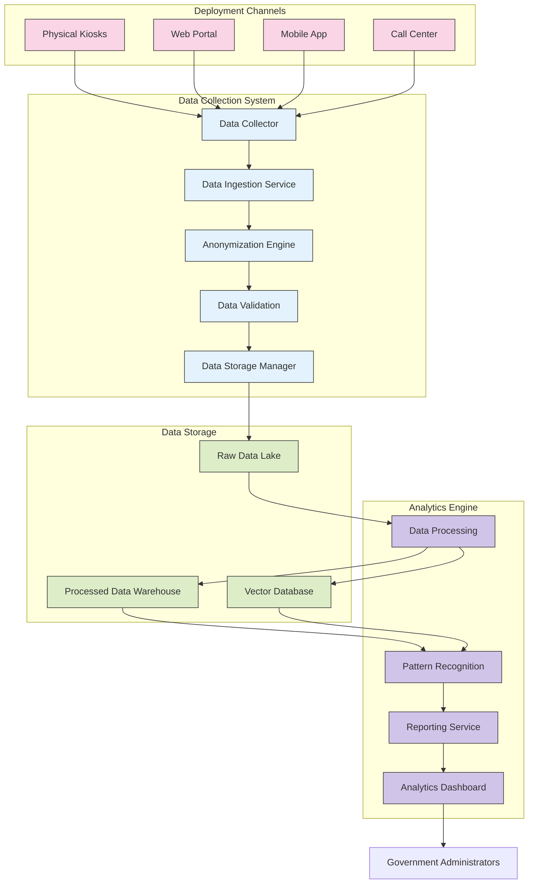

# 2.9 Visión General de la Recolección de Datos

## Introducción

El sistema TAINA Voice AI incluye capacidades robustas de recolección de datos diseñadas para capturar las interacciones de los ciudadanos a través de todos los canales de implementación. Estos datos se utilizan para mejorar el rendimiento del sistema, identificar patrones en las necesidades de los ciudadanos y proporcionar información a las agencias gubernamentales para la mejora de servicios.

Este documento proporciona una visión general de alto nivel de la arquitectura de recolección de datos, los tipos de datos recopilados y cómo estos datos son procesados y analizados.

## Arquitectura de Recolección de Datos

## Proceso de Recolección de Datos

### 1. Captura de Datos

El sistema captura datos de todas las interacciones de los ciudadanos a través de los siguientes canales:

- **Quioscos Físicos:** Ubicados en oficinas gubernamentales y espacios públicos
- **Portal Web:** Integración con la plataforma web GOB.DO
- **Aplicación Móvil:** Integración con la aplicación móvil Carpeta Ciudadana
- **Centro de Llamadas:** Integración con sistemas de centros de llamadas gubernamentales

### 2. Ingestión de Datos

El Servicio de Ingestión de Datos procesa los datos entrantes con los siguientes pasos:

1. **Recolección:** Los datos sin procesar se recolectan de todos los canales en tiempo real
2. **Validación:** Los datos se validan para comprobar su integridad y formato
3. **Anonimización:** La información personal identificable (PII) se anonimiza según las políticas de privacidad
4. **Transformación:** Los datos se transforman a un formato estandarizado
5. **Almacenamiento:** Los datos procesados se almacenan en los repositorios de datos apropiados

### 3. Procesamiento de Datos

El sistema de Procesamiento de Datos realiza las siguientes operaciones:

1. **Enriquecimiento:** Añadir metadatos y contexto a las interacciones sin procesar
2. **Agregación:** Combinar puntos de datos relacionados
3. **Clasificación:** Categorizar interacciones por tema e intención
4. **Vectorización:** Crear embeddings para búsqueda semántica
5. **Análisis:** Extraer insights y patrones

## Tipos de Datos Recolectados

### 1. Datos de Conversación

- **Transcripciones:** Texto de conversaciones ciudadano-IA (anonimizadas)
- **Intenciones:** Intenciones del ciudadano identificadas para cada interacción
- **Temas:** Temas principales discutidos en las conversaciones
- **Sentimiento:** Análisis de sentimiento de las interacciones de los ciudadanos
- **Reconocimiento de Entidades:** Entidades extraídas de las conversaciones

### 2. Datos de Interacción

- **Información de Sesión:** Duración, marca de tiempo, canal
- **Rutas de Navegación:** Cómo los ciudadanos navegan a través de las conversaciones
- **Tasas de Finalización:** Si los ciudadanos lograron sus objetivos
- **Eventos de Escalamiento:** Cuándo y por qué las conversaciones fueron escaladas a agentes humanos
- **Eventos de Error:** Errores del sistema o fallos de reconocimiento

### 3. Datos de Servicio

- **Tipos de Servicio:** Servicios gubernamentales discutidos o solicitados
- **Datos de Citas:** Métricas de programación de citas (anonimizadas)
- **Solicitudes de Documentos:** Tipos de documentos que los ciudadanos consultan
- **Análisis de Frecuencia:** Solicitudes de servicio más comunes
- **Distribución Geográfica:** Patrones regionales en las solicitudes de servicio

## Privacidad y Seguridad de los Datos

El sistema de recolección de datos implementa las siguientes medidas de privacidad y seguridad:

### Medidas de Privacidad

1. **Anonimización:** La información personal identificable (PII) se anonimiza en el punto de recolección
2. **Gestión de Consentimiento:** Procesos de consentimiento claros antes de la recolección de datos
3. **Minimización de Datos:** Solo se recopilan los datos necesarios
4. **Políticas de Retención:** Políticas claras para la retención y eliminación de datos
5. **Controles de Acceso:** Controles estrictos sobre quién puede acceder a qué datos

### Medidas de Seguridad

1. **Cifrado:** Los datos se cifran en reposo y en tránsito
2. **Registro de Accesos:** Registro exhaustivo de todos los accesos a los datos
3. **Almacenamiento Seguro:** Almacenamiento de datos seguro con controles adecuados
4. **Cumplimiento:** Cumplimiento de las regulaciones de protección de datos relevantes
5. **Auditorías Regulares:** Auditorías de seguridad y privacidad del sistema de recolección de datos

## Capacidad de Análisis de Datos

El motor de análisis proporciona las siguientes capacidades:

### 1. Análisis Descriptivo

- **Métricas de Uso:** Patrones y tendencias de uso del sistema
- **Métricas de Rendimiento:** Rendimiento y tiempos de respuesta del sistema
- **Popularidad de Servicios:** Servicios gubernamentales más solicitados
- **Preferencias de Canal:** Patrones de uso en diferentes canales

### 2. Análisis Diagnóstico

- **Análisis de Errores:** Análisis de causa raíz de errores del sistema
- **Análisis de Escalación:** Razones para la escalada a agentes humanos
- **Análisis de Satisfacción:** Factores que afectan la satisfacción del ciudadano
- **Identificación de Cuellos de Botella:** Identificación de cuellos de botella en los procesos

### 3. Análisis Predictivo

- **Previsión de Demanda:** Predicción de la demanda futura de servicios
- **Predicción de Tendencias:** Identificación de necesidades emergentes de los ciudadanos
- **Patrones Estacionales:** Identificación de variaciones estacionales en las solicitudes de servicio
- **Planificación de Recursos:** Optimización de la asignación de recursos

### 4. Análisis Prescriptivo

- **Mejora de Servicios:** Recomendaciones para la mejora de servicios
- **Optimización de Procesos:** Sugerencias para la simplificación de procesos gubernamentales
- **Recomendaciones de Contenido:** Identificación de lagunas en la base de conocimientos
- **Recomendaciones de Capacitación:** Áreas donde la IA necesita capacitación adicional

## Gobernanza de Datos

El sistema de recolección de datos opera bajo el siguiente marco de gobernanza:

1. **Propiedad de Datos:** Definición clara de la propiedad y custodia de los datos
2. **Estándares de Calidad:** Estándares definidos para la calidad y completitud de los datos
3. **Marco de Cumplimiento:** Cumplimiento de las regulaciones y estándares relevantes
4. **Proceso de Revisión:** Revisión regular de las prácticas de recolección de datos
5. **Transparencia:** Documentación clara del uso y procesamiento de los datos

## Próximos Pasos

Para obtener más información detallada sobre las capacidades de recolección y análisis de datos, consulte:

- [Esquema de Datos](./2.10_Data_Schema.md)
- [Privacidad y Seguridad](./2.11_Privacy_and_Security.md)
- [Capacidades de Análisis](./2.12_Analytics_Capabilities.md)
