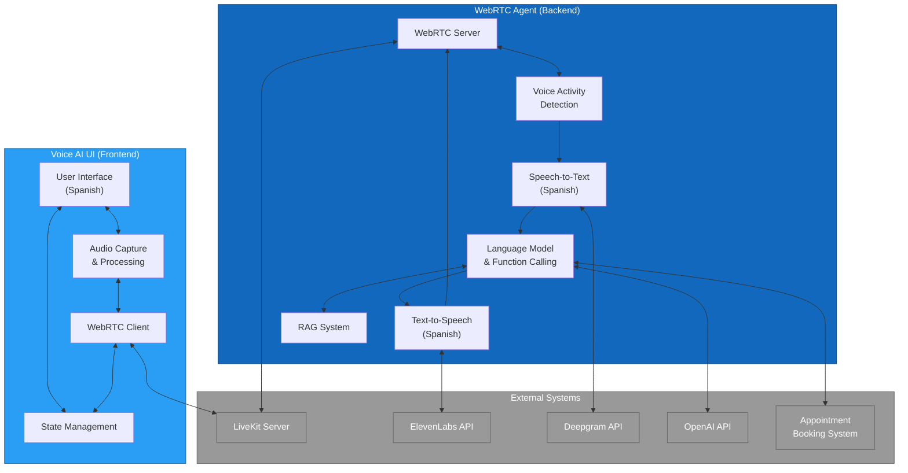
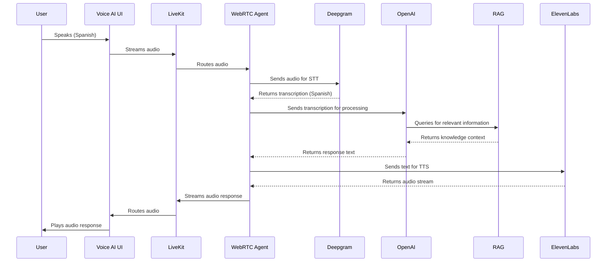
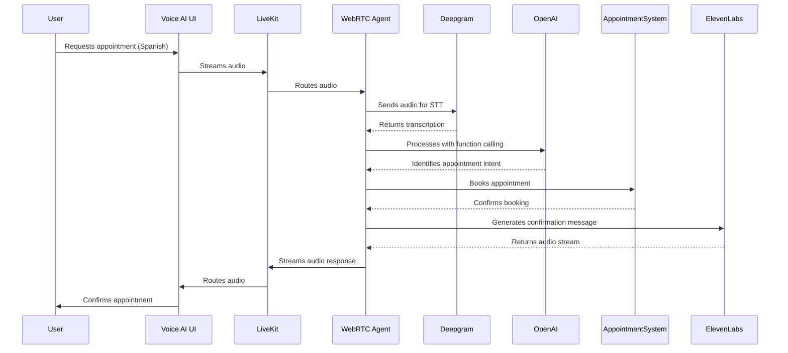

# 2.5 Integración de Sistemas

## Visión General

Este documento detalla cómo los componentes del sistema TAINA Voice AI se integran entre sí y con sistemas externos. Se centra en los patrones de comunicación, formatos de intercambio de datos y puntos de integración entre la Interfaz de Usuario de Voice AI (frontend) y el Agente WebRTC (backend), así como sus interacciones con servicios externos.

## Diagrama de Integración de Sistemas

## Puntos de Integración

### 1. Integración de Frontend a Backend

La Interfaz de Usuario de Voice AI (frontend) y el Agente WebRTC (backend) se integran principalmente a través de LiveKit, un servidor WebRTC que facilita la comunicación de audio en tiempo real.

#### Puntos Clave de Integración:

1. **Conexión WebRTC**
   - **Protocolo**: WebRTC sobre WebSockets
   - **Servidor**: LiveKit
   - **Autenticación**: Tokens JWT generados por el backend
   - **Formato de Datos**: Flujos de audio en tiempo real y canales de datos

2. **Gestión de Salas**
   - El frontend se conecta a una sala de LiveKit
   - El backend se une a la misma sala como participante
   - Los nombres de las salas se basan típicamente en identificadores de sesión

3. **Canales de Datos**
   - Utilizados para enviar metadatos y mensajes de control
   - Formato JSON para intercambio de datos estructurados
   - Incluye resultados de transcripción y actualizaciones de estado del sistema

### 2. Integración de Backend con Servicios Externos

El Agente WebRTC se integra con varios servicios externos para proporcionar su funcionalidad:

#### Integración de Speech-to-Text (Deepgram)

- **Método de Integración**: API REST
- **Autenticación**: Clave API
- **Formato de Solicitud**: Flujo de audio o fragmentos
- **Formato de Respuesta**: JSON con resultados de transcripción
- **Configuración**:
  - Idioma: Español (`es`)
  - Modelo: Mejorado
  - Características: Puntuación, resultados provisionales

#### Integración de Text-to-Speech (ElevenLabs)

- **Método de Integración**: API REST y WebSocket para streaming
- **Autenticación**: Clave API
- **Formato de Solicitud**: JSON con texto y parámetros de voz
- **Formato de Respuesta**: Flujo de audio (MP3)
- **Configuración**:
  - ID de Voz: Voz personalizada en español dominicano
  - Modelo: eleven_multilingual_v2
  - Frecuencia de Muestreo: 44100Hz
  - Formato: MP3

#### Integración de Modelo de Lenguaje (OpenAI)

- **Método de Integración**: API REST
- **Autenticación**: Clave API
- **Formato de Solicitud**: JSON con prompt y parámetros
- **Formato de Respuesta**: JSON con texto generado
- **Configuración**:
  - Modelo: gpt-4o-mini
  - Temperatura: 0.7
  - Llamada de Funciones: Habilitada

#### Integración de Reserva de Citas

- **Método de Integración**: Webhook
- **Autenticación**: Clave API u OAuth
- **Formato de Solicitud**: JSON con detalles de la cita
- **Formato de Respuesta**: JSON con estado de confirmación
- **Intercambio de Datos**:
  - Información del ciudadano
  - Hora y fecha de la cita
  - Tipo de servicio
  - Estado de confirmación

### 3. Integración del Sistema RAG

El sistema de Generación Aumentada por Recuperación (RAG) está integrado dentro del backend:

- **Base de Datos Vectorial**: Almacenamiento local con LlamaIndex
- **Fuente de Documentos**: Archivos Markdown en el directorio knowledge_data
- **Interfaz de Consulta**: API interna de Python
- **Formato de Respuesta**: Texto con citas
- **Método de Integración**: Llamadas directas a funciones

## Secuencias de Flujo de Datos

### Flujo de Interacción de Voz

### Appointment Booking Flow

## Detalles Técnicos

### Configuración de WebRTC

- **Servidores ICE**: Servidores STUN y TURN para atravesar NAT
- **Restricciones de Medios**:
  - Audio: Habilitado, frecuencia de muestreo de 16kHz, mono
  - Video: Deshabilitado
- **Configuración de Canal de Datos**:
  - Ordenado: true
  - MaxRetransmits: 0

### Integración de LiveKit

- **Servidor**: Instancia alojada de LiveKit
- **Bibliotecas de Cliente**:
  - Frontend: SDK de Cliente LiveKit para Web
  - Backend: SDK de Servidor LiveKit para Python
- **Configuración de Sala**:
  - Máximo de Participantes: 2 (cliente y agente)
  - Tiempo de Espera: 30 minutos

### Consideraciones de Seguridad

1. **Autenticación**:
   - Tokens JWT con expiración corta
   - Generación de tokens en el lado del servidor
   - HTTPS para todas las llamadas API

2. **Protección de Datos**:
   - Cifrado de extremo a extremo para flujos WebRTC
   - TLS para todas las comunicaciones API
   - Sin almacenamiento persistente del audio de conversación

3. **Gestión de Claves API**:
   - Claves almacenadas en variables de entorno
   - Diferentes claves para desarrollo y producción
   - Rotación regular de claves

## Variantes de Implementación

El sistema admite diferentes variantes de implementación para ciertos componentes:

### Variantes de TTS

1. **TTS de ElevenLabs**:
   - Implementación principal
   - Voz en español de alta calidad
   - Capacidad de streaming

2. **TTS de OpenAI**:
   - Implementación alternativa
   - Menor latencia
   - Opciones de voz limitadas

### Variantes de RAG

1. **RAG con Motor de Chat**:
   - Preservación del contexto conversacional
   - Interacciones de múltiples turnos

2. **RAG con Motor de Consulta**:
   - Respuestas factuales directas
   - Mayor precisión para consultas específicas

3. **RAG con Motor de Recuperación**:
   - Mejora dinámica del prompt del sistema
   - Contexto más completo

## Consideraciones de Despliegue

1. **Requisitos de Red**:
   - Conexión de baja latencia para WebRTC
   - Ancho de banda suficiente para streaming de audio
   - Conexión a internet confiable

2. **Escalabilidad**:
   - El servidor LiveKit puede escalarse horizontalmente
   - Se pueden desplegar múltiples instancias de agentes
   - Balanceo de carga para tráfico alto

3. **Monitoreo**:
   - Métricas de calidad de conexión WebRTC
   - Tiempos de respuesta de API
   - Tasas y tipos de errores

## Next Steps

For more detailed information on the API interactions, refer to the [API Flow Diagrams](./2.6_API_Flow_Diagrams.md) document, which provides sequence diagrams for each major API interaction.
