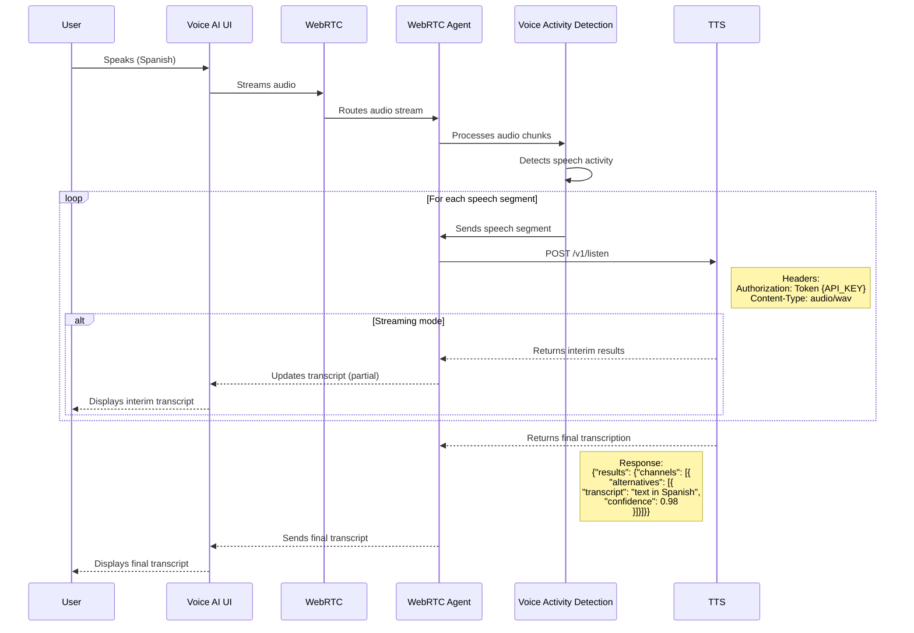
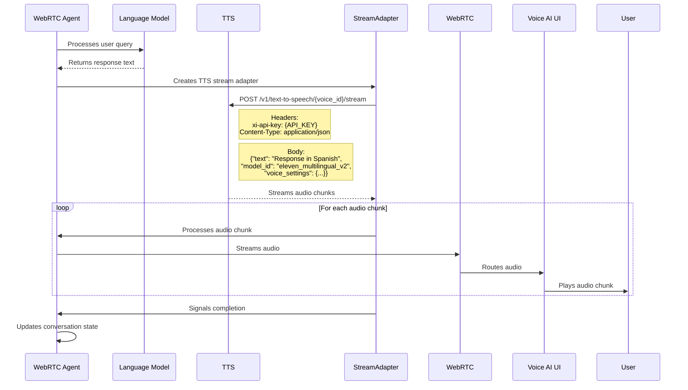
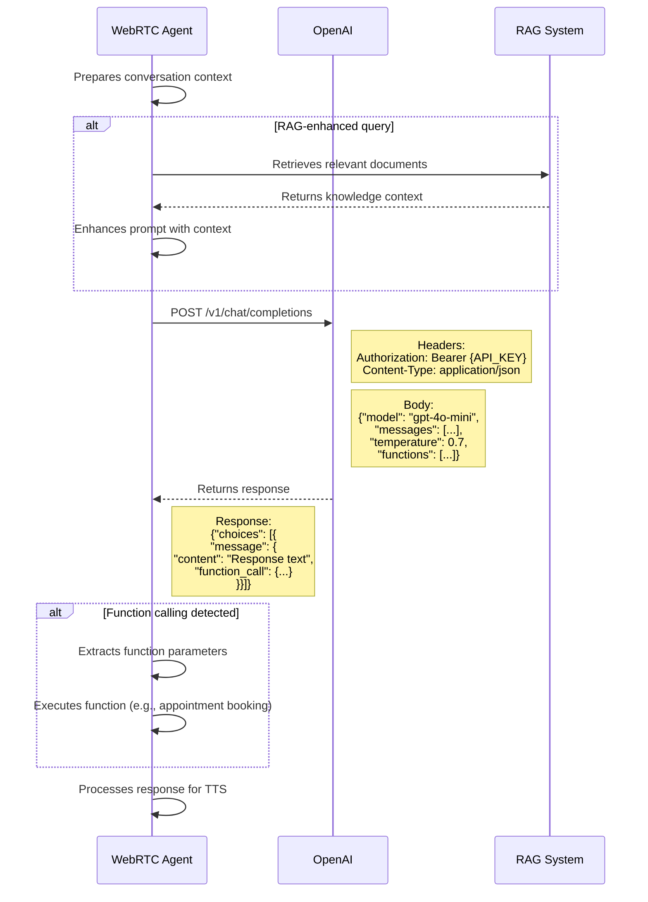
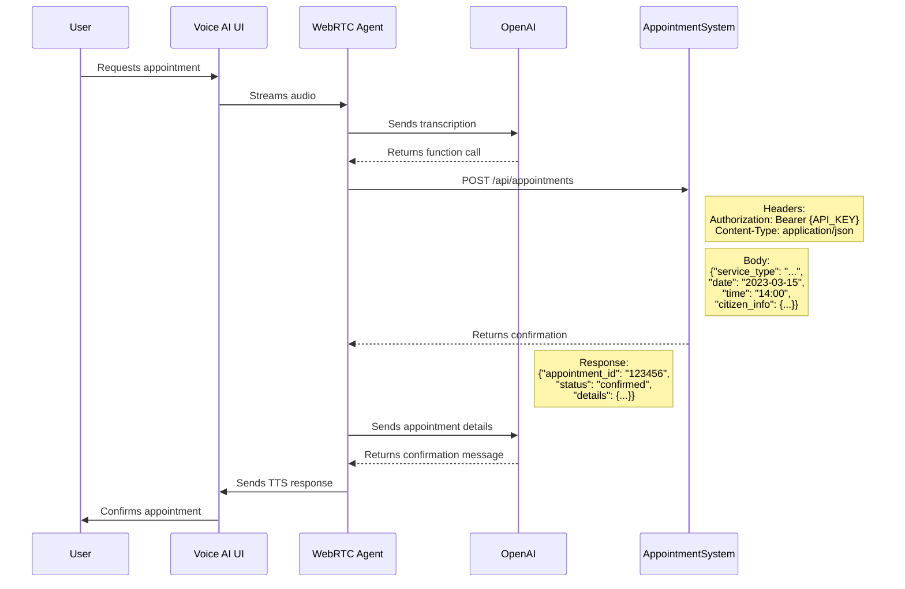
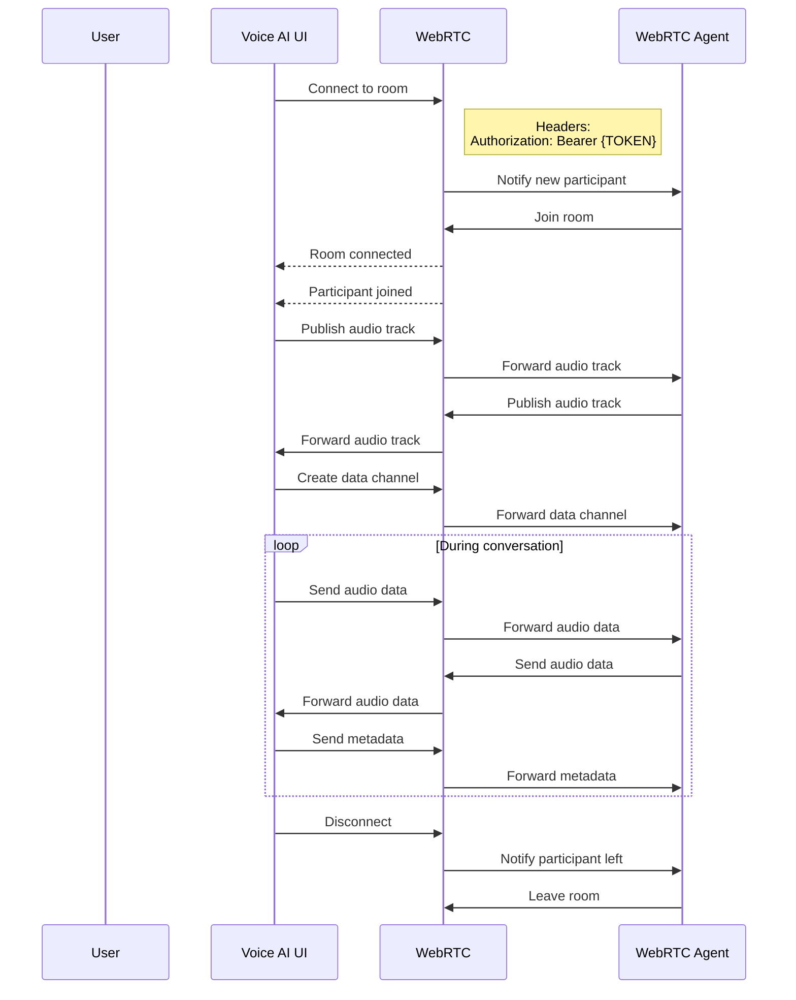
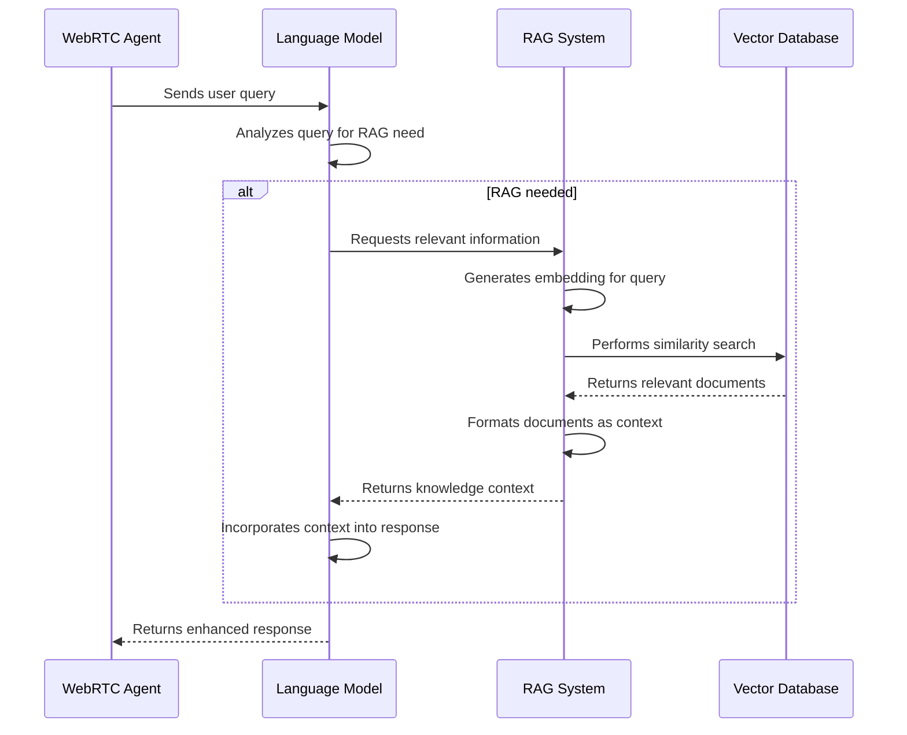
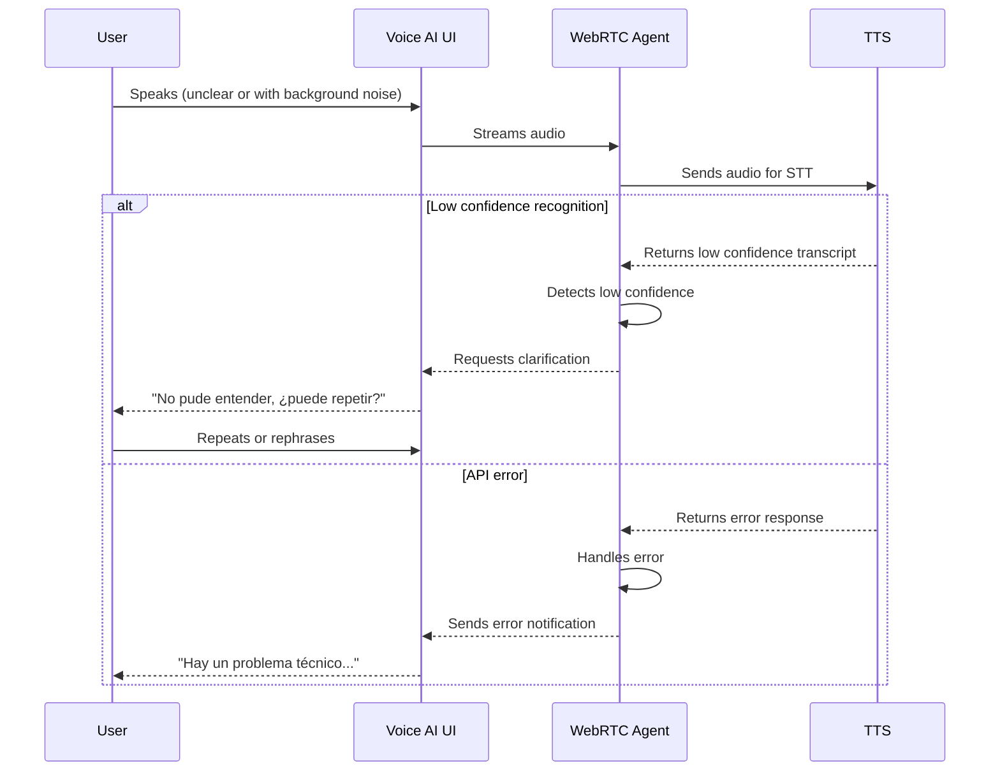
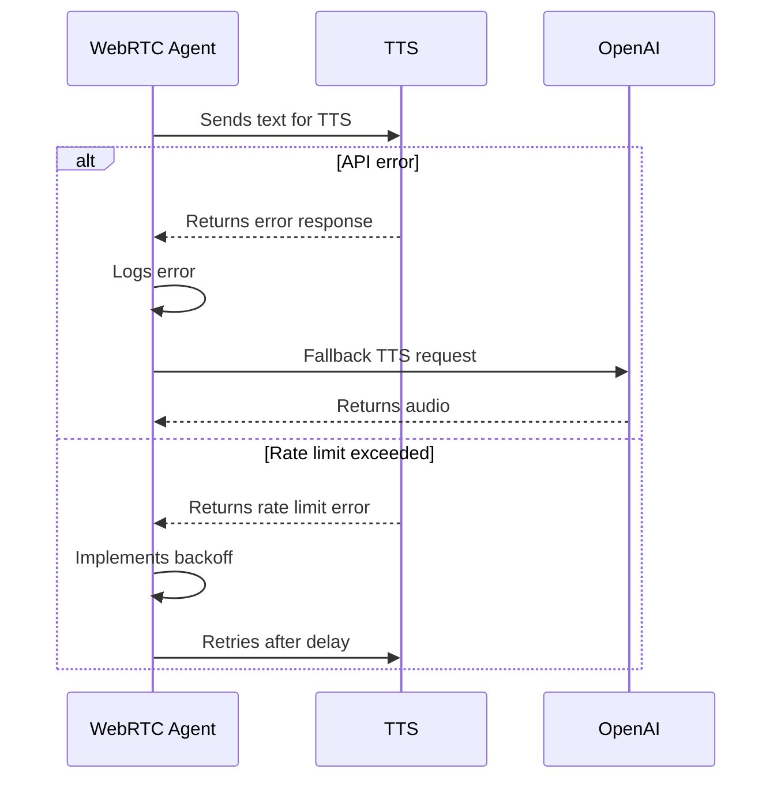

# 2.6 Diagramas de Flujo de API

## Visión General

Este documento proporciona diagramas de secuencia detallados para las interacciones clave de API en el sistema TAINA Voice AI. Se centra en los patrones de comunicación entre la Interfaz de Usuario de Voice AI (frontend), el Agente WebRTC (backend) y servicios externos como TTS, TTS, OpenAI y el sistema de reserva de citas.

## 1. Flujo de Speech-to-Text (API de TTS)

El siguiente diagrama de secuencia ilustra el flujo de audio desde el usuario a través del sistema hasta la API de TTS para el reconocimiento de voz:



### Detalles de API: TTS

**Endpoint:** `https://api.TTS.com/v1/listen`

**Method:** POST

**Headers:**
```
Authorization: Token {TTS_API_KEY}
Content-Type: audio/wav
```

**Query Parameters:**
```
language=es
model=enhanced
punctuate=true
interim_results=true
```

**Request Body:**
- Binary audio data (WAV format)

**Response Format:**
```json
{
  "results": {
    "channels": [
      {
        "alternatives": [
          {
            "transcript": "text in Spanish",
            "confidence": 0.98,
            "words": [
              {
                "word": "text",
                "start": 0.01,
                "end": 0.25,
                "confidence": 0.99
              },
              ...
            ]
          }
        ]
      }
    ]
  }
}
```

## 2. Flujo de Text-to-Speech (API de TTS)

El siguiente diagrama de secuencia ilustra cómo el sistema genera voz desde texto utilizando la API de TTS:



### Detalles de API: TTS

**Endpoint:** `https://api.TTS.io/v1/text-to-speech/{voice_id}/stream`

**Method:** POST

**Headers:**
```
xi-api-key: {TTS_API_KEY}
Content-Type: application/json
```

**Request Body:**
```json
{
  "text": "Response text in Spanish",
  "model_id": "eleven_multilingual_v2",
  "voice_settings": {
    "stability": 0.5,
    "similarity_boost": 0.75
  }
}
```

**Response:**
- Audio stream (MP3 format)

## 3. Flujo del Modelo de Lenguaje (API de OpenAI)

El siguiente diagrama de secuencia ilustra cómo el sistema procesa consultas de usuario utilizando la API de OpenAI:



### Detalles de API: OpenAI

**Endpoint:** `https://api.openai.com/v1/chat/completions`

**Method:** POST

**Headers:**
```
Authorization: Bearer {OPENAI_API_KEY}
Content-Type: application/json
```

**Request Body:**
```json
{
  "model": "gpt-4o-mini",
  "messages": [
    {
      "role": "system",
      "content": "You are a government service assistant that speaks Spanish..."
    },
    {
      "role": "user",
      "content": "User query in Spanish"
    }
  ],
  "temperature": 0.7,
  "functions": [
    {
      "name": "book_appointment",
      "description": "Book a government service appointment",
      "parameters": {
        "type": "object",
        "properties": {
          "service_type": {
            "type": "string",
            "description": "Type of government service"
          },
          "preferred_date": {
            "type": "string",
            "format": "date",
            "description": "Preferred appointment date"
          },
          "preferred_time": {
            "type": "string",
            "format": "time",
            "description": "Preferred appointment time"
          }
        },
        "required": ["service_type"]
      }
    }
  ]
}
```

**Response Format:**
```json
{
  "id": "chatcmpl-123",
  "object": "chat.completion",
  "created": 1677858242,
  "model": "gpt-4o-mini",
  "choices": [
    {
      "message": {
        "role": "assistant",
        "content": "Response text in Spanish",
        "function_call": {
          "name": "book_appointment",
          "arguments": "{\"service_type\":\"consulta general\",\"preferred_date\":\"2023-03-15\",\"preferred_time\":\"14:00\"}"
        }
      },
      "finish_reason": "function_call"
    }
  ],
  "usage": {
    "prompt_tokens": 56,
    "completion_tokens": 31,
    "total_tokens": 87
  }
}
```

## 4. Flujo de Reserva de Citas

El siguiente diagrama de secuencia ilustra el proceso de reserva de citas:



### Detalles de API: Sistema de Reserva de Citas

**Endpoint:** `https://api.appointments.gob.do/api/appointments`

**Method:** POST

**Headers:**
```
Authorization: Bearer {APPOINTMENT_API_KEY}
Content-Type: application/json
```

**Request Body:**
```json
{
  "service_type": "consulta general",
  "date": "2023-03-15",
  "time": "14:00",
  "duration": 60,
  "citizen_info": {
    "name": "Citizen Name",
    "email": "citizen@example.com",
    "phone": "+1234567890"
  },
  "notes": "Initial consultation regarding government service"
}
```

**Response Format:**
```json
{
  "appointment_id": "123456",
  "status": "confirmed",
  "details": {
    "service_type": "consulta general",
    "date": "2023-03-15",
    "time": "14:00",
    "duration": 60,
    "agent": "Agent Name",
    "location": "Virtual Meeting",
    "join_url": "https://meeting.gob.do/123456"
  }
}
```

## 5. Flujo de WebRTC WebRTC

El siguiente diagrama de secuencia ilustra el flujo de conexión WebRTC utilizando WebRTC:



### Detalles de API: WebRTC

**Connection Endpoint:** `wss://WebRTC.taina.gob.do/room/{room_name}`

**Authentication:**
- JWT token with room access permissions
- Token generated server-side

**Client SDK Methods:**
```javascript
// Frontend (JavaScript)
const room = new Room();
await room.connect('wss://WebRTC.taina.gob.do', token);
const localTrack = await createLocalAudioTrack();
await room.localParticipant.publishTrack(localTrack);
```

```python
# Backend (Python)
room_name = "user_session_123"
room = Room(room_name)
await room.connect("wss://WebRTC.taina.gob.do", token)
local_track = await create_local_audio_track()
await room.local_participant.publish_track(local_track)
```

## 6. Flujo del Sistema RAG

El siguiente diagrama de secuencia ilustra cómo el sistema RAG recupera y procesa información:



### Detalles de API: Sistema RAG Interno

**Interface Method:** `retrieve_context(query: str, top_k: int = 3) -> List[Document]`

**Parameters:**
- `query`: The user query or a reformulated search query
- `top_k`: Number of documents to retrieve

**Return Value:**
- List of Document objects with content and metadata

**Implementation:**
```python
def retrieve_context(query: str, top_k: int = 3) -> List[Document]:
    # Generate embedding for the query
    query_embedding = embedding_model.embed_query(query)
    
    # Perform vector search
    results = vector_store.similarity_search_by_vector(
        query_embedding, 
        k=top_k
    )
    
    # Format and return results
    return [
        Document(
            content=doc.page_content,
            metadata=doc.metadata
        )
        for doc in results
    ]
```

## Flujos de Manejo de Errores

### 1. Flujo de Error de Reconocimiento de Voz



### 2. Flujo de Error de TTS



## Conclusión

Estos diagramas de flujo de API proporcionan una visión detallada de cómo el sistema TAINA Voice AI interactúa con servicios externos y componentes internos. Sirven como referencia para los desarrolladores que implementan o mantienen estas integraciones, y ayudan a entender el flujo de datos a lo largo del sistema.

Para obtener más información sobre la integración general del sistema, consulte el documento [Integración del Sistema](./2.5_System_Integration.md).
