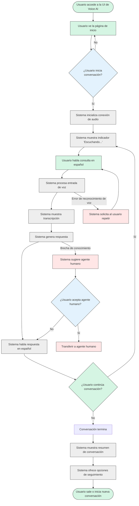

# 4.1 Flujo de Conversación

## Visión General

Este documento ilustra el flujo de usuario para conversaciones de voz con el sistema TAINA Voice AI. Detalla el proceso paso a paso desde la interacción inicial del usuario hasta la finalización de la conversación, destacando la experiencia del usuario, las respuestas del sistema y los puntos de decisión a lo largo del recorrido de la conversación.

## Flujo de Conversación Principal

El siguiente diagrama ilustra el flujo de conversación estándar entre un usuario y el sistema Voice AI:

## Pasos Detallados del Flujo

### 1. Acceso Inicial y Conexión

1. **Acceso del Usuario**
   - El usuario navega a la aplicación web de la UI de Voice AI
   - El sistema muestra la página de inicio con mensaje de bienvenida en español
   - La UI muestra el botón "Iniciar Conversación" de manera prominente

2. **Iniciación de Conversación**
   - El usuario hace clic en el botón "Iniciar Conversación"
   - El sistema solicita permiso de micrófono si no se ha concedido previamente
   - El sistema establece conexión WebRTC con el backend
   - La UI transiciona al modo de conversación

3. **Confirmación de Conexión**
   - El sistema muestra indicador de estado de conexión
   - Retroalimentación visual confirma conexión exitosa
   - La UI muestra indicador "Escuchando..." con icono de micrófono animado

### 2. Entrada del Usuario y Procesamiento

1. **Entrada de Voz**
   - El usuario habla consulta en español
   - El sistema captura audio a través de WebRTC
   - La UI muestra retroalimentación visual indicando que se está recibiendo audio
   - Opcional: Visualización de volumen en tiempo real

2. **Procesamiento de Voz**
   - El sistema envía audio a la API de TTS para transcripción
   - La UI muestra indicador "Procesando..."
   - El sistema aplica detección de idioma para confirmar entrada en español
   - El sistema realiza filtrado de ruido y mejora si es necesario

3. **Visualización de Transcripción**
   - El sistema muestra texto transcrito en la UI
   - El texto aparece en formato de burbuja conversacional
   - La transcripción se marca como "Usuario:" para distinguirla de las respuestas del sistema

### 3. Generación y Entrega de Respuesta

1. **Generación de Respuesta**
   - El sistema procesa la transcripción con LLM
   - El sistema recupera información relevante de la base de conocimientos
   - El sistema formula respuesta en español
   - La UI muestra indicador "Generando respuesta..."

2. **Entrega de Respuesta**
   - El sistema envía texto de respuesta a TTS para TTS
   - La respuesta de audio se reproduce a través de los altavoces del usuario
   - La UI muestra respuesta de texto en burbuja de conversación
   - La respuesta se marca como "Taína:" para distinguirla de la entrada del usuario
   - Indicador visual muestra cuando el sistema está hablando

3. **Indicación de Seguimiento**
   - Después de completar la respuesta, el sistema vuelve al modo de escucha
   - La UI muestra el mensaje "¿Algo más en lo que pueda ayudarle?"
   - El sistema muestra nuevamente el indicador "Escuchando..."
   - Botones opcionales de acción rápida aparecen para seguimientos comunes

### 4. Continuación o Finalización de Conversación

1. **Continuación**
   - Si el usuario habla nuevamente, el sistema vuelve al paso de Entrada de Voz
   - Se mantiene el contexto de intercambios anteriores
   - El sistema ajusta respuestas basadas en el historial de conversación

2. **Finalización**
   - El usuario indica finalización de conversación (declaración explícita o tiempo de espera)
   - El sistema reconoce el fin de la conversación
   - La UI muestra resumen de conversación
   - El sistema ofrece opciones para acciones de seguimiento (p. ej., enviar transcripción por correo electrónico, programar cita)

3. **Post-Conversación**
   - El sistema guarda transcripción de conversación para análisis
   - La UI ofrece opción para iniciar nueva conversación
   - El sistema proporciona mecanismo de retroalimentación para calidad de conversación

## Flujos Alternativos

### Manejo de Errores

1. **Problemas de Conexión**
   - Si la conexión WebRTC falla, la UI muestra mensaje de error
   - El sistema ofrece opción de reconexión
   - El usuario puede reintentar la conexión
   - Respaldo al modo de solo texto si no se puede establecer conexión de audio

2. **Errores de Reconocimiento de Voz**
   - Si la confianza de transcripción es baja, el sistema solicita aclaración
   - La UI muestra "No pude entender bien. ¿Puede repetirlo?"
   - El sistema puede sugerir posibles interpretaciones
   - Después de múltiples fallos, el sistema ofrece métodos alternativos de entrada

3. **Brechas de Conocimiento**
   - Si el sistema no puede responder consulta con alta confianza, reconoce limitación
   - La UI muestra "No tengo suficiente información sobre eso"
   - El sistema ofrece conectar con agente humano
   - El sistema sugiere temas relacionados con los que puede ayudar

4. **Fallos Técnicos**
   - Si algún servicio API falla (TTS, OpenAI, TTS)
   - El sistema implementa degradación elegante
   - La UI muestra mensaje de error apropiado
   - El sistema ofrece métodos alternativos para continuar

### Casos Especiales

1. **Transferencia a Agente Humano**
   - El usuario solicita agente humano o el sistema determina necesidad de escalación
   - El sistema confirma solicitud de transferencia
   - La UI muestra "Conectando con un agente humano..."
   - El sistema transfiere contexto de conversación a interfaz de agente humano
   - El agente humano continúa conversación con historial completo

2. **Aclaración Multi-turno**
   - El sistema necesita información adicional para responder consulta
   - La UI muestra preguntas específicas para aclarar intención del usuario
   - El sistema guía al usuario a través de recopilación estructurada de información
   - Una vez recopilada suficiente información, el sistema proporciona respuesta completa

3. **Programación de Citas**
   - El usuario solicita programar cita
   - El sistema inicia flujo de programación de citas
   - La UI muestra horarios disponibles
   - El sistema confirma detalles de la cita
   - El sistema envía confirmación al usuario a través del método preferido

## Elementos de UI y Retroalimentación Visual

### Componentes Clave de UI

1. **Contenedor de Conversación**
   - Área central que muestra historial de conversación
   - Burbujas de mensaje alternadas de usuario y sistema
   - Clara distinción visual entre mensajes de usuario y sistema
   - Desplazamiento automático a los mensajes más recientes

2. **Indicadores de Estado**
   - Estado de conexión (conectado/desconectado)
   - Estado de audio (escuchando/procesando/hablando)
   - Retroalimentación visual para detección de actividad de voz
   - Indicadores de error cuando corresponda

3. **Panel de Control**
   - Botón de silenciar/activar micrófono
   - Control de volumen para voz del sistema
   - Botón de finalizar conversación
   - Acceso a configuración para preferencias de voz

4. **Características de Accesibilidad**
   - Opción de modo de alto contraste
   - Ajuste de tamaño de texto
   - Compatibilidad con lector de pantalla
   - Soporte para navegación por teclado

### Principios de Retroalimentación Visual

1. **Capacidad de Respuesta en Tiempo Real**
   - Retroalimentación visual inmediata para acciones del usuario
   - Transiciones animadas entre estados
   - Indicadores de progreso para procesos más largos
   - Señalización clara de cambios de estado del sistema

2. **Señalización Intuitiva**
   - Codificación de colores para diferentes estados de conversación
   - Iconografía consistente en toda la interfaz
   - Señales visuales que coinciden con señales de audio
   - Animaciones que dirigen la atención para elementos importantes

## Directrices de Voz y Tono

### Características de Voz del Sistema

1. **Profesional pero Accesible**
   - Lenguaje formal apropiado para contexto de servicio gubernamental
   - Tono cálido y servicial
   - Evita jerga técnica excesiva a menos que sea necesario

2. **Clara y Concisa**
   - Oraciones cortas y directas
   - Organización lógica de información
   - Énfasis en puntos clave
   - Ritmo apropiado con pausas naturales

3. **Culturalmente Apropiada**
   - Idioma español optimizado para dialecto dominicano
   - Ejemplos y referencias culturalmente relevantes
   - Nivel de formalidad apropiado (usted vs. tú)
   - Reconocimiento de terminología local para servicios gubernamentales

### Patrones de Respuesta

1. **Reconocimiento**
   - El sistema reconoce la entrada del usuario antes de responder
   - Las frases de confirmación varían para sonar naturales
   - Ejemplos: "Entiendo su pregunta sobre...", "Con respecto a su consulta sobre..."

2. **Entrega de Información**
   - Estructurada de lo general a lo específico
   - Información importante presentada primero
   - Información compleja dividida en fragmentos digeribles
   - Ofertas de seguimiento para detalles adicionales

3. **Solicitudes de Aclaración**
   - Frases corteses al solicitar aclaración
   - Específico sobre qué información se necesita
   - Ofrece ejemplos de respuestas esperadas
   - Explica por qué la información adicional es útil

## Conclusión

Este documento de flujo de conversación sirve como una guía completa para implementar la experiencia de interacción del usuario en el sistema TAINA Voice AI. Asegura una comunicación consistente, intuitiva y efectiva entre los ciudadanos y el sistema a través de todos los canales de implementación.

El flujo está diseñado para ser lo suficientemente flexible para manejar diversas necesidades de los usuarios mientras mantiene un enfoque estructurado para la recopilación y entrega de información. Siguiendo estas directrices, el sistema proporcionará una experiencia natural, útil y eficiente para los ciudadanos que buscan asistencia en servicios gubernamentales.
